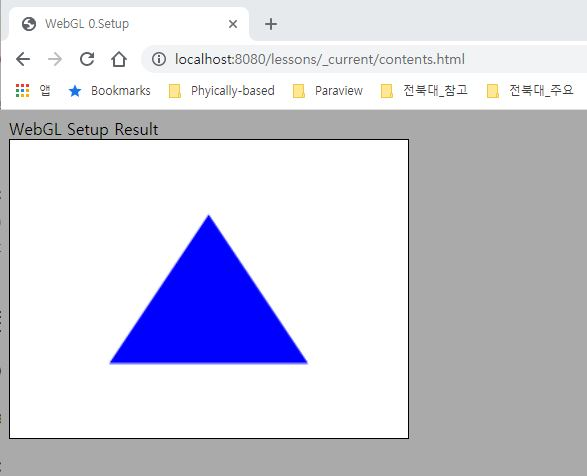
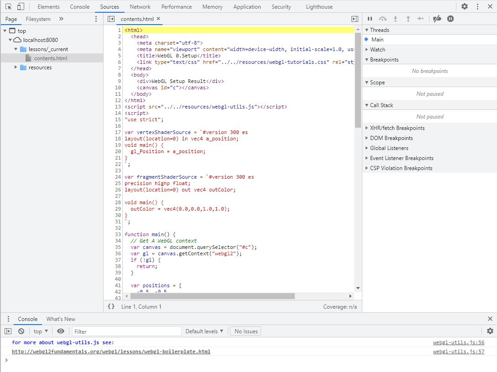

# 0. SETUP

첫 번째 내용으로, 웹 서버를 설치하고 문제가 없는지 부터 살펴봅니다.

## How to

### Install and Run Web Server
1. 우선 이 Repository(또는 현재 커밋)을 Clone하여 여러분의 PC에 사본을 만듭니다.
    * `D:/Lecture/CG/`에 Clone했다고 가정하겠습니다. 즉 `D:/Lecture/CG/resources/` 폴더와 `D:/Lecture/CG/lessons/` 폴더가 있는 상태입니다.
2. [Serves](https://greggman.github.io/servez/)를 다운로드하고 설치합니다.
3. 설치된 Serves를 실행하고 "Folder to Serve" 경로를 Clone한 폴더로 지정합니다.
    * 위 예시에 따르면 `D:/Lecture/CG/` 폴더를 선택합니다.
4. Start를 누릅니다.

### Connect and Check
5. 웹 브라우저(Chrome 또는 FireFox)를 실행하고 `http://localhost:8080/lessons/_current/contents.html` 주소로 접속합니다.
    * 최종 커밋을 Clone하였다면 `http://localhost:8080/lessons/0_Setup/contents.html`
6. 아래와 같이 WebGL Setup Result 글자와 파란색 삼각형이 나오는지 확인합니다.



### Modify
7. 이제 `D:/Lecture/CG//lessons/_current/contents.html` 파일을 메모장/편집기로 열어서 아래 `<div>`태그 내의 문자열을 다른 문자로 바꿔 보세요.

    ```html
    <div>WebGL Setup Result</div>
    ```

8. 페이지를 새로고침해서 바뀐 문자열이 적용되어 표시되는지 확인해 보세요.

9. F12를 눌러 아래와 같은 개발자 도구를 띄우고 "Source"를 누른 뒤 왼쪽의 contents.html을 더블클릭해서 코드가 표시되는 것을 확인해 보세요.
    * 표시되지 않으면 F5를 눌러서 화면을 새로고침하여 확인해 보세요.



위 과정들이 모두 제대로 동작한다면 이제 WebGL 코드를 작성할 준비가 된 것입니다!

## FAQ

- 화면에 아무것도 나오지 않는다면 우선 본인 브라우저가 WebGL을 지원하는지 [링크](https://get.webgl.org/webgl2/)에 접속해서 확인해 보세요. 지원하지 않는다면 다른 웹 브라우저를 설치해서 사용하셔야 합니다.
- `http://localhost:8080`이 3번에서 설정한 경로를 가리킵니다. 따라서 `http://localhost:8080/lessons/_current/contents.html`이라 하면 `D:/Lecture/CG/lessons/_current/contents.html`파일을 가리키게 됩니다. 제대로 설정되었는지 확인해 보세요.

## Useful Links

- [WebGL2 설정 및 설치(WebGL2 Fundamentals)](https://webgl2fundamentals.org/webgl/lessons/ko/webgl-setup-and-installation.html)

---

[다음 강의](../01_vertex_buffer/)

[목록으로](../)


