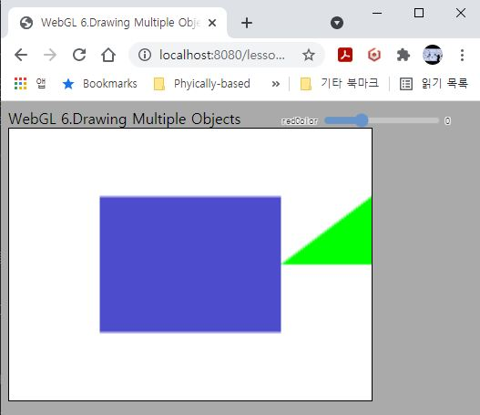

# 6. Drawing Multiple Objects - Part 1

**[!!이 장의 코드는 사실 다음 내용인 VAO를 설명하기 위한 빌드업입니다. 한번 보시고 잘 이해가 안된다면 VAO 내용까지 보고 다시 돌아와서 보시면 좀 더 확실히 이해되실 수 있습니다.!!]**

이제 여러분이 WebGL의 동작 개념을 확실히 이해하셨는지 확인할 수 있는 코드를 살펴보겠습니다. 이제는 물체도 두개고, 셰이더 프로그램도 두개입니다. 결과는 아래 그림과 같습니다.



가운데 사각형은 이전과 동일하며, 여기에 추가적으로 오른쪽에 초록색 삼각형이 같이 그려져 있습니다. 삼각형은 초반부 예제와 같이 uniform이 없이 초록색으로 그리는 셰이더를 사용합니다. 따라서 여기서는 사각형 데이터(정점 데이터 1), 사각형 프로그램(프로그램 1), 삼각형 데이터(정점 데이터 2), 삼각형 프로그램(프로그램 2)가 모두 사용됩니다.

우선 거시적인 관점에서, 새로 작성한 코드가 어떤 작업들을 하는지 순서대로 나열해 보겠습니다. 또한 이전 강의에서는 "활성화", "바인딩"을 혼용해서 사용했는데, 이제는 좀 더 명확한 용어인 "바인딩"으로 가급적 통일하도록 하겠습니다. ([상태 다이어그램](https://webgl2fundamentals.org/webgl/lessons/resources/webgl-state-diagram.html)을 보셨으면 왜 바인딩이 더 명확한지 이해하실 수 있을겁니다.)

|시점|대상|작업||
|:----:|:----:|:----:|:----:|
|||(사각형 및 삼각형 정점 및 인덱스 배열 생성)||
|초기화|사각형|정점 데이터 1(위치 및 인덱스)버퍼 생성 및 GPU에 업로드||
|||프로그램 1을 GPU에 업로드하고 컴파일 & 링크하여 프로그램 생성||
|||(정점 데이터 1 Attribute를 읽는 방법을 알려줌)||
|||정점 데이터 1과 프로그램 1을 언바인딩|(1)|
||삼각형|정점 데이터 2(위치 및 인덱스)버퍼 생성 및 GPU에 업로드|(2)|
|||프로그램 2를 GPU에 업로드하고 컴파일 & 링크하여 프로그램 생성||
|||(정점 데이터 2 Attribute를 읽는 방법을 알려줌)||
|||정점 데이터 2와 프로그램 2를 언바인딩|(3)|
||||
|렌더링|사각형|정점 데이터 1, 프로그램 1 바인딩|(4)|
|||정점 데이터 1 Attribute를 읽는 방법을 알려줌||
|||**사각형 색상 관련 Uniform 설정**||
|||<span style="color:red">드로우콜</span>||
|||정점 데이터 1과 셰이더 1을 언바인딩|(5)|
||삼각형|정점 데이터 2, 프로그램 2 바인딩|(6)|
|||정점 데이터 2 Attribute를 읽는 방법을 알려줌||
|||<span style="color:red">드로우콜</span>||
|||정점 데이터 2와 셰이더 2를 언바인딩||

복잡하죠? 네. 좀 복잡해지긴 했습니다. 그런데 위 표를 아래와 같이 두 번을 나누어서 바라보시면 이해하기 어렵지 않습니다.

1. 우선 삼각형에 해당하는 부분을 모두 지우고 생각해 보세요. 그러면 초기화 시점에 "정점 데이터 1과 프로그램 1을 언바인딩" 부분과, 렌더링(그리기) 시점에 "정점 데이터 1, 프로그램 1 바인딩" 부분을 빼면 지난 번 예제와 동일하다는 것을 알 수 있습니다. 즉, 언바인딩->바인딩를 한번씩 수행하는 것을 빼놓고 나면 지난번 코드와 다를 것이 없습니다!

2. 사각형은 정점 데이터(`position` & `indices`) 1과 프로그램 1을, 삼각형은 정점 데이터 2와 프로그램 2를 사용하고 있습니다. 한 번에 하나씩만 바인딩이 가능하기 때문에 (1)과 (2) 사이, (3)과 (4) 사이, (5)와 (6) 사이에서 현재 작업하지 않을 대상을 언바인딩 하는 과정이 필요합니다.

이렇게 생각하면 그렇게까지 복잡하지는 않은 것 같지 않나요? 코드를 보고, 위 표에 해당하는 코드가 어디 있는지 대입해서 한번 차분히 보시면 이해하실 수 있을겁니다. 이런 과정을 해 보신 분과 그렇지 않은 분의 이해도에는 분명히 차이가 생길겁니다.

(정점 데이터 1 Attribute를 읽는 방법을 알려줌)이 부분에 왜 괄호가 있고, 꼭 초기화 시점과 렌더링 시점에 두 번 다 해주어야 하는지 궁금하신 분들이 있을겁니다. 이에 대한 설명은 마지막 부분(+다음 강의)에 말씀 드리겠습니다.

## How to

이전 코드에서 변화된 내용들을 보자면 아래와 같습니다.

---
0. 사각형/삼각형 셰이더 프로그램

    ```glsl
    var triangleVertexShaderSource = `#version 300 es
    layout(location=0) in vec4 a_position; 

    void main() {
    gl_Position = a_position;
    }
    `;

    var triangleFragmentShaderSource = `#version 300 es
    precision highp float;
    layout(location=0) out vec4 outColor;

    void main() {
    outColor = vec4(0.0,1.0,0.0,1.0);  //<--triangle을 위한 shader는 항상 초록색으로 그린다.
    }
    `;
    ```
    
    사각형 셰이더는 이전과 동일하므로 다시 옮기지 않았습니다. 삼각형 셰이더는 그 전 강의내용에서의 셰이더와 동일한데, 색상을 uniform을 통해 외부로부터 받지 않고 그냥 셰이더 내부에 하드코딩 해 두었습니다. 항상 초록색으로 그립니다.

    이번 예제에는 셰이더 프로그램을 두 개 사용하고 있습니다.

1. [초기화]사각형 및 삼각형 정점 및 인덱스 배열 생성 (70~91 라인)

    굳이 여기에 코드를 다시 옮겨놓지 않아도 이제는 배열을 보시면 어떻게 정점 위치들이 정의되었고 인덱스에 의해 어떻게 삼각형들이 구성되는지 아실 수 있을겁니다.

2. [초기화]사각형 데이터 업로드 및 셰이더 컴파일 (95~116 라인)

    마찬가지로 이전과 동일합니다. 하나 언급하고 싶은것은 지금은 Attibute를 읽는 방법을 알려주지 않아도 화면이 잘 표시될 것입니다. 그래서 위 표에서 괄호로 표시해 둔 것인데, 이에 대해서는 마지막 부분(+다음 강의)에 설명 드리겠습니다.
    
3. [초기화]사각형 관련 버퍼 및 프로그램 언바인딩(124~126 라인)

    ```js
    gl.bindBuffer(gl.ARRAY_BUFFER,null)
    gl.bindBuffer(gl.ELEMENT_ARRAY_BUFFER,null)
    gl.useProgram(null)
    ```

    바인딩 할때와 마찬가지로 `gl.bindBuffer`, `gl.useProgram`을 사용하지만 인자로 `null`을 넣어주면 언바인딩상태가 됩니다. <span style="color:red">여기서 언바인딩을 하는 이유는, 뒤에 삼각형을 위한 버퍼와 프로그램을 새로 바인딩 해야 하기 때문입니다.</span>

    참고로 `gl.ARRAY_BUFFER`와 같이 바인딩할 목적지를 바인드 포인트라고 부르는데, 바인드 포인트에는 하나만 바인딩이 가능합니다. 그래서, 예를들어 아래와 같이 두 줄의 코드가 호출되면, 최종적으로 `b_buffer`가 바인딩된 상태에서 그려지게 됩니다. 그러니 사실은 사각형을 언바인딩 하지 않아도 자연스레 삼각형 데이터가 바인딩된 상태가 되긴 합니다.

    ```js
    ...
    gl.bindBuffer(gl.ARRAY_BUFFER, a_buffer);
    ...
    gl.bindBuffer(gl.ARRAY_BUFFER, b_buffer);
    ...
    gl.drawElements(...);
    ```

    하지만 이렇게 무분별한(?) 바인딩을 하게 되면 현재 바인딩되어있는 것이 무엇인지 추적이 어렵고 실수로 다른 데이터를 바인딩하는 경우도 생길 수 있기 때문에, 사용이 끝나게 되면 확실하게 언바인딩을 하는 것이 안전합니다. [언바인딩을 꼭 해야 할까?](https://gamedev.stackexchange.com/questions/90471/should-unbind-buffers)에 대한 답변도 읽어 보세요.

4. [초기화]삼각형 관련 초기화(130~157 라인)

    사각형과 동일하고 데이터/프로그램만 다르기 때문에 굳이 다시 옮기지 않습니다. 마지막에 사각형과 동일하게 언바인딩으로 깔끔하게 바인딩 된 것이 없는 상태를 만들어 둡니다.

---

이제 아래는 렌더링 시점(`drawScene()` 함수 내부)의 바뀐 코드입니다.

5. [렌더링]사각형 그리기 준비(186~195 라인)

    ```js
    gl.bindBuffer(gl.ARRAY_BUFFER, positionBuffer1); // <--(1)
    gl.enableVertexAttribArray(0); 
    var size = 2;          
    var type = gl.FLOAT;   
    var normalize = false; 
    var stride = 0;        
    var offset = 0; 
    gl.vertexAttribPointer(0, size, type, normalize, stride, offset);
    gl.bindBuffer(gl.ELEMENT_ARRAY_BUFFER, indexBuffer1); // <--(2)
    gl.useProgram(program1); // <--(3)
    ```

    4번 시점에 모든 바인딩 포인트가 아무것도 바인딩이 안된 상태기 때문에, 사각형을 그리기 위해서 다시 바인딩을 해 줍니다. 중간의 데이터를 읽는 법을 알려주는 부분을 제외한 (1),(2),(3)을 보시면 단순히 다시 바인딩을 하는 코드라는 것을 알 수 있습니다.

6. [렌더링]사각형 프로그램(=프로그램 1) uniform 설정(197~198 라인)

    ```js
    var location = gl.getUniformLocation(program1, "u_color");
    gl.uniform4f(location, red, 0.3, 0.8, 1.0);
    ```

    이전과 동일하게 슬라이더를 통해 변경된 red값을 사용해 프로그램 1의 `u_color` uniform을 설정해 줍니다.

7. [렌더링]사각형 렌더링 및 언바인딩(199~208 라인)

    ```js
    var primitiveType = gl.TRIANGLES;
    var indexcount = 6;
    var indexoffset = 0
    gl.drawElements(primitiveType, indexcount, gl.UNSIGNED_SHORT, 0);
    ```

    `gl.drawElements()`를 호출해서 지금 바인딩된 것들로(5에서 바인딩한 데이터/프로그램) 화면을 그립니다. 이후 삼각형을 그리기 위해 다시 언바인딩합니다.

    ```js
    gl.bindBuffer(gl.ARRAY_BUFFER,null);
    gl.bindBuffer(gl.ELEMENT_ARRAY_BUFFER,null);
    gl.useProgram(null);
    ```

8. [렌더링]삼각형 그리기 준비(211~220 라인)

    5번 과정과 유사하게 삼각형을 위한 데이터/프로그램을 바인딩합니다.

9. [렌더링] 삼각형 렌더링 및 언바인딩(222~231 라인)

    삼각형은 uniform이 따로 필요하지 않으므로 바로 렌더링을 수행하고 이후 언바인딩합니다.

---

`http://localhost:8080/lessons/_current/contents.html`(또는 `http://localhost:8080/lessons/06_drawing_multiple_objects_pt1/contents.html`)에 접속해서 우측 상단의 슬라이더를 움직여 보세요.  삼각형과 사각형이 보이고, 슬라이더를 통해 사각형의 색상이 변하는 것을 보실 수 있습니다.

코드가 상당히 길어져서 당황스러우셨을 수 있을 것 같습니다. 이후 강의에서는 이 코드를 줄일 수 있는 기능을 소개 해 드리도록 하겠습니다. 지금까지 숨겨져 있었던 VAO(Vertex Array Object)라는 새로운 기능을 사용할 것입니다.

개인적인 생각으로 물론 VAO를 배우고 나면 지금 예제처럼 코드를 작성하지는 않겠지만, VAO가 왜 필요한지, 없으면 어떻게 코드를 작성해야 하는지를 이 예제를 통해 확실히 이해하시는 것이 필요하다고 봅니다. VAO를 사용하지 않고 지금 예제의 코드와 같은 방식으로 구현된 사례도 많이 있기 때문입니다.

## Quiz

1. VAO라는것을 아직 배우지 않았다고 하더라도, 사실 위 코드는 중복되는 명령문이 매우 많습니다. 어떻게 중복을 줄이도록 구조화 할 수 있을지 생각해 보세요.

2. 바인딩/언바인딩이 중복적으로 이루어지고 있는데 몇몇 부분을 주석처리 한 상태에서 결과를 보시고 왜 그런 결과가 나오는 걸까 생각해 보세요.

## Useful Links

- [WebGL2 상태 다이어그램](https://webgl2fundamentals.org/webgl/lessons/resources/webgl-state-diagram.html)
- [언바인딩이 꼭 필요한가요?](https://gamedev.stackexchange.com/questions/90471/should-unbind-buffers)

---

[다음 강의](../06_drawing_multiple_objects_pt2/)

[목록으로](../)