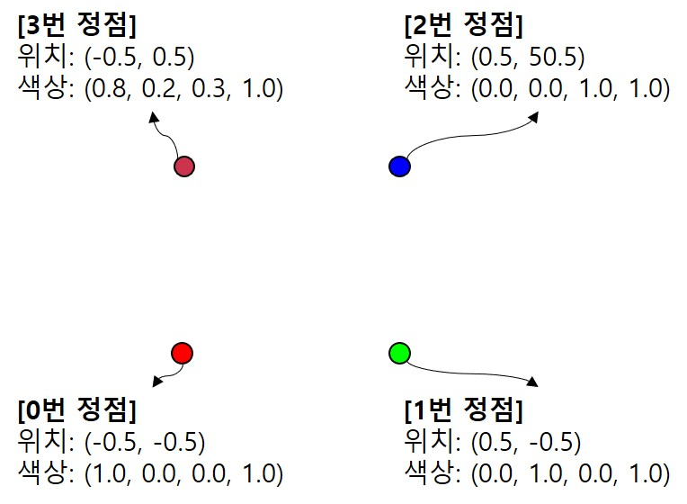
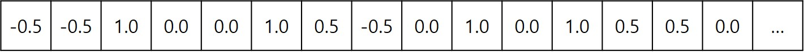
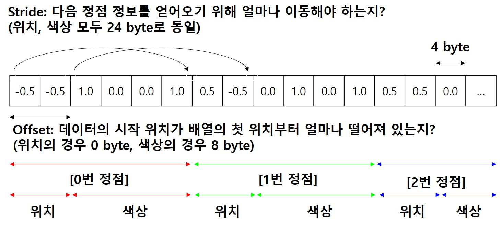

# 8. Vertex Array Abstraction

**먼저 말씀드릴 것은 지난번까지는 `contents.html`의 `script`태그 안에 모든 코드를 작성해 두었었는데, 이번 강의에서부터 메인 함수 부분을 `main.js`파일로 옮기고 해당 모듈을 가져오는 형식으로 수정했다는 것입니다.** 이 방법이 코드를 좀 더 깔끔하게 구조화가 가능하며, 객체지향에 부합하는 방식입니다. 앞으로는 HTML파일이 아닌 `main.js`파일의 변경사항을 주로 추적하셔야 합니다.

또한 클래스를 구현한 파일은 `lessons/_classes` 하위로 옮겨져 있습니다. 즉, 이전 강의에서 만든 IndexBuffer 클래스와 VertexBuffer 구현 결과는 `lessons/_classes` 폴더의 `IndexBuffer.js`와 `VertexBuffer.js`파일로 옮겨왔습니다. 앞으로 추가될 클래스 정의들 모두 이러한 형식으로 해당 폴더에 추가될 것이니 미리 말씀드립니다. 해당하는 강의 스텝에서는 `main.js`파일에 클래스를 직접 구현하고, 그 다음 강의에서 이를 개별 js파일로 옮기는 방식으로 진행할 예정입니다.

> 구현한 클래스를 main에서 참조하여 사용하는 방법은 아래 0번 내용에 설명되어 있습니다.

---

이번에는 Abstraction의 두 번째 단계로 VAO를 관리하는 클래스를 만들어 보겠습니다. VAO를 생각해보면 VAO를 만들고 바인딩 하기만 하는 아주 단순한 클래스를 만들면 끝날 것 같지만 그렇지 않습니다. 여기에서 우리가 만들 VertexArray 클래스는 데이터를 읽는 법을 알려주는 `gl.enableVertexAttribArray()` 및 `gl.vertexAttribPointer()`까지의 함수를 호출하는 것을 담당하도록 할 것입니다.

이론 강의에서 설명드린 내용입니다만 정점(Vertex) 데이터라 함은 단순히 위치 좌표를 나타내는 데이터가 아닙니다. 정점에 관련된 모든 데이터를 통합해서 우리는 정점 데이터라고 이야기합니다. 좌표뿐만 아니라 색상, 텍스처 좌표, 법선(normal) 벡터 등 다양한 데이터가 하나의 점에 들어가 있을 수 있고 이를 통틀어서 우리는 정점 데이터라고 이야기합니다.

그러면 한 점에 대해서 위치 정보도 있고, 색상 정보도 있고, 좌표 정보도 있고, 법선 정보도 있는데 이를 어떻게 GPU에 전달해 주어야 할까요? 여러 가지 방법이 있습니다만 여기에서는 하나의 배열에 모든 데이터를 집어넣고, 끊어서 읽는 방법을 알려주는 접근법을 취할겁니다. [C++ 예제](https://github.com/diskhkme/OpenGL_Lecture_Material/commit/e20e563338fedc146edc8407f378313128943f09)에서는 보다 추상화된 구현을 사용했었는데, 학습 목적에서는 이렇게까지는 필요 없다고 생각되어 약간 단순화 했습니다.

## How to

이전 코드에서 변화된 내용들을 보자면 아래와 같습니다.

---
0. VertexBuffer/IndexBuffer 클래스 import

    ```js
    import VertexBuffer from '../_classes/VertexBuffer.js';
    import IndexBuffer from '../_classes/IndexBuffer.js';
    ```
    
    VertexBuffer/IndexBuffer를 import하였습니다. 이미 구현이 완료된 클래스들은 이 레포지토리에서는 `_classes` 폴더 하위에 위치해 있을 예정입니다. 따라서 import하는 경로는 해당 폴더 상대 경로를 활용 하였습니다. 만일 여러분이 직접 구현한 VertexBuffer/IndexBuffer를 사용하고 싶으시다면 다른 폴더(예를들어 `classes`)를 만들고 거기에 구현한 js 파일들을 배치한 뒤 위 import를 `from '../classes/VertexBuffer.js'` 와 같은 형식으로 바꾸어 주시면 되겠죠?

1. VertexArray 클래스 구현

    ```js
    class VertexArray{
        id;
        
        constructor(gl)
        {
            this.id = gl.createVertexArray(); //this.id == vao
            //vao의 바인딩은 AddBuffer 직전에 수행하도록 한다.
        }
        
        Bind(gl)
        {
            gl.bindVertexArray(this.id);
        }
        
        Unbind(gl)
        {
            gl.bindVertexArray(null);
        }
        
        AddBuffer(gl, vb, countArray, normalizedArray)
        {
            //countArray와 normalizedArray의 길이는 같아야 함
            console.assert(countArray.length == normalizedArray.length,
                "length of countArray and normalizedArray should match!");
            this.Bind(gl); //VAO binding
            vb.Bind(gl); //입력된 VertexBuffer binding
            
            var stride = 0;
            for(var i=0;i<countArray.length;i++)
            {
                stride += countArray[i] * 4;
            }
            
            var offset = 0;
            for(var i=0;i<countArray.length;i++) 
            {
                gl.enableVertexAttribArray(i); 
                gl.vertexAttribPointer(i, countArray[i], gl.FLOAT, normalizedArray[i], stride, offset);
                offset += 4*countArray[i];
            }
        }
    }
    ```

    생성자, `Bind()` 및 `Unbind()`에 대해서는 별도의 설명이 필요 없을 것 같습니다. 생성자에서 바인딩은 `AddBuffer()`에 호출이 들어온 경우 하도록 구현했다는 점만 주의해 주세요.

    핵심은 `AddBuffer()` 부분입니다. [VAO 관련 강의](../6_drawing_multiple_objects_pt2/README.md)에서 말씀드린 것처럼, VAO에 필요한 데이터는 VAO를 바인딩한 상태에서 IBO를 바인딩할 때, 그리고 `gl.vertexAttribPointer()`를 호출해 데이터를 읽는 법을 알려주는 경우에 저장됩니다. 

    인자는 다음과 같습니다.

    * `vb`: VertexBuffer 클래스 객체입니다. `gl.vertexAttribPointer()`를 호출하기 이전에 VBO를 바인딩 하기 위해 전달받았습니다. (즉, 어느 버퍼에 있는 데이터를 읽는 방법인지를 명시하기 위해 전달받은 것입니다.)
    
    * `countArray`: 정점 데이터가 종류마다 각각 몇 개의 숫자로 구분되어 있는지를 저장한 배열입니다.

    * `normalizedArray`: 종류별로 정규화를 해야 하는지 아닌지 여부를 boolean으로 저장한 배열입니다.

    자, 이제 아래 부분에 stride와 offset 계산을 하면서 `gl.vertexAttribPointer()`를 호출하고 있는데, 이 부분은 셰이더 코드와 데이터까지 보고나서 다시 설명해 드리겠습니다.

2. 셰이더 수정

    ```glsl
    var rectangleVertexShaderSource = 
    `#version 300 es

    layout(location=0) in vec4 a_position; 
    layout(location=1) in vec4 a_color; 

    out vec4 v_color; 

    void main() {
        gl_Position = a_position;
        v_color = a_color;
    }
    `;

    var rectangleFragmentShaderSource = 
    `#version 300 es

    precision highp float;

    layout(location=0) out vec4 outColor;

    in vec4 v_color;

    void main() {
        outColor = v_color; color값이다.
    }
    `;
    ```

    정점 셰이더에서 프래그먼트 셰이더로 데이터를 넘기는 부분에 대한 설명은 이론 강의시간에 자세히 해 드리겠습니다. 우선 여기서는 아래 두 줄의 코드에만 주목하세요.

    ```glsl
    layout(location=0) in vec4 a_position; 
    layout(location=1) in vec4 a_color;
    ```

    attribute(기억나시죠?) 두 개를 선언해 주었는데, 하나는 `a_position`으로 정점의 좌표를 받을겁니다. 다른 하나는 `a_color`로 정점의 색상을 받을겁니다. 중요한 것은 앞에 붙어있는 `(location=X)`입니다. 정점 데이터는 0번 attribute로 받을거고, 색상 데이터는 1번 attribute로 받을거라고 미리 정의해둔 것입니다. 이렇게 붙여놓은 번호를 어디다 사용했는지 기억 나시나요?

    [초반부 attribute에 대한 설명](../2_shader_attribute/contents.html)에서 말씀드린 것처럼 해당 번호는 아래 두 줄 코드의 첫번째 인자로써, 지금 알려주는 데이터 읽는 방법이 어떤 attribute에 대한 데이터 읽는 방법인지를 명시하는 데 사용됩니다.

    ```js
    gl.enableVertexAttribArray(i); 
    gl.vertexAttribPointer(i, ...);
    ```

    즉, 위 `i`를 0으로 호출한 `gl.vertexAttribPointer()`는 `a_position`에 대한 데이터의 읽기 방법이고, 1로 호출한건 `a_color`에 대한 데이터 읽기 방법입니다. 그리고 VAO를 바인딩한 상태에서 읽기 방법을 알려주면, 그 정보는 **VAO에 저장됩니다.**

3. 사각형 정점 데이터 정의

    ```js
    var rectangleVertices = [ 
        //x     y    r    g    b    a
	    -0.5, -0.5, 1.0, 0.0, 0.0, 1.0, //0번 vertex
         0.5, -0.5, 0.0, 1.0, 0.0, 1.0, //1번 vertex
         0.5,  0.5, 0.0, 0.0, 1.0, 1.0, //2번 vertex
	    -0.5,  0.5, 0.8, 0.2, 0.3, 1.0, //3번 vertex
    ];
    ```

    자, 이제 실제 정점 데이터를 정의 했습니다. 지금까지는 사각형을 구성하는 점의 x, y좌표만 가지고 있었는데 이제는 각 점의 색상값까지 들어 있습니다. 색상은 RGB값과 a(alpha, 투명도)의 4개 float으로 구성됩니다. 즉, 하나의 정점에 대해 6개씩의 float데이터가 있는겁니다.

    위에서 정의한 사각형 정점 데이터를 그림으로 나타내보면 아래와 같습니다.

    

    그리고 아시다시피 위 그림은 우리의 머리속에만 있는 것이고, 실제로는 그냥 float의(정확히는 아직 float배열로 변환하지 않았으므로 그냥 숫자의) 배열일 뿐입니다. 아래 그림처럼요.
    
    

    이 데이터를 해석하는 방법은 아래 코드를 통해 알려주게 됩니다.

4. 사각형 VAO, VBO, IBO 생성 및 `AddBuffer()` 호출

    ```js
    let rectVA = new VertexArray(gl); 
    let rectangleVB = new VertexBuffer(gl,rectangleVertices);
    rectVA.AddBuffer(gl, rectangleVB, [2, 4], [false, false]); 
    let rectangleIB = new IndexBuffer(gl, rectangleIndices, 6);
    ```

    첫 줄은 VertexArray 객체인 `rectVA`를 생성합니다. 생성자에서는 VAO를 만듭니다.

    두번째 줄은 위의 VertexBuffer 객체인 `rectangleVB`를 생성합니다. 생성자에서는 VBO를 만들고, `rectangleVertices` 배열의 내용을 GPU에 복사해 둡니다.

    세 번째 줄은 `rectVA.AddBuffer()` 메소드를 호출합니다. 다시 위로 돌아가 `AddBuffer()`의 구현을 보면서 아래 설명을 보시기를 바랍니다.

    우선 stride의 계산을 보면, `countArray[]`에 들어있는 값들에 각각 4를 곱해서 더하고 있습니다. stride는 다음 정점 정보를 얻기 위해서 이동해야 하는 바이트의 사이즈를 알려줍니다. 우리는 [2, 4]를 넣어줬기 때문에 stride=24 (4byte * (2+4))가 될겁니다.

    `AddBuffer()`의 for문을 봅시다. 그러면 아래와 같은 순서로 API가 호출된다는 것을 아실 수 있을겁니다. (스스로 검산(?)을 해 보세요.)

    ```js
    // 첫번째 loop
    gl.enableVertexAttribArray(0);
    gl.vertexAttribPointer(0, 2, gl.FLOAT, false, 24, 0);
    // 두번째 loop
    gl.enableVertexAttribArray(1);
    gl.vertexAttribPointer(1, 4, gl.FLOAT, false, 24, 8);
    ```

    자 우선 첫번째 loop에서는 0번 attribute의 데이터를 읽는법이라고 말하고 있습니다. 0번 attribute가 뭐였죠? `a_position`입니다. 그리고 `gl.vertexAttribPointer()`의
    
    * 두번째 인자를 통해 두개씩의 데이터가 `a_position`으로 들어가야한다고 알려줍니다.
    * 다섯번째 인자를 통해 다음 정점 데이터를 얻기 위해 24 byte씩 건너뛰어야 한다고 알려줍니다.
    * 여섯번째 인자를 통해 0번 위치부터 데이터를 읽어야 한다고 알려줍니다.

    두 번째 loop에서는 1번 attribute인 `a_color`의 데이터 읽는법을 알려주고 있습니다.

    * 두번째 인자를 통해 네개씩의 데이터가 `a_color`로 들어가야한다고 알려줍니다.
    * 다섯번째 인자를 통해 다음 정점 데이터를 얻기 위해 24 byte씩 건너뛰어야 한다고 알려줍니다.
    * 여섯번째 인자를 통해 8번 위치부터 데이터를 읽어야 한다고 알려줍니다.

    왜 이렇게 되어야하는지 아래 그림을 통해서 알아봅시다.

    

    보시다시피 배열에는 네 점에 대한 위치, 색상 값들이 순차적으로 나열되어 있습니다. 위치든 색상이든 다 4 byte float에 저장되어 있다고 가정하고 있습니다. 두번째 인자인 count는 몇 개씩이 해당 데이터인지 알려주는 것이므로 각각 2,4입니다. 코드에서는 인자로 넘어온 `countArray[]`값을 바로 사용하면 됩니다.

    다섯번째 인자인 stride는 다음 정점 데이터를 얻기위해 이동해야 하는 바이트의 크기입니다. 배열 위쪽의 화살표를 보면 알 수 있듯이, 이는 위치든 색상이든 24로 동일합니다.

    여섯번째 인자인 offset은 데이터의 시작 위치를 말합니다. 위치값은 맨 앞에 있으므로 0입니다. 색상값은 위치값 두개 뒤부터 시작하므로 맨 앞에서 8 byte 떨어진 위치부터 값을 읽기 시작해야 첫번째 값을 얻을 수 있습니다.
    
---

`http://localhost:8080/lessons/practice/contents.html`(또는 `http://localhost:8080/lessons/08_vertex_array_abstraction/contents.html`)에 접속해 보시면 알록달록한 사각형이 보이는 것을 보실 수 있습니다. 왜 색상이 이렇게 표현되는지는 rasterization 과정과 프래그먼트 셰이더에 대해 배우면 알게 되실겁니다.

VertexArray에 구현해둔 AddBuffer() 메소드 덕분에 우리는 각 attribute에 해당하는 데이터가 배열에 몇개 있는지를 인자로 넣어주기만 하면 알아서 stride와 offset을 계산해 줍니다. 물론 여기에는 몇 가지 가정(및 한계점)이 들어가 있다는 사실을 알아두셔야 합니다. 우선 떠오르는 것은 아래와 같습니다.

* 모든 데이터가 하나의 배열에 들어가야 하므로 동일한 자료형이어야 함
* 배열의 데이터가 float32라고 가정하고 있음 (`4`가 하드코딩되어 있음)

따라서 좀더 일반적으로 동작할 수 있는 코드를 작성하시려면 수정이 필요합니다. 아예 구조가 다른 것이 더 나을수도 있습니다. 하지만 여기에서는 정점 데이터에 좌표값 이외에 다른 정보를 같이 전달할 수 있다는 것, stride와 offset의 의미를 정확히 이해하시는 것을 목표로 하였으므로 이 정도로 마무리 하겠습니다.

## Quiz

1. 사각형 데이터를 (왜인지 모르겠지만) 아래와 같이 순서를 바꾸어서 전달하고 싶다고 해 봅시다. 이러한 경우 두 번의 호출에서 stride, offset을 어떻게 설정해서 호출해야 할지 생각해 보세요. 그리고 생각한 대로 동작하는지 확인해 보세요.

    ```js
    var rectangleVertices = [ 
        //x     y    
        -0.5, -0.5, //0번 vertex
         0.5, -0.5, //1번 vertex
         0.5,  0.5, //2번 vertex
        -0.5,  0.5, //3번 vertex
        //r    g    b    a
        1.0, 0.0, 0.0, 1.0, //0번 vertex
        0.0, 1.0, 0.0, 1.0, //1번 vertex
        0.0, 0.0, 1.0, 1.0, //2번 vertex
        0.8, 0.2, 0.3, 1.0, //3번 vertex
    ];
    ```

2. 이전 강의의 코드로 돌아가 보시면, `gl.vertexAttribPointer()`의 stride로 0을 전달하고 있었습니다! 이상하죠? 다음 정점 데이터를 읽어오는데 바이트를 0만큼 이동해서 읽어오라는건데 그러면 같은 값만을 계속 읽어올텐데 실제로는 그렇지 않았죠. 그 이유에 대해 [vertexAttribPointer에 대한 레퍼런스 문서](https://developer.mozilla.org/en-US/docs/Web/API/WebGLRenderingContext/vertexAttribPointer)를 읽어 보세요.


## Advanced

1. [C++ 버전의 VertexArray 클래스](https://github.com/diskhkme/OpenGL_Lecture_Material/commit/e20e563338fedc146edc8407f378313128943f09)를 보면 VertexBufferLayout이라는 클래스를 두어 한 단계 더 추상화 시켰습니다. 이를 참고하여 JS에서 유사한 형태로 구현 해보세요. 이렇게 구현하면 정점 데이터별로 다른 타입의 데이터도 사용할 수 있습니다. 버퍼를 꼭 하나의 배열로 통합할 필요도 없고요.

## Useful Links

- [C++ 버전의 VertexArray 클래스](https://github.com/diskhkme/OpenGL_Lecture_Material/commit/e20e563338fedc146edc8407f378313128943f09)
- [vertexAttribPointer 레퍼런스 문서](https://developer.mozilla.org/en-US/docs/Web/API/WebGLRenderingContext/vertexAttribPointer)

---

[다음 강의](../09_shader_renderer_abstraction/)

[목록으로](../)
