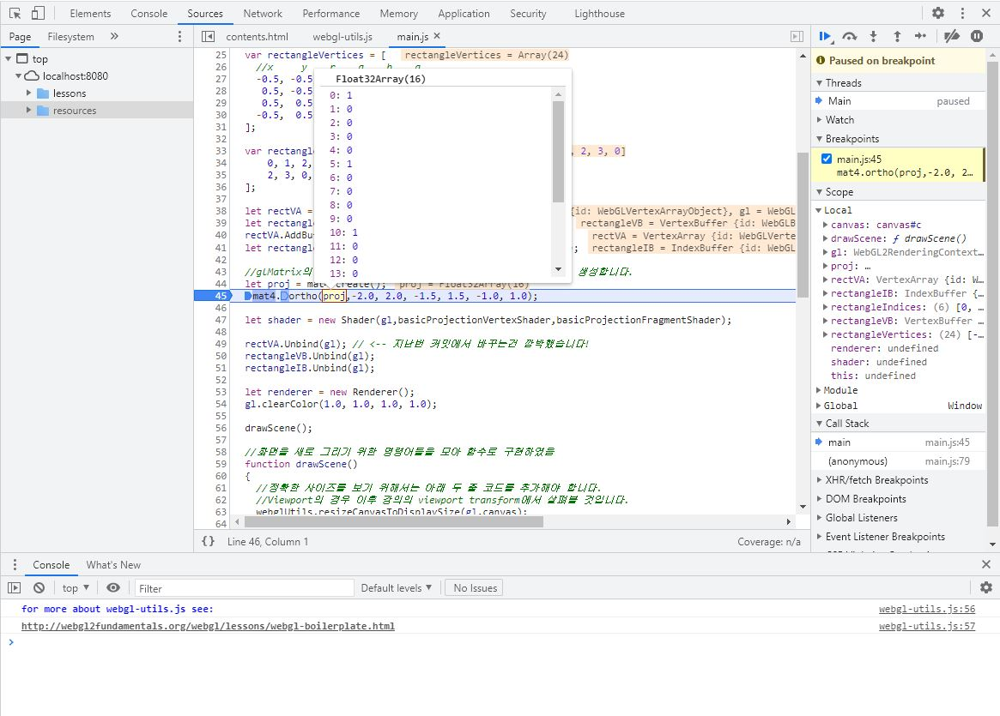

# 10. Using Matrix

이번 강의부터는 이론 강의시간에 배웠던 행렬 계산들을 화면을 그리는 데 적용해 볼 겁니다.

그러기 위해서 먼저 행렬 계산을 위한 외부 라이브러리인 [glMatrix](https://glmatrix.net/)를 사용할겁니다. glMatrix는 WebGL 구현을 위해 설계된 JS의 행렬 및 벡터 라이브러리입니다. 모든 구현은 `resources/glMatrix/gl-matrix.js`에 들어있습니다. 

이 라이브러리를 사용해 간단한 직교 투영(Orthographic Projection) 행렬을 만들어서 셰이더에 uniform으로 넘기고, 각 정점의 좌표를 이 투영행렬에 곱해줄 겁니다.

정점 셰이더에서 수행하는 MVP(Model, View, Projection) 행렬곱을 통한 클립공간 좌표로의 변환에 대해서는 이론 강의시간에 모두 설명드렸으니(또는 드릴 예정이오니) 여기에서는 꼭 필요한 내용을 제외하면 길게 적지 않겠습니다.

정작 `main.js`코드는 별로 변한것이 없는데, 추가된 파일들이 많아서 변경 항목들이 좀 됩니다. 이번 장에서는 아래 How to의 각 항목 앞에 어떤 파일을 보셔야 하는지 같이 적어 두겠습니다.

## How to

이전 코드에서 변화된 내용들을 보자면 아래와 같습니다.

---
1. [practice/main.js] 클래스 모듈 이동

    ```js
    import Shader  from '../_classes/Shader.js';
    import Renderer from '../_classes/Renderer.js';
    ```
    
    우선 지난 시간에 구현한 Shader와 Renderer 클래스를 별도의 모듈로 분리하고 `main.js`에서 import 하도록 해 두었습니다. 그런데 Shader.js에 좀 추가한것이 있어서 설명 드리겠습니다.

2. [`_classes/Shader.js] Shader 클래스 SetUniform 추가 구현

    ```js
    SetUniform1f(gl,name, val) 
    {
        let location = this.GetUniformLocation(gl,name);
        gl.uniform1f(location, val); 
    }
    
    SetUniform3f(gl,name, v0,v1,v2) 
    {
        let location = this.GetUniformLocation(gl,name);
        gl.uniform3f(location, v0, v1, v2); 
    }
    
    SetUniform4f(gl,name, v0,v1,v2,v3)
    {
        let location = this.GetUniformLocation(gl,name);
        gl.uniform4f(location, v0, v1, v2, v3); 
    }
        
    SetUniformMat4f(gl, name, mat) 
    {
        let location = this.GetUniformLocation(gl,name);
        gl.uniformMatrix4fv(location, false, mat);
    }
    
    SetUniform1i(gl, name, val) 
    {
        let location = this.GetUniformLocation(gl,name);
        gl.uniform1i(location, val);
    }
    ```

    지난 시간에는 그때 당장 사용할 `SetUniform4f()` 메소드만 구현했는데, 어차피 향후에 다른 것들도 사용하게 될 것이므로 미리 필요한 것들을 구현해 두었습니다.

    [Shader Uniform](../04_shader_uniform/README.md)에서 말씀드렸듯이 셰이더의 uniform 타입에 따라 개별적으로 `gl.uniformXXX()` 함수들이 존재하고, 이에 대한 래퍼들을 구현했다고 보시면 됩니다. 이제는 float, vec3, vec4, mat4, int 타입의 uninform에 값을 설정할 수 있게 되었습니다.

3. [`practice/main.js` 및 `_shader/basicProjectionVertex.js`] 셰이더 수정

    `main.js`에 보시면 아래와 같이 이번에는 지난 시간과는 다른 셰이더를 사용하고 있습니다. 향후 최종 커밋에서도 모든 설명문서를 문제없이 볼 수 있도록 하기 위해 셰이더들을 조금 많이 만들게 될것 같습니다. 항상 지금 예제가 어떤 셰이더를 사용하고 있는지 잘 확인해 주시면 감사하겠습니다. (다른 방식으로 구조화 되었으면 좋겠다는 개선 의견이 있으시면 언제든 환영합니다.)
    
    ```js
    import basicProjectionFragmentShader from '../_shaders/basicProjectionFragment.js';
    import basicProjectionVertexShader from '../_shaders/basicProjectionVertex.js';
    ```

    `basicProjectionFragmentShader`는 지난번과 동일한 코드이고, `basicProjectionVertexShader`가 변경되었습니다. 아래를 보시죠.

    ```glsl
    #version 300 es

    layout(location=0) in vec4 a_position; 
    layout(location=1) in vec4 a_color; 

    uniform mat4 u_projection; // <-- 4x4 투영 행렬을 uniform으로 받을 겁니다. (즉, CPU로부터 전달받을 겁니다.)

    void main() {
        gl_Position = u_projection * a_position; //이제 position은 u_projection에 의해 변환됩니다.
    }
    ```

    `a_position` attribute, 즉 정점의 좌표값에 `u_projection`을 곱하고 있습니다. `u_projection`은 uniform이니 CPU-side(지금까지는 RAM이라고 표현했는데 앞으로는 이렇게 표현하겠습니다.)에서부터 값이 전달될겁니다. 이제 정점 좌표를 그대로 표시하는 것이 아니고 `u_projection` 행렬곱으로 변환해서 표시하게 됩니다.

4. [`practice/contents.html` 및 `_currrent/main.js`] glMatrix 사용

    일단 `practice/contents.html`에서는 아래 라인을 통해 glMatrix 구현을 가져옵니다.

    ```html
    <script src="../../resources/glMatrix/gl-matrix.js"></script>
    ```

    `_currrent/main.js` 상단에서는 아래 코드를 통해 glMatrix 네임스페이스를 자동으로 인식하게 합니다. (아래 라인이 없으면 glMatrix.mat4와 같이 적어주어야 합니다.)

    ```js
    const {mat2, mat3, mat4, vec2, vec3, vec4} = glMatrix;
    ```

    실제 glMatrix 라이브러리를 사용해 행렬을 생성하는 코드는 아래와 같습니다.

    ```js
    let proj = mat4.create();
    mat4.ortho(proj,-2.0, 2.0, -1.5, 1.5, -1.0, 1.0);
    ```

    `create()` 메소드를 사용해 빈 행렬을 생성하고, 직교 투영 행렬을 만들어주는 `ortho()`함수를 사용해 행렬에 값들을 채웁니다. 직교 투영 자체는 원근 투영을 배우시면서 자연스럽게 알게 되실텐데, 자세한 내용은 아래 Useful Links의 직교 투영 관련 글을 한번 읽어보시면 좋을 것 같습니다.
    
    중요한 것은, 채운 값들이 저장될 빈 행렬을 함수의 첫 번째 인자로 넣어주어야 합니다. 꼭 이렇게 해야하는게 조금 이상해 보이실 수도 있는데 OpenGL에서 많이 사용되는 [GLM](https://github.com/g-truc/glm)과 동일한 컨벤션으로 구현해서 그런 것 같습니다. 자주 사용할테니 코드를 따라서 타이핑 해보시면서 익숙해 집시다.

    <span style="color:red">아래와 같이 웹브라우저에서 F12를 눌러서 개발자 도구를 열고 중단점을 설정하여 행렬에 저장된 값들을 손쉽게 확인할 수 있습니다. 앞으로는 자주 활용하게 될테니 사용에 익숙해 지시는 것이 좋을겁니다. 중단점을 건 상태에서 가장 하단의 콘솔창에 변수 이름을 타이핑해서 값을 출력해 보는것도 가능합니다.</span>

    

5. [`_currrent/main.js`] 행렬을 셰이더 uniform으로 전달

    ```js
    let blueColor = vec4.fromValues(0.0, 0.0, 1.0, 1.0);
    shader.SetUniform4f(gl,"u_color", blueColor[0], blueColor[1], blueColor[2], blueColor[3]);
    shader.SetUniformMat4f(gl, "u_projection", proj); 
    ```

    `drawScene()`함수 내부에 보면 위와 같이 `u_color`뿐만 아니라 `u_projection`에도 데이터를 전달하고 있는 것을 보실 수 있을겁니다. `u_color`는 vec4 uniform이므로 `SetUniform4f`를 사용하고, `u_projection`은 mat4 uniform이므로 `SetUniformMat4f`를 사용합니다. 
    
    데이터 전달 자체는 아주 쉽습니다. 그냥 `glMatrix.mat4` 타입인 `proj` 객체를 세 번째 인자로 넘겨주기만 하면 됩니다. 그러면 `proj`행렬에 저장된 값이 셰이더의 `u_projection`으로 들어가게 됩니다.

    추가적으로 glMatrix의 vec4의 간단한 사용 예제를 보여드리기 위해 색상 uniform의 전달도 약간 바꾸어 보았습니다. `blueColor`라는 vec4 타입 객체를 `fromValues()` 메소드를 사용해 만들었고, 인덱스를 사용해 각 x, y, z, w 컴포넌트의 값을 `SetUniform4f()`에 인자로 전달합니다.

6. [`_currrent/main.js`] 뷰포트 크기 조절

    ```js
    webglUtils.resizeCanvasToDisplaySize(gl.canvas);
    gl.viewport(0, 0, gl.canvas.width, gl.canvas.height);
    ```

    흐름상 5번에서 설명한 코드가 더 밑에 있지만 먼저 설명드렸네요. `drawScene()`함수 초반부에 보면 위와 같은 두 줄의 코드가 추가된 것을 보실 수 있습니다. 뷰포트 변환에 대해서는 아마 좀 더 후에 (이론 강의에서) 설명 드릴건데요, 여기서 먼저 한차례 간단히 설명을 드리겠습니다.

    이전 강의까지 사각형을 보면서 뭔가 이상한 점을 혹시 느끼셨었나요? 우리는 사각형의 좌표를 정사각형으로 정의했는데 화면에는 좌우로 긴 직사각향으로 표시되고 있었습니다! (충격) 그리고 지금 상태에서는 보기 어렵지만, 만일 캔버스의 크기가 변하면 직사각형의 크기도 함께 변했을겁니다. 이러한 효과가 필요한 경우도 있겠지만, 대부분의 경우 이것은 잘못된 겁니다. 정사각형을 그리면, 화면에도 정사각형으로 표시되어야 맞는거죠.

    이렇게 되었던 원인은 두 가지인데요, 하나는 정점의 좌표를 그대로 클립공간 좌표로 변환하지 않고 사용했기 때문이고, 또 하나는 클립공간 좌표를 스크린공간 좌표로 변환하는 법을 알려주지 않았기 때문입니다. 아직 뷰포트 변환을 배우지 않으셨을 것으로 예상되니, 위 두줄의 코드와 proj 행렬을 사용해 이 문제들을 해결해서 올바로 보이게 만들었다 정도로 보시고 넘어가시면 되겠습니다.

---

`http://localhost:8080/lessons/practice/contents.html`(또는 `http://localhost:8080/lessons/10_using_matrix/contents.html`)에 접속해 보시면 파란색으로 "정사각형"이 표시되는 것을 보실 수 있습니다.

좀 더 재미있는 작업을 하기 전에 필요한 행렬 계산 라이브러리의 사용 준비와 아주 간단한 사용 예를 알아보았습니다. uniform으로 행렬을 셰이더에 넘기는 방법을 정확하게 숙지해 두시는 것이 중요할 것으로 생각됩니다. 

다음 강의에서는 3D 어플리케이션에 걸맞게 W,A,S,D 키를 사용해 카메라를 움직이도록 장면을 만들면서 뷰 행렬에 대해 실습을 통해 알아보도록 합시다.

## Quiz

1. 개발자 도구를 사용하거나 콘솔 창에 출력할 수 있도록 하는 코드를 통해 gl.canvas.width의 크기를 확인해 보고, `ortho()` 함수의 인자들을 바꾸어 가며 사각형이 어떻게 변하는지 관찰해 보세요.

    ```js
    //콘솔창에 값을 출력하도록 하는 코드
    console.log(gl.canvas.width);
    console.log(gl.canvas.height);
    ```

## Advanced

1. HTML 캔버스의 크기는 CSS를 사용해 정의하는 것이 좋습니다. 현재 예제에서 사용하는 CSS은 `resources/webgl-tutorials.css`에 있습니다. 창의 크기를 바꾸고, 6번에서 설명한 코드를 주석처리하여 어떤 결과가 나오는지 보세요. 또한 proj 행렬이 왜 가로길이 4, 세로길이 3으로 설정되었는지 생각해 보세요.

## Useful Links

- [glMatrix](https://glmatrix.net/): Documentation이 아주 쉽고 간단하니 잘 사용하시길 바랍니다.
- [GLM](https://github.com/g-truc/glm)
- [직교 투영(WebGL2Fundamentals)](https://webgl2fundamentals.org/webgl/lessons/ko/webgl-3d-orthographic.html)
- [캔버스 리사이징(WebGL2Fundamentals)](https://webgl2fundamentals.org/webgl/lessons/ko/webgl-resizing-the-canvas.html)

---

[다음 강의](../11_input_handling_pt1_color_change/)

[목록으로](../)