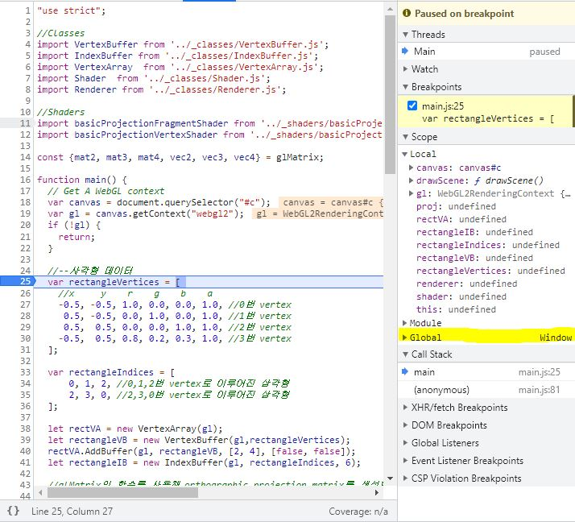
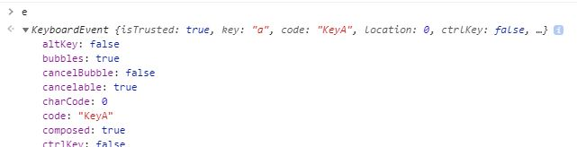

# 11. Input Handling - Color Change

W,A,S,D로 카메라를 움직이기 위한 구현에 앞서, 우선 간단히 입력 핸들링에 대해 알아봅시다. (윈도우즈 프로그래밍 또는 다른 이벤트 기반 GUI 프로그래밍을 해 보신 분이라면 조금 더 쉽게 이해하실 수 있을겁니다.)

이번 예제에서는 사용자가 W,A,S,D 키를 누르면 사각형의 색상이 변화되도록 코드를 작성해 볼겁니다. 사용자의 입력에 따라서 출력이 변화되는 [인터랙티브 프로그램](../5_shader_uniform_interactive/README.md)를 이미 작성해 본 바 있습니다. 해당 예제에서는 슬라이더 UI의 입력값이 따라 화면이 변화되었는데요, 이번에는 키보드 입력에 따라 화면이 변한다는 것만 다릅니다.

추가적으로 마우스의 좌표를 얻어오는 부분까지 해서 예제 코드를 구현했습니다. 다음 예제에서 카메라를 컨트롤 할 때에는 마우스 입력도 활용할겁니다.

## How to

이전 코드에서 변화된 내용들을 보자면 아래와 같습니다.

---
1. 입력에 따라 변화되는 값을 저장할 변수 선언

    ```js
    let red = 0.0;
    let green = 0.0;
    let mouseX = 0.0;
    let mouseY = 0.0;
    ```
    
    `drawScene()` 호출 직전에 위와 같이 네 개의 변수를 선언해 두었습니다. `red`, `green`값은 W,A,S,D 입력이 들어오면 변수의 값이 변하도록 할겁니다. `mouseX`와 `mouseY`는 마우스 커서의 위치를 저장하도록 할겁니다.

    추가적으로 코드 전체적으로 `var`을 모두 `let`으로 수정하였습니다.

2. `drawScene()`의 uniform 전달 코드 수정

    ```js
    shader.SetUniform4f(gl,"u_color", red, green, 0.0, 1.0);
    ```

    `drawScene()` 내부에서, vec4를 통해 값을 전달하던 코드를 위와 같은 코드로 수정하였습니다. `red`와 `green` 변수의 값이 변하면, 변한 값이 위 코드에 의해 셰이더 uniform으로 전달되고, 프래그먼트 셰이더 연산에 의해 화면에 표시되는 사각형의 색상이 변할겁니다.

3. event listener(콜백함수) 부착

    ```js
    window.addEventListener('keydown', KeyboardEventHandler);
    window.addEventListener('mousemove', MouseMoveEventHandler);
    ```

    이번 장의 핵심 내용입니다. 여기서 `window` 객체는 우리가 선언하지 않았는데 사용하고 있습니다. `window`는 현재 스크립트가 실행되고 있는 창을 나타내는 객체입니다. 즉 웹 브라우저를 띄웠을 때, 컨텐츠가 표시되는 그 창 전체를 참조하고 있는 "전역 변수"입니다. 개발자 도구를 사용해서 아무데나 중단점을 걸고 오른쪽을 보시면 아래 그림과 같이 Global에 Window가 들어있는 것을 볼 수 있습니다.

     

    이 `window` 객체에 특정 이벤트가 발생할 경우에 호출할 콜백 함수를 등록할 수 있습니다. 위 두줄의 코드가 바로 콜백함수를 등록하는 코드입니다. `window`에서 키보드 입력이 발생하면 `KeyboardEventHandler`함수를, 마우스 움직임이 발생하면 `MouseMoveEventHandler`함수를 호출하도록 등록해 두었습니다.

    이 외에도 다양한 [이벤트 유형](https://developer.mozilla.org/ko/docs/Web/Events)에 대해 콜백 함수를 등록할 수 있으니 관심 있으신 분은 살펴 보시길 바랍니다.

4. 키보드 입력 콜백함수 구현

    ```js
    function KeyboardEventHandler(e)
    {
        if(e.code == "KeyA") // 'A' key down
        {
            red -= 0.1;
        }
        if(e.code == "KeyD") // 'D' key down
        {
            red += 0.1;
        }
        if(e.code == "KeyW") // 'W' key down
        {
            green += 0.1;
        }
        if(e.code == "KeyS") // 'S' key down
        {
            green -= 0.1;
        }
        drawScene();
    }
    ```

    키보드 입력 콜백함수는 위와 같이 구현했습니다. 콜백으로 등록하면, 인자로 넘어오는 `e` 객체에 해당 이벤트와 관련한 다양한 정보가 들어있도록 구현되어 있습니다. `e.code`를 통해 눌린 키가 어떤 키인지를 알 수 있습니다. 
    
    여기서는 코드가 "KeyA", "KeyD", "KeyW", "KeyS"인 경우 `red`값을 0.1씩 더하거나 빼기, `green`값을 0.1씩 더하거나 빼도록 구현해 두었습니다. 중요한 것은 마지막의 `drawScene()` 호출입니다. 사용자가 키보드를 눌렀을때 변화된 값을 인터랙티브하게 보여주기 위해서는 이미지를 새로 그려주어야 합니다. 따라서 `drawScene()`의 호출이 필요합니다.

    `e`에 어떤 다른값들이 들어있는지 궁금하신가요? 개발자 도구를 사용해 아래와 같이 손쉽게 확인해 볼 수 있습니다. 개발자 도구를 잘 활용하시기를 바랍니다.

    

5. 마우스 이동 콜백함수 구현

    ```js
    function MouseMoveEventHandler(e)
    {
        mouseX = e.clientX;
        mouseY = e.clientY;
        console.log("Mouse position : (" + mouseX + "," + mouseY + ")");
    }
    ```

    마우스의 경우 움직일 경우(`mousemove`) 콜백함수가 호출되도록 되어 있습니다. `e`에는 현재 마우스 커서의 위치 등등이 저장되어 있습니다. 이중 우리는 `clientX`와 `clientY`값으로 마우스 커서의 위치를 얻어와 `mouseX`와 `mouseY`에 저장해 두고 그 값을 콘솔창에 출력해 확인해 봅니다.

    현재는 마우스 커서의 움직임이 화면을 그리는 데는 영향을 미치지 않기 때문에 `drawScene()`을 호출하도록 하지는 않았습니다.

---

`http://localhost:8080/lessons/practice/contents.html`(또는 `http://localhost:8080/lessons/11_input_handling_color_change/contents.html`)에 접속해 보시면 검은색 사각형이 나타나고, D키를 꾹 누르면 빨간색으로 변합니다. A키를 꾹 누르면 다시 검은색으로 변하고, 그 상태에서 W키를 꾹 누르면 초록색으로 변하는 등, 의도하는 대로 색상이 변하는 것을 보실 수 있습니다.

W,A,S,D 키를 사용해 카메라를 움직이기 전에 키보드와 마우스 입력을 탐지하여 콜백함수를 호출하는 간단한 예제를 먼저 살펴 보았습니다. 다음 예제에서는 Camera 클래스를 구현하여 키보드 입력과 마우스 입력에 따른 뷰 행렬 갱신을 통해 카메라 위치를 이동하는 코드를 구현해 봅시다. 이제 진정한 3D의 시작입니다.

## Quiz

1. `red`와 `green`값에 제한을 두지 않아서 0 이하, 1 이상의 값을 가질 수 있습니다. 이를 방지하도록 코드를 수정해 보세요.

## Advanced

1. `window.addEventListener()` 대신 `canvas.addEventListener()`로 구현할 수도 있습니다. 즉, window가 아닌 캔버스 객체에 이벤트 리스너를 부착하는 것입니다. 어떤 차이가 있을까요?

2. [애니메이션 관련 글](https://webgl2fundamentals.org/webgl/lessons/ko/webgl-animation.html)도 한번 읽어 보시고, drawScene()을 매번 호출하지 않는 방식으로 코드를 수정해 보세요.

## Useful Links

- [이벤트 유형](https://developer.mozilla.org/ko/docs/Web/Events)
- [WebGL 애니메이션(WebGL2Fundamentals)](https://webgl2fundamentals.org/webgl/lessons/ko/webgl-animation.html)
- [WebGL 키보드 입력(WebGL2Fundamentals)](https://webgl2fundamentals.org/webgl/lessons/ko/webgl-tips.html#tabindex)

---

[다음 강의](../11_input_handling_camera_control/)

[목록으로](../)