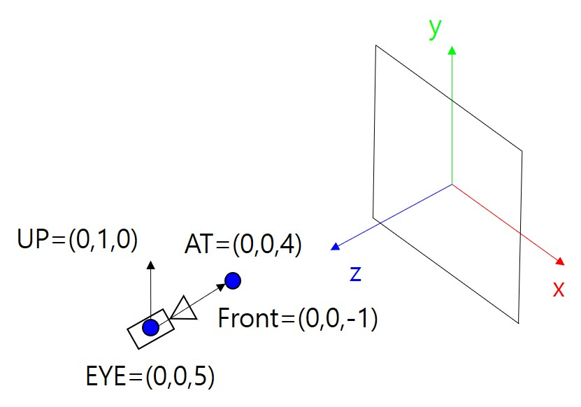

# 11. Input Handling - Camera Control

이제 W,A,S,D로 카메라를 움직여 보도록 하겠습니다. 카메라를 움직이는 것은 대략적으로 아래와 같은 과정을 통해 구현됩니다.

1. 사용자의 입력 이벤트를 탐지
2. 입력 이벤트에 따라 카메라의 위치 및 방향값을 갱신
3. 갱신된 위치 및 방향값을 기반으로 뷰 행렬 계산
4. 뷰 행렬을 셰이더로 전달
5. 그리기

입력 이벤트를 탐지하여 입력이 발생할 때마다 2-5의 과정을 수행하는 함수를 호출하는 방법은 이전 예제에서 이미 살펴보았습니다. 또한 4 과정은 셰이더의 uniform으로 투영 행렬을 전달하는 예제를 이미 살펴본 바 있습니다. 그리기는 지금까지 계속 해봤으니 더이상 말할 필요 없겠죠.

이 장의 핵심 코드는 2-3 과정을 수행하는 Camera 클래스를 구현하는 데 있습니다. 아래에서 Camera 클래스의 구현을 하나씩 살펴보면서 어떠한 일들이 일어나는지 하나씩 설명해보도록 하겠습니다.

## How to

이전 코드에서 변화된 내용들을 보자면 아래와 같습니다. 해당하는 파일은 번호 목록의 앞에 써 놓았습니다.

---
1. [`_classes/Camera.js`] Camera 클래스 생성자

    ```js
    constructor(eye, up, yaw, pitch, movespeed, turnspeed)
    {
        this.eye = eye; this.worldup = up; this.yaw = yaw; this.pitch = pitch;
        this.movespeed = movespeed; this.turnspeed = turnspeed;
        this.front = [0.0,0.0,-1.0]; //바라보는 방향. at = eye + front로 계산
        this.lastMouseX = -1.0; 
        this.lastMouseY = -1.0;

        this.right = vec3.create();
        this.up = vec3.create();
        this.Update();
    }
    ```
    
    생성자에서는 `eye`(카메라의 초기 위치), `up`(카메라의 정수리 방향), `yaw`(카메라의 수평방향 각도), `pitch`(카메라의 수직방향 각도), `movespeed`와 `turnspeed`를 인자로 받아서 필드에 저장합니다. [Yaw, Pitch, Roll 용어에 관해서는 이 그림을 보시면 바로 이해가 되실겁니다.](https://happy8earth.tistory.com/492)

    이론 강의에서 카메라 좌표계를 기술하는 데 EYE, AT, UP이 사용된다는 것을 배운 바 있습니다. EYE와 UP은 지금 여기서 인자로 받고 있고, AT이 빠져있는데요, 우리는 이 AT을 계산하기 위해 `front`라는 방향 벡터를 대신 사용할겁니다. AT은 `eye` + `front`로 계산됩니다.

    `lastMouseX`와 `lastMouseY`는 마우스 커서의 이동량을 계산하는 데 사용될 겁니다. 이전 강의에서 보셨지만 이벤트 데이터에는 마우스의 좌표값이 들어옵니다. 따라서 사용자가 마우스를 얼마나 움직였는지는 현재 좌표에서 이전 좌표를 뺀 값을 계산하여 얻어와야 합니다. 따라서 이전 좌표값을 저장해 두기 위해 `lastMouseX`와 `lastMouseY`를 선언하였습니다.

    `right`와 `up` 벡터가 추가적으로 존재하는데요, 이는 이론강의 시간에 배웠던 `u` 벡터와 `v` 벡터에 해당합니다. 잠깐! 위에서 인자로 up을 받았는데 그 up과 이 `up`은 다른 걸까요? 네 다릅니다. 보시면 인자로 받은 `up`은 사실 `worldup`이라는 벡터에 저장해 두었는데요, 이는 강의자료의 아래 그림을 보시면 이해가 되실겁니다. 우측 상단에 보시면 UP 벡터와 계산된 `v` 벡터가 다른 것이 보이시죠? 카메라게 roll 또는 pitch각이 존재한다면, 정수리의 방향이 (0,1,0)이 아니게 됩니다. 따라서 실제로 그때그때 계산되는 카메라의 `v` 방향은 우리가 초기에 정해준 UP 방향과는 다릅니다. 정리해 보자면 아래와 같습니다.
    
    * 인자로 받은 up = `this.worldup` = 아래 그림의 검은색 UP 벡터
    * `this.up` = 아래 그림의 `v` 벡터
    * `this.right` = 아래 그림의 `u` 벡터
    * (추가로) `this.front` = 아래 그림의 `-n`벡터(`n`벡터의 반대방향)

    

    생성자 마지막에 `Update()` 함수를 호출하는데 먼저 이 함수부터 봅시다.

2. [`_classes/Camera.js`] Camera 클래스 `Update()` 메소드

    ```js
    Update()
    {
        this.front[0] = Math.cos(this.yaw * Math.PI / 180) * Math.cos(this.pitch * Math.PI / 180);
        this.front[1] = Math.sin(this.pitch * Math.PI / 180);
        this.front[2] = Math.sin(this.yaw * Math.PI / 180) * Math.cos(this.pitch * Math.PI / 180)
        vec3.normalize(this.front,this.front);
        
        vec3.cross(this.right, this.front, this.worldup)
        vec3.normalize(this.right,this.right);

        vec3.cross(this.up, this.right, this.front)
        vec3.normalize(this.up,this.up);
    }
    ```

    `Update()`에서는 우선 `front` 벡터(=`-n` 벡터)를 계산합니다. `front` 벡터는 yaw값과 pitch값을 가지고 계산되는데, 두 각도가 있으면 구 위의 한 점의 위치를 특정할 수 있습니다. 잘 모르시는 분은 [구면 좌표계](https://ko.wikipedia.org/wiki/%EA%B5%AC%EB%A9%B4%EC%A2%8C%ED%91%9C%EA%B3%84) 글을 읽어 보세요. 원점과 그 구위의 한 점을 잇는 벡터가 `front` 벡터가 됩니다. yaw와 pitch각을 바꾸면 `front` 벡터의 방향이 변하게 될겁니다.

    다음으로 `right`벡터(=`u` 벡터)를 계산합니다. 수식에서는 UP과 `n`을 외적(Cross product)했는데요, 우리는 `n` 대신 `-n`을 `front`로 가지고 있으므로 외적 순서를 바꾸어 -를 상쇄해 줍니다.

    마지막으로 `up`벡터(=`v` 벡터)를 계산합니다. 마찬가지로 `n`과 `u`의 외적 순서를 바꾸어 -를 상쇄해 올바른 결과가 나오도록 해 줍니다.

    glMatrix 라이브러리 함수를 호출하면 첫 번째 인자로 넘겨준 객체에 결과가 저장된다는것을 잊지 마세요. 가독성이 조금 떨어지지만, 규칙에 따르도록 합시다.

3. [`_classes/Camera.js`] Camera 클래스 `KeyControl()` 메소드

    ```js
    KeyControl(e)
    {
        if(e.code == "KeyA") // 'A' key down
        {
            let scaledVec = vec3.create();
            vec3.scale(scaledVec, this.right, this.movespeed);
            vec3.sub(this.eye, this.eye, scaledVec);
        }
        if(e.code == "KeyD") // 'D' key down
        {
            let scaledVec = vec3.create();
            vec3.scale(scaledVec, this.right, this.movespeed);
            vec3.add(this.eye, this.eye, scaledVec);
        }
        if(e.code == "KeyW") // 'W' key down
        {
            let scaledVec = vec3.create();
            vec3.scale(scaledVec, this.front, this.movespeed);
            vec3.add(this.eye, this.eye, scaledVec);
        }
        if(e.code == "KeyS") // 'S' key down
        {
            let scaledVec = vec3.create();
            vec3.scale(scaledVec, this.front, this.movespeed);
            vec3.sub(this.eye, this.eye, scaledVec);
        }
    }
    ```

    키보드 입력이 발생하면 호출할 함수입니다. 'A' 키 입력이 들어오는 경우만 봅시다. (나머지는 유사합니다.)
    
    먼저 `right` 벡터와 `movespeed`를 곱해서 `scaledVec`을 계산합니다. `right`벡터는 정규화(normalization)을 해 두었으므로 길이가 1입니다. 따라서 우리가 `movespeed`에 1 이상의 값을 할당해 두었다면 곱한 벡터의 길이가 길어질거고, 1 이하의 값을 할당해 두었다면 길이가 짧아질겁니다.

    그리고 나서 이 `scaledVec`을 `eye` 벡터에 더해줍니다. 즉, `eye` 위치를 이동하는 것이고, 이는 카메라를 움직이는 것과 같습니다. 물론 이러한 움직임의 결과는 우리가 `eye`위치를 반영한 뷰 행렬을 계산해서 GPU에 넘겨주고 셰이더가 이를 기반으로 그리기를 수행하기 전까지는 나타나지 않습니다.

    결과적으로 `movespeed`가 클수록 키보드 한번 입력으로 더 먼거리를 이동하기 때문에 이동속도가 빨라지는 것과 같은 효과를 나타냅니다. 나머지 D,W,S 키 입력에 대해서는 수행하는 계산 코드가 의미적으로 맞는지 스스로 한번 점검해 보세요.

4. [`_classes/Camera.js`] Camera 클래스 `MouseControl()` 메소드

    ```js
    MouseControl(e)
    {
        let currentMouseX = e.clientX;
        let currentMouseY = e.clientY;
        
        if(this.lastMouseX == -1.0)
        {
            this.lastMouseX = currentMouseX;
            this.lastMouseY = currentMouseY;
        }
        
        let mouseChangeX = (currentMouseX - this.lastMouseX) * this.turnspeed;
        let mouseChangeY = (currentMouseY - this.lastMouseY) * this.turnspeed;
        
        this.yaw += mouseChangeX;
        this.pitch -= mouseChangeY;
        
        if(this.pitch > 89.0) this.pitch = 89.0;
        if(this.pitch < -89.0) this.pitch = -89.0;
        
        this.Update();
        
        this.lastMouseX = currentMouseX;
        this.lastMouseY = currentMouseY;
    }
    ```

    조금 길어 보이지만 사실 간단합니다. 현재 마우스 좌표를 `currentMouseX/Y`에 저장해 두고, `lastMouseX/Y`에서 빼서 이동량(`mouseChangeX/Y`)을 계산합니다. 이때 마우스가 조금만 움직여도 각도를 많이 바꾸고 싶다면 `turnspeed`에 큰값을 주어 `mouseChangeX/Y`가 더 큰 값을 갖도록 하면 됩니다.

    이렇게 계산된 이동량으로 `yaw`, `pitch`각을 바꾸어주면 됩니다. 이렇게 바뀐 `yaw`와 `pitch`를 통해 `front` 벡터 방향이 변하게 되고, 이는 카메라가 바라보는 방향이 바뀌는 것을 의미합니다.

    `pitch`값이 90도 또는 -90도 이하가 되면 마치 고개가 뒤로 넘어가는듯한 상태가 되어 `yaw` 방향이 바뀌고 컨트롤이 어려워지기 때문에 이러한 현상을 방지하고자 값에 제한을 두었습니다.

    이후 갱신된 `yaw`와 `pitch`값으로 `u`,`v`,`n`을 다시 계산하도록 `Update()`를 호출해 준 후, 다음 계산을 위해 현재 커서 위치를 `lastMouseX/Y`에 저장해주면 됩니다.

5. [`_classes/Camera.js`] Camera 클래스 `CalculateViewMatrix()` 메소드

    ```js
    CalculateViewMatrix()
    {
        let cameramat = mat4.create();
        let at = vec3.create();
        vec3.add(at, this.eye,this.front)
        mat4.lookAt(cameramat, this.eye, at, this.up);
        return cameramat;
    }
    ```

    카메라 클래스 구현의 마지막은 뷰 행렬을 계산하여 반환하는 `CalculateViewMatrix()` 메소드입니다. 처음에 이야기한것처럼 AT은 `eye + front`로 계산되며, 현재의 EYE, AT, UP 값을 가지고 뷰 행렬을 계산하는 것은 우리가 직접 구현할 필요 없이 glMatrix에서 제공하는 `lookAt()` 함수를 사용하면 됩니다.

    실제 사용은 이처럼 단순합니다만 EYE, AT, UP이 무엇이고 이를 통해 뷰 행렬이 어떻게 계산되는지 그 과정을 모른다면 위와 같이 키보드/마우스 입력으로 카메라를 움직이는 것을 구현하지도 못하고, 다른 사람이 구현된 코드를 봐도 제대로 이해하지 못했을겁니다.

---

이제 Camera 클래스의 구현을 이해하였으니 이를 사용하는 나머지 코드의 변화를 살펴봅시다.

---

6. [`_shaders/basicViewProjectionVertex.js`] 정점 셰이더 수정

    ```glsl
    #version 300 es

    layout(location=0) in vec4 a_position; 
    layout(location=1) in vec4 a_color; 

    uniform mat4 u_projection;
    uniform mat4 u_view; //Camera 클래스에서 반환된 view행렬

    void main() {
        gl_Position = u_projection * u_view * a_position; 
    }
    ```

    이제 CPU-side에서 키보드/마우스 이벤트가 발생하여 갱신된 뷰 행렬을 셰이더에서 받아서 사용할 수 있도록 수정하였습니다. uniform인 `mat4` 타입의 `u_view`를 추가로 선언해 주었고, `main()`에서는 `a_position`에 먼저 `u_view`를 곱한 뒤 `u_projection`을 곱한 결과를 `gl_Position`에 저장하도록 하였습니다. 따라서 이제 정점의 클립공간 좌표는 뷰 행렬까지 적용되어 계산됩니다.

    프래그먼트 셰이더는 이전 강의의 코드와 동일합니다.

7. [`main.js`] import

    ```js
    import Camera from '../_classes/Camera.js';

    ...

    import basicViewProjectionFragmentShader from '../_shaders/basicViewProjectionFragment.js';
    import basicViewProjectionVertexShader from '../_shaders/basicViewProjectionVertex.js';
    
    ...

    let shader = new Shader(gl,basicViewProjectionVertexShader,basicViewProjectionFragmentShader);
    ```

    새로 구현한 Camera 클래스와 셰이더들을 사용합니다.

8. [`main.js`] `mainCamera` 생성

    ```js
    let eye = [0.0, 0.0, 5.0];
    let up = [0.0, 1.0, 0.0];
    let yaw = -90.0;
    let pitch = 0.0;
    let movespeed = 0.05;
    let turnspeed = 0.5;
    let mainCamera = new Camera(eye,up,yaw,pitch,movespeed,turnspeed);
    ```

    Camera 클래스 생성자에 필요한 인자들을 넣어주어 `mainCamera` 객체를 생성합니다. 초기값을 통해 아래 그림과 같은 상황이 설정됩니다. (`yaw`=-90, `pitch`=0 각도를 통해 `front`가 (0,0,-1)이 되는것이 맞는지 확인해보세요.) (정점 위치의 Z좌표로는 값을 넘겨주지 않았기때문에 기본값인 0이 들어가있는 상태입니다.)

    </img>

9. [`main.js`] 투영행렬 정의

    ```js
    let fovRadian = 90.0 * Math.PI / 180;
    let aspect = gl.canvas.clientWidth/gl.canvas.clientHeight;
    let proj = mat4.create();
    mat4.perspective(proj, fovRadian, aspect, 0.1, 100.0);
    ```

    위와 같은 FOV(Field of View), aspect ratio 및 near, far 파라메터로 절두체를 정의하고 투영 행렬을 만듭니다. 투영 행렬을 만드는 것도 직접 할 필요 없이 glMatrix가 제공하는 `perspective()` 함수를 사용해 손쉽게 생성 가능합니다.

    혹시 아직 투영 행렬에 대해 배우지 않은 시점이라면 이론 강의를 들으신 후에 다시 돌아와서 보시면 될 것 같습니다.

10. [`main.js`] 셰이더로 uniform 전달

    ```js
    let view = mainCamera.CalculateViewMatrix();
    shader.SetUniformMat4f(gl, "u_view", view);
    shader.SetUniformMat4f(gl, "u_projection", proj); 
    ```

    `drawScene()` 안에서는 매 그리기마다 갱신된 뷰 행렬을 Camera 클래스의 메소드를 통해 얻어오고(`CalculateViewMatrix()`) 이를 셰이더로 전달합니다. 반면 투영 행렬의 경우 한번 정의된 후에 변경이 일어나지 않기 때문에 초기화 시점에 정의된 행렬을 그대로 넘겨줍니다. (사실 이러한 경우에는 투영 행렬을 `drawScene()` 내부에서 전달할 필요 없이 초기화 시점에 한번만 전달해 주어도 됩니다. 여기에서는 uniform 설정 코드를 한 군에데 모아서 보여드리기 위해 이렇게 작성한 것입니다.)

11. [`main.js`] 이벤트 리스너 등록

    ```js
    window.addEventListener('keydown', KeyboardEventHandler);
    window.addEventListener('mousemove', MouseMoveEventHandler);

    function KeyboardEventHandler(e)
    {
        mainCamera.KeyControl(e); 
        drawScene(); 
    }

    function MouseMoveEventHandler(e)
    {
        mainCamera.MouseControl(e);
        drawScene();
    }
    ```

    키보드와 마우스 이벤트 리스너 부분입니다. 이제는 카메라의 `KeyControl()`과 `MouseControl()`이 입력 이벤트를 핸들링하므로 해당 이벤트들이 발생하면, `mainCamera()`의 각각 메소드를 호출하고, 화면을 새로 그리도록만 하면 됩니다. 물론 메소드를 호출할 때 이벤트 데이터를 인자로 넘겨주는 것을 잊으시면 안됩니다.

---

`http://localhost:8080/lessons/practice/contents.html`(또는 `http://localhost:8080/lessons/11_input_handling_pt2_camera_control/contents.html`)에 접속해 보시면 빨간색 사각형이 보이고, 마우스를 움직이면 카메라를 사용해 둘러볼 수 있으며 W,S,A,D를 사용해 카메라를 움직일 수 있습니다! 이제 드디어 사각형이 3차원 공간상 어느 위치에 놓여있다는 느낌이 드네요.

멋있고 화려한 게임에서 볼 수 있는 장면과 지금 우리가 그리고 있는 (0,0,0)에 놓여진 사각형과는 어마어마한 차이가 있지만, 3차원 장면을 그리는 원리는 동일합니다. 공간상에 물체를 구성하는 정점의 좌표들과 이를 바라보는 뷰 행렬을 병렬 계산이 가능한 GPU에 전달합니다. 그리고 정점 셰이더 프로그램을 실행하여 뷰(+투영) 행렬과 정점 좌표를 곱해 최종 결과물인 2차원 이미지의 어떤 위치에 정점들이 나타나야 할 지 그 좌표를 계산하는 것입니다.

(0,0,0)이 아닌 다른 위치에 물체가 놓인 경우엔 어떻게 해야 할까요? 또한 삼각형의 내부 색상을 계산하기 위해 프래그먼트 셰이더는 어떤 방식으로 연산을 수행하는 걸까요? 아직 확인해 봐야 할 것들이 많습니다.

일단 다음 강의에서 "프레임"이라는 개념에 대해 조금 더 알아보고 나서 나머지 내용을 진행해 보겠습니다.

## Quiz

1. W,A,S,D 를 사용해 전후좌우로 이동하는 것 이외에, Q,E 키를 사용해서 상하로 이동이 가능하도록 구현해 보세요.

2. Camera 클래스의 `MouseControl()` 메소드에서 아래 조건에 대해서는 상세히 설명하지 않았습니다. 아래 조건이 왜 필요하며, 없으면 어떤 문제가 발생할까요?

    ```js
    if(this.lastMouseX == -1.0)
    {
        this.lastMouseX = currentMouseX;
        this.lastMouseY = currentMouseY;
    }
    ```

## Advanced

이전 강의와 동일한 질문이 이 강의자료에도 해당됩니다.

1. `window.addEventListener()` 대신 `canvas.addEventListener()`로 구현할 수도 있습니다. 즉, window가 아닌 캔버스 객체에 이벤트 리스너를 부착하는 것입니다. 어떤 차이가 있을까요?

2. [애니메이션 관련 글](https://webgl2fundamentals.org/webgl/lessons/ko/webgl-animation.html)도 한번 읽어 보시고, drawScene()을 매번 호출하지 않는 방식으로 코드를 수정해 보세요.

## Useful Links

- [Yaw, Pitch, Roll](https://happy8earth.tistory.com/492)
- [구면 좌표계](https://ko.wikipedia.org/wiki/%EA%B5%AC%EB%A9%B4%EC%A2%8C%ED%91%9C%EA%B3%84)

---

[다음 강의](../12_model_matrix_and_load_obj/)

[목록으로](../)