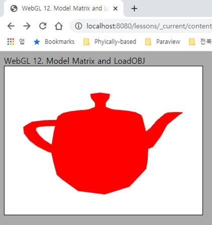
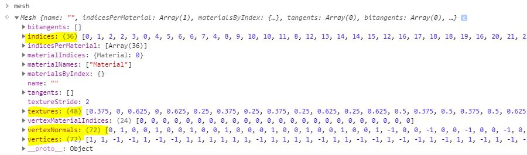
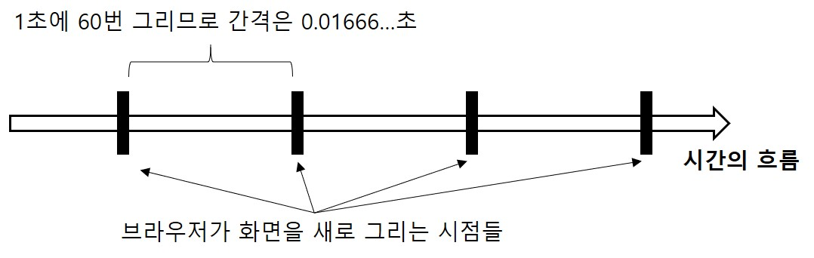
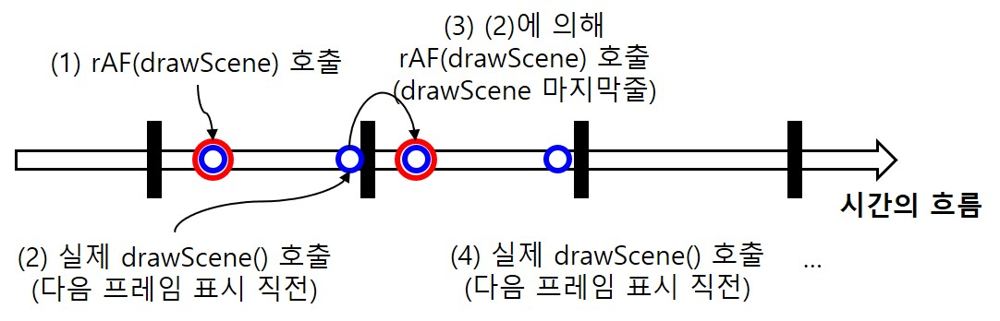

# 12. Model Matrix and LoadOBJ

이제 모델 행렬의 적용과, 외부 파일에서부터 정점 정보를 읽어오는 기능을 추가해 보도록 하겠습니다. 은근히 바뀐 부분이 많으니 잘 따라 오시길 바라겠습니다. 먼저 이번 강의에서 바뀐 내용에 대한 개략적인 설명은 아래와 같습니다.

## Basic Shader

먼저 셰이더 부분에서는, 지금까지와는 달리, 최소한의 모든(뭔가 역설적이지만) 기능이 구현된 셰이더를 작성했습니다. 뷰 행렬과 투영행렬 뿐만 아니라 모델 행렬(강의자료에서는 world matrix로 지칭)까지 모두 적용한 변환을 수행하도록 기능을 추가합니다. 따라서 우리가 그리고자 하는 모델이 항상 원점에만 위치해 있는것이 아니고, 월드 공간상 어느 위치에, 어떤 자세로 놓여있는지까지 기술할 수 있게 될겁니다.

뿐만 아니라 정점 데이터가 위치, 텍스처 좌표 및 법선 정보를 CPU-side로부터 attribute로 입력받도록 확장했습니다. 텍스처 좌표를 통해 이후 강의에서 살펴볼 텍스처 이미지를 삼각형의 색상을 결정하는 데 사용하고, 법선 정보를 빛에 의한 색상 변화를 계산하는 데 사용합니다. 내부적으로 어떻게 계산되는지는 이론 강의 및 이후 코드에서 살펴볼 것이니 지금은 몰라도 걱정하지 마세요. 다만, attribute가 무엇인지, 버퍼로부터 데이터를 어떻게 받는지는 이미 배운 내용이니 코드를 보셨을때 데이터가 어떻게 셰이더로 전달되겠구나 하는 건 감이 잡히셔야 합니다.

이렇게 MVP(Model, View, Projection) 행렬을 통해 클립 공간 좌표로 변환하는 것, 그리고 각 정점의 위치뿐만 아니라 텍스처 좌표와 법선 데이터를 받아 사용하는것이 셰이더의 일반적인 구조라고 보시면 됩니다. 그래서 이름도 앞의 길었던 수식들을 떼고, 간단히 Basic Shader라고 이름지었습니다.

## OBJ Loading

OBJ 파일 포맷은 정점의 위치, 텍스처 좌표, 법선 등을 기록할 수 있는 간단한 파일 포맷입니다. Repository의 `resources/models/` 폴더 하위에 몇 가지 샘플 OBJ 파일들이 들어있고, 이 강의에서는 cube를 예제로 사용할겁니다. 

실제 [`cube.obj` 파일](../../resources/models/cube/cube.obj)을 텍스트 에디터를 통해 열어보시면 이론 강의에서 설명드린대로 데이터가 들어 있는것을 보실 수 있습니다. 이 파일을 읽어서 `v`로 시작하는 데이터는 정점의 좌표로, `vt`로 시작하는 데이터는 정점의 텍스처 좌표로, `vn`으로 시작하는 데이터는 정점의 법선으로 읽어오고, 각 삼각형을 구성하는 정점들의 인덱스는 `f`로부터 얻어오는 과정이 필요합니다. (직접 파서를 만드는 것도 크게 어렵지 않습니다.)

다만, 이러한 과정까지 다 직접 구현하기에는 시간이 부족하므로 이번 강의 예제에서는 [WebGL2Fundamentals](https://webgl2fundamentals.org/webgl/lessons/ko/)에서 제공하는 `webgl-obj-loader.js` 라이브러리를 사용할 겁니다. 대신 우리가 만들어둔 VertexArray 클래스에 맞게 약간의 변환만 해주면 됩니다.

이것들을 통해 마지막에는 아래와 같이 멋진(?) 주전자도 그려볼 수 있을겁니다.

</img>

## Animation

지금까지는 그려야 할 때만 그리기를 수행하도록 했습니다. 무슨 말이냐면, 강의 초반부에는 `main()` 마지막에 `gl.drawArrays()` 혹은 `gl.drawElements()`를 한번 호출해서 그림이 생성되면 그 그림이 계속 캔버스에 표시되는 상태였습니다. 그러다가 UI를 집어넣어보면서 UI값이 바뀔때마다 다시 화면을 그리도록 했고([인터랙티브 예제](../5_shader_uniform_interactive/README.md)), 지난 강의에서는 W,A,S,D와 마우스 입력이 들어올때마다 다시 화면을 그리도록 했습니다.

하지만 항상 이것이 가능한 것은 아닙니다. 예를들어 계속 회전하고 있는 육면체를 화면에 그리고 싶다고 해 보면, 육면체가 조금씩 회전할 때마다 화면을 계속 새로 그려줘야 합니다. 따라서 주기적으로 드로우콜을 호출해 줄 수밖에 없습니다. 이제는 웹브라우저가 제공하는 `requestAnimationFrame()`을 사용해서 항상 화면을 다시 그리도록 해 줄겁니다. 사용자 입력이 없어도요.


## How to

이전 코드에서 변화된 내용들을 보자면 아래와 같습니다. 해당하는 파일은 번호 목록의 앞에 써 놓았습니다.

---
1. [`contents.html`] webgl-obj-loader 포함

    ```html
    <script src="../../resources/webgl-obj-loader/webgl-obj-loader.js"></script> 
    ```
    
    webgl-obj-loader가 제공하는 OBJ 파싱 기능을 사용하기 위해 html 파일에 해당 모듈을 로드하도록 하였습니다.

2. [`_shaders/basicVertex.js`] Basic Vertex Shader 구현

    ```glsl
    #version 300 es
    
    //--Attributes
    layout(location=0) in vec3 a_position; 
    layout(location=1) in vec2 a_texcoord; 
    layout(location=2) in vec3 a_normal; 

    //--Uniforms
    uniform mat4 u_projection;
    uniform mat4 u_view;
    uniform mat4 u_model;

    //--Varyings
    out vec2 v_texcoord;
    out vec3 v_normal;

    void main() {
        gl_Position = u_projection * u_view * u_model * vec4(a_position, 1.0); 

        v_texcoord = a_texcoord;
        v_normal = a_normal;
    }
    ```

    일반적인 정점 셰이더입니다. Attribute의 location이 각각 어느 데이터에 할당되어 있는지를 잘 기억해 두세요. Uniform으로는 u_model을 추가하였습니다.

    `gl_Position`에 대입할 클립공간 좌표를 계산할 때, `a_position`을 `vec4`로 변환해서 계산하고 있는 것에 유의하세요. 위 `a_poaition`의 정의를 `vec3`로 바꾸었기 때문입니다. (사실 그냥 `vec4`로 정의해도 상관은 없습니다. 다만 `main.js`의 버퍼 정의에서 positoin이 3개 값으로 되어있어서 통일성을 맞춰주기 위해 이렇게 바꾸었습니다.)

    이번에 처음 나오는 것은 Varying 변수인 `v_texcoord`와 `v_normal`입니다. 앞에 `out` 키워드가 보이시죠? 말 그대로 정점 셰이더에서 출력되는 값이라는 의미입니다. 그래서 `main()` 함수에서도 보면 해당 변수들에 값을 할당해 주고 있죠. 그러면 정점 셰이더에서 출력되어서 어디로 입력되는 걸까요?

    네. 프래그먼트 셰이더로 입력됩니다. 이따 보시면 아시겠지만 프래그먼트 셰이더에도 동일한 타입과 이름을 가진 변수가 있고, 앞에 `in` 키워드가 붙어있는것을 보실 수 있습니다. 이처럼 정점 셰이더에서 프래그먼트 셰이더로 넘겨주는 값을 가진 변수를 Varying 변수라고 합니다.

    ### <셰이더의 Varying 변수>

    Varying은 "바꾸다"라는 의미입니다. 말 그대로 값이 바뀐다는 이야기이고, 어떻게 바뀌는지는 이론 강의시간에 배웠듯이 보간(interpolation)을 통해 값이 바뀌게 됩니다. 간단히 말씀드리면 우리가 삼각형을 하나 그릴 때 정점은 3개여서 정점 셰이더 프로그램이 3번 실행됩니다. 그런데 그 삼각형이 화면에서 1,000픽셀 너비를 차지하고 있다면 각 픽셀의 색상을 결정하기 위해 프래그먼트 셰이더는 1,000번 호출됩니다. 픽셀 색상을 결정하기 위해서는 정점에 저장된 데이터가 필요한데, 값이 3개밖에 없으니 어떻게 하죠?
    
    각 정점에 저장된 3개의 값은 다행히 **래스터라이징** 과정에서 보간되어 1,000개의 픽셀이 모두 데이터를 가지고 있게 됩니다. 픽셀+데이터를 표현하는 말이 바로 프래그먼트인 것입니다. [링크](https://webgl2fundamentals.org/webgl/lessons/ko/webgl-how-it-works.html)의 글과 그림을 보시면 보다 직관적으로 이해가 되실겁니다. [VAO 강의](../8_vertex_array_abstraction/README.md) 결과인 알록달록한 사각형이 이렇게 계산된겁니다. 4개 정점 색상을 가지고 그 안의 픽셀들이 보간된거죠.

    `a_color`는 attribute로 왜 선언하지 않았는지 의문이 드실겁니다. 정점에 색상 데이터를 저장해 놓고 사용하는 것 보다는 이미지 텍스처링을 사용하는 것이 좀더 일반적입니다. (이때 텍스처 좌표가 필요합니다.) 앞으로도 거의 그렇게 할 것이기 때문에 `a_color`와 같은 attribute는 사용하지 않을겁니다.


3. [`_shaders/basicFragment.js`] Basic Fragment Shader 구현

    ```glsl
    #version 300 es

    precision highp float;

    layout(location=0) out vec4 outColor;

    in vec2 v_texcoord;
    in vec3 v_normal;

    uniform vec4 u_color;

    void main() {
        outColor = vec4(1.0,0.0,0.0,1.0); 
    }
    ```

    중간에 `in vec2 v_texcoord`, `in vec3 v_normal`이 정점 셰이더에서 보간되어 넘어온 varying 값을 담고 있습니다. 현재는 이 값들을 사용하지는 않고, 그냥 빨간색을 하드코딩하여 출력하고 있습니다. 셰이더 코드에 주석처리해놓은 부분을 해제해 보시면 텍스처 좌표값이 법선 벡터를 간접적으로 확인하실 수 있습니다.

4. [`main.js`] 셰이더 import

    ```js
    import basicVertexShader from '../_shaders/basicVertex.js';
    import basicFragmentShader from '../_shaders/basicFragment.js';
    ...
    let shader = new Shader(gl,basicVertexShader,basicFragmentShader);
    }
    ```

    위에서 설명한 Basic Shader를 사용합니다.

5. [`main.js`] OBJ 파일 로딩

    ```js
    async function main() {
        ...
        const response = await fetch('../../resources/models/cube/cube.obj'); 
        const text = await response.text();
        let mesh = new OBJ.Mesh(text);
        
        let meshVertexData = []
        
        let vertexCount = mesh.vertices.length/3;
        for(let i=0; i<vertexCount; i++)
        {
            meshVertexData.push(mesh.vertices[3*i], mesh.vertices[3*i+1], mesh.vertices[3*i+2]);
            meshVertexData.push(mesh.textures[2*i], mesh.textures[2*i+1]);
            meshVertexData.push(mesh.vertexNormals[3*i], mesh.vertexNormals[3*i+1], mesh.vertexNormals[3*i+2]);
        }
    ```

    `fetch()` 함수를 통해 서버에 cube.obj 파일을 요청합니다. obj 파일은 ASCII 형식으로 저장되어 있어서 그 내용을 `response.text()` 메소드를 사용해 문자열로 얻어옵니다. 그리고 `webgl-obj-loader.js`의 OBJ 네임스페이스의 `Mesh()` 함수를 사용해 이 텍스트로부터 mesh 정보를 파싱합니다.

    ### <Mesh 정보 살펴보기>

    mesh에 어떠한 정보들이 저장되어 있는지 한번 봅시다. 중요한 부분은 노란색으로 표시 해 두었습니다.

    </img>

    `mesh.vertices`는 길이 72인 배열로, 정점의 위치 좌표들이 저장되어 있습니다. 각 정점은 x,y,z 좌표를 가지고 있으므로 사실 정점의 개수는 72/3=24개 입니다. 음, 육면체(cube)인데 왜 정점이 8개가 아니라 24개 일까요? OBJ 파일에도 8개만 있었는데요? 

    일단 24개는 육면체의 각 면당 4개의 정점이 있다는 이야기고, 우리가 알다시피 4개의 정점으로 두개의 삼각형을 만들어 사각형을 표현할 수 있습니다. 즉 동일한 위치의 정점이 중복되어 들어가 있다는것을 예상할 수 있습니다.

    초반에 index array에 대해 설명하면서 메모리 절감을 위해 동일한 좌표의 정점을 한번만 정의하여 사용할 수 있다고 했습니다. 하지만 이제는 정점이 좌표+텍스처 좌표+법선+@의 여러 데이터를 가지고 있다는 것을 배우셨을 겁니다.

    따라서 좌표가 같더라도, 다른 데이터가 들어있으면 다른 정점으로 정의해야 합니다! 그렇게 하지 않으면 여러가지 문제가 발생할 수 있습니다. 이에 대해서는 추후 기회가 되면 직접 예제를 통해 보여드리도록 하겠습니다. ([정점 인덱스](https://webgl2fundamentals.org/webgl/lessons/ko/webgl-indexed-vertices.html) 관련 글을 읽어보셔도 좋습니다.)

    `mesh.vertexNormals`도 동일하게 길이가 72이고, 법선벡터 또한 x,y,z 세 값으로 표현되므로 정점의 개수와 동일한 법선 데이터가 들어있다는 것을 알 수 있습니다. `mesh.textures`는 48인데, 텍스처 좌표는 (u,v)(또는 (s,t))의 2차원 좌표이므로 마찬가지로 정점의 개수와 동일하게 들어있습니다.

    마지막으로 `mesh.index`에는 36개의 인덱스가 들어있는데, 3개 인덱스가 하나의 정점을 표현하므로 12개의 삼각형이 정의되어 있고, 각 면에 2개의 삼각형들이 있으니까 6*2=12개 맞습니다.

    ### <Vertex Buffer 생성>

    `mesh`에 모든 필요한 정보가 들어있으니 이제 이를 기반으로 VBO를 만들어주면 됩니다. [Vertex Array Object](../8_vertex_array_abstraction/README.md)에서 설명드렸지만, 우리가 구현한 방식에 따르면 정점의 모든 데이터가 하나의 배열에 들어있어야 합니다. 그리고 아래와 같은 순서로 저장이 되어야 합니다.

    |정|점|1||||||정|점|2||||||...|
    |-|-|-|-|-|--|--|--|-|-|-|-|-|--|--|--|---|
    |x|y|z|u|v|nx|ny|nz|x|y|z|u|v|nx|ny|nz|...|

    위치, 텍스처 좌표, 법선 순으로 들어가 있어야 하는 이유는 우리가 셰이더에서 location 0, 1, 2를 각각 이러한 순서대로 지정해 주었기 때문입니다. `meshVertexData`라는 배열에 모든 정점을 순회하면서 위와 같은 순서대로 데이터가 들어가도록 for loop를 구현한 것을 볼 수 있습니다.

    > <p> <h3>Async/await</h3> </p>
    > main() 함수의 앞에 보면 async 키워드가 있고 fetch에는 await가 있습니다. 게임에서는 게임을 실행하거나 맵을 이동할 때 로딩 과정에서 필요한 자원들을 준비하는데 이 동안에는 게임이 멈춥니다. (사실 이것도 대개 비동기적으로 처리하기는 합니다만 그냥 비유적으로 받아들이시면 됩니다.)
    
    > 하지만 웹 어플리케이션에서는 무언가를 로딩하는 동안 페이지가 멈추는 것은 사용자 경험에 매우 좋지않은 영향을 끼칩니다. 따라서 리소스를 로딩하는 동안에도 프로그램이 멈추지 않도록 async와 await 키워드를 사용해 비동기적으로 모델을 로딩하는 것이 좋습니다.

6. [`main.js`] VAO, VBO, IBO 설정

    ```js
    let cubeVA = new VertexArray(gl); 
    let cubeVB = new VertexBuffer(gl,meshVertexData);
    cubeVA.AddBuffer(gl, cubeVB, [3, 2, 3], [false, false, false]); 
    let cubeIB = new IndexBuffer(gl, mesh.indices, mesh.indices.length);
    ```

    이제 그리기에 필요한 VAO, VBO, IBO를 설정해 주면 됩니다. VBO에 필요한 데이터는 `meshVertexData`에 준비가 되었으니 넘겨주면 됩니다.

    `VAO.AddBuffer()`에서는 각 값들을 몇개씩 끊어 읽어야 하는지, 각 값들이 정규화가 필요한지 알려주어야 합니다. 위치값 3개, 텍스처 좌표값 2개, 법선 3개가 하나의 정점 데이터를 구성하므로 `[3, 2, 3]`배열을 인자로 넘겨줍니다. 정규화는 필요하지 않습니다.

    IBO의 경우에는 `mesh.indices`에 들어있는 정보를 그대로 사용하면 됩니다. 이제는 rectangle이 아니니 이름을 `rectXX`에서 `cubeXX`로 바꾸었음에 주의하세요.

7. [`main.js`] 육면체가 회전하도록 모델 행렬 전달

    ```js
    let rotationAngle = 0;

    function drawScene()
    {
        ...
        rotationAngle += 0.05;
        
        let model = mat4.create();
        mat4.fromXRotation(model, rotationAngle);
        shader.SetUniformMat4f(gl, "u_model", model);
        ...
    ```

    이제 육면체가 계속해서 회전하도록 모델 행렬을 적용해보겠습니다. `drawScene()` 외부에 회전각을 저장할 `rotationAngle` 변수를 우선 0으로 초기화합니다. `drawScene()`이 호출될 때마다(화면이 새로 그려질 때마다) 회전각이 조금씩 늘어나 육면체가 회전할겁니다.

    자, 만일 제 설명에 따라 코드를 직접 수정하고 계신다면 이 시점에서 페이지에 접속해 보면 육면체가 회전하지 않는 것을 보실 수 있을겁니다. 그러다 마우스를 움직이거나 키보드를 누르는 순간에만 육면체가 회전하실 겁니다.

    드로우콜을 호출해야 화면이 그려진다는 것을 명심하시면 이러한 현상은 당연해 보일겁니다. 왜냐하면 우리는 처음에 `drawScene()`을 한번 호출한 뒤에는, 키보드나 마우스 입력이 발생할 때만 화면을 그리도록 했으니까요. 육면체가 계속 돌아가도록 하려면 이렇게 하면 안됩니다. 따라서 아래와 같은 구현이 필요합니다.

8. [`main.js`] 애니메이션 재생

    ```js
    requestAnimationFrame(drawScene); // <-- (1)

    function drawScene()
    {
        ...
        requestAnimationFrame(drawScene); // <-- (2)
    }
    ```

    [requestAnimationFrame은](https://developer.mozilla.org/en-US/docs/Web/API/window/requestAnimationFrame) 브라우저가 제공하는 메소드로, 브라우저가 새로 그리기를 하기 전에 인자로 넘겨준 함수를 호출하도록 합니다.

    자, 여러분이 웹 브라우저를 실행시켜서 어떤 사이트에 접속하면 브라우저는 화면을 여러분에게 보여줍니다. 마치 우리가 WebGL을 활용해 3D 장면을 그리는 것처럼 웹 브라우저는 텍스트, 그림 등으로 이루어진 웹 페이지를 화면에 표시하는 작업을 수행합니다. 
    
    이때, 화면을 한번 그리고 끝나는 것이 아니라 1초에 60번씩(모니터 주사율에 따라 다를 수 있음) 새로 그립니다. 그래야 움직이는 GIF도 보여줄 수 있고, 우리가 스크롤을 하면 문서의 아래쪽에 있는 컨텐츠도 보여줄 수 있습니다. 우리 눈의 잔상효과로 인해 브라우저가 화면을 새로 그리는것을 우리는 알아챌 수 없습니다. 너무 빨라서요. 이를 간단히 다이어그램으로 아래처럼 그려볼 수 있습니다.

    </img>

    브라우저가 화면을 새로 그리기 직전에 어떠한 함수를 호출하게 하고 싶다면, `requestAnimationFrame()`에 인자로 콜백함수를 넘겨주면 됩니다. 여기서는 `drawScene`을 콜백함수로 사용하고 있습니다. 위 코드에서 (1)을 실행하게 되면 다음 화면을 그리기 직전에 `drawScene()`이 호출되어 WebGL도 새로운 이미지가 그려져 화면에 표시됩니다.

    여기서 끝나면 안되고, 계속 이미지를 갱신해야 하기 때문에 (2) 코드를 통해 `drawScene()`의 마지막에 `requestAnimationFrame()`을 다시 호출해야 합니다. 그러면 자동적으로 브라우저의 다음 화면을 그리기 직전에 증가한 `rotationAngle`값으로 계산된 이미지가 그려지고, 화면에 표시되게 됩니다. 이 과정을 다이어그램으로 나타내보면 아래와 같습니다. (그림 내의 (1),(2),(3),(4)는 위 코드의 (1),(2)와는 별개입니다. 혼동하지 마세요.)

    </img>

    아주 간단하게 화면을 계속 갱신하도록 할 수 있습니다.

    > <p> <h3>Game Loop</h3> </p>
    > OpenGL을 사용해 게임과 같은 데스크탑용 어플리케이션을 만들때에는 직접 while문을 만들어 계속 화면을 갱신하도록 합니다. 프로그램이 실행되는 동안 로직을 업데이트하고 화면을 새로 그리는 이 while문이 무한 반복되는데, 이러한 loop를 보통 Game loop 또는 render loop라고 부릅니다. Unity3D같은 게임 엔진에서 게임오브젝트 컴포넌트가 가진 Update() 함수는 game loop가 한 번 돌때, 한번씩 실행되도록 설계되어 있습니다.

9. [`main.js`] 키보드/마우스 이벤트 핸들러에서 화면 갱신 제거

    ```js
    function KeyboardEventHandler(e)
    {
        mainCamera.KeyControl(e); 
        //drawScene();
    }

    function MouseMoveEventHandler(e)
    {
        mainCamera.MouseControl(e); 
        //drawScene();
    }
    ```

    키보드/마우스 이벤트 핸들러에서 더이상 화면을 다시 그리지 않습니다. 화면을 다시 그리도록 놔두면 어떤 일이 발생할까요? 미리 한 번 생각해 보시고 주석을 해제해서 직접 확인해 보십시오.

---

`http://localhost:8080/lessons/practice/contents.html`(또는 `http://localhost:8080/lessons/12_model_matrix_and_load_obj/contents.html`)에 접속해 보시면 빨간색 육면체가 회전하고 있는 것을 볼 수 있습니다. 이전과 동일하게 키보드와 마우스로 원하는 곳으로 이동하여 장면을 확인할 수도 있습니다.

이번 강의에서는 꽤 많은 내용을 배운 것 같습니다. 이론 강의와 연관된 부분은 모델 행렬을 다루는 부분이 있었고요, 이론 강의에서 설명하지는 않았지만 실제로 WebGL 또는 다른 그래픽스 어플리케이션을 개발할 때에 공통적으로 알아두어야 할 사항들인 모델의 로딩과 화면 갱신과 관련한 이슈를 다뤄보았습니다.

이 주제들에 대해 보다 깊게 이야기하고 싶은 내용들이 있지만, 시간이 부족한 관계로 이번 학기에 모두 다루기는 어려울 것 같습니다. 이러한 내용에 관심이 있으시다면 언제든지 저에게 따로 연락을 주시거나, 학부 연구생(또는 대학원)에 관심을 가져 주시면 좋을 것 같습니다.

다음 강의에서는 우선 OBJ로 로딩한 모델을 관리하기 위한 Abstraction을 수행한 뒤에, 이미지 텍스처링을 통해 육면체를 보다 예쁘게 표현하는 방법을 배워보도록 하겠습니다.

## Quiz

1. `cube.obj`대신에 `teapot.obj`모델이 보이도록 코드를 수정해 보세요.

2. 모델 행렬을 통한 애니메이션을 원하는 방식대로 한번 바꿔서 구현해 보세요. 예를들어 x축만이 아닌 y축으로도 동시에 회전시켜 본다거나, 모델이 좌우로 반복하여 움직이도록 만들어 보세요.

3. Fragment Shader의 주석 처리된 부분을 참고하여 텍스처 좌표와 법선 값을 화면에 색상으로 나타내 보세요. `cube.obj`파일을 보고, 왜 그러한 색상으로 표시되는 것인지 한번 검산(?) 해보세요.

## Advanced

1. 브라우저가 화면을 1초에 몇번 새로그리는지는 모니터 주사율에 의존적이라고 말씀 드렸습니다. 그렇다면 다른 모니터 주사율을 가진 유저가 이 페이지에 접속할 경우, 육면체가 더 빠르거나 더 느리게 회전한다는 뜻입니다! 이러한 문제를 어떻게 해결해야 할까요? 아래 Useful Link의 두 번째 글을 읽고 직접 구현해 보세요.

2. 실제 어플리케이션을 만드는 경우에, OBJ 포맷을 사용하는 경우는 거의 없습니다. glTF, FBX와 같은 파일 포맷이 많이 사용됩니다. OBJ 포맷과 제가 언급한 다른 포맷들의 차이점이 무엇인지 한번 조사해 보세요.

## Useful Links

- [Varying의 보간(WebGL2Fundamentals)](https://webgl2fundamentals.org/webgl/lessons/ko/webgl-how-it-works.html)
- [requestAnimationFrame을 사용한 애니메이션](https://webgl2fundamentals.org/webgl/lessons/ko/webgl-animation.html)
- [requestAnimationFrame 명세](https://developer.mozilla.org/en-US/docs/Web/API/window/requestAnimationFrame)

---

[다음 강의](../13_model_abstraction/)

[목록으로](../)