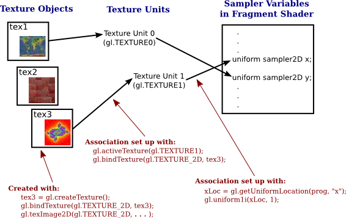
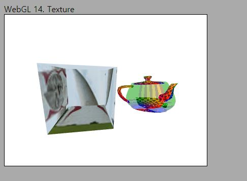

# 14. Texture

이번 강의에서는 WebGL에서 이미지 텍스처링을 수행하는 방법을 설명 드리도록 하겠습니다.텍스처에 대해 강의시간에 다루었겠지만, 복습 겸 해서 짧은 글로 다시 내용을 정리해 보았으니 한번 쭉 읽어 보시기 바랍니다.

---

### 이미지 텍스처링

텍스처란 이미지 형태로 저장된 데이터를 의미합니다. 이렇게 텍스처에 저장된 데이터는 매우 다양한 방식으로 활용될 수 있는데, 강의에서는 가장 일반적인 사용 방식인 이미지 텍스처링에 대해서 배웠습니다. 이미지 텍스처링이란, 화면에 그려질 픽셀의 색상을 이미지로부터 가져와서(샘플링해서) 사용하는 기법을 이야기합니다. 

화면상의 한 픽셀에 이미지의 어떤 픽셀이 대응되는지는 텍스처 좌표를 통해 결정됩니다. 텍스처 좌표란 (u, v)(또는 s, t)로 표현되는 2차원 좌표로, 각각 이미지의 가로축, 세로축 위치를 의미합니다. 이때, (u, v)의 범위는 [0, 1]로 정규화된 값을 사용하는 것이 일반적입니다. 예를들어 우리가 600x400 이미지를 텍스처로 사용한다면 (0 , 0)은 이미지의 좌측 하단 픽셀이, (0.5, 0.5)는 이미지 중간의 픽셀이 대응되는 식입니다. 텍스처 좌표가 정점들에 잘 정의되어 있으면, 결과적으로 모델에 이미지를 붙이는 것과 같은 효과가 화면에 나타나게 됩니다. 

하지만 텍스처 좌표를 가지고 단순히 이미지와 1:1 대응하여 샘플링하게 되면 화면에 표시되는 결과 품질에 문제가 발생합니다. 문제가 발생하는 것은 이미지 해상도에 비해 화면에 그려야 하는 픽셀이 많은 경우(Magnification)와 화면에 그려야 하는 픽셀이 적은 경우(Minification)의 두가지 경우입니다. 이를 해결하기 위해 샘플링 과정에서 텍스처 필터링을 수행하며, 어떤 필터링을 적용할지는 우리가 코드를 통해 정의할 수 있습니다.

---

예제 코드를 통해 실제로 이미지 파일을 읽어와서 텍스처로 사용하도록 GPU에 전달하는 방법, 텍스처 맵핑 및 필터링 관련 파라메터를 설정하는 방법과 셰이더에서 텍스처를 사용하는 방법을 알아보겠습니다. 

## How to

이전 코드에서 변화된 내용들을 보자면 아래와 같습니다. 해당하는 파일은 번호 목록의 앞에 써 놓았습니다.

---
1. [`_classes/Texture.js`] Texture 클래스 정의 및 생성자

    ```js
    id;
    image;

    export default class Texture {
        constructor(gl)
        {
            this.id = gl.createTexture();
            gl.bindTexture(gl.TEXTURE_2D, this.id);

            gl.texParameteri(gl.TEXTURE_2D, gl.TEXTURE_MIN_FILTER, gl.LINEAR);
            gl.texParameteri(gl.TEXTURE_2D, gl.TEXTURE_MAG_FILTER, gl.LINEAR);
            gl.texParameteri(gl.TEXTURE_2D, gl.TEXTURE_WRAP_S, gl.CLAMP_TO_EDGE);
            gl.texParameteri(gl.TEXTURE_2D, gl.TEXTURE_WRAP_T, gl.CLAMP_TO_EDGE);
            
            //1x1 크기의 임시 텍스처를 생성합니다.
            gl.texImage2D(gl.TEXTURE_2D, 0, gl.RGBA, 1, 1, 0, gl.RGBA, gl.UNSIGNED_BYTE, new Uint8Array([0, 0, 255, 255]));
            gl.bindTexture(gl.TEXTURE_2D, null);
        }
        ...
    ```
    
    이제는 많이 익숙해지셨을테니 바로 Texture 클래스를 만들어 사용하도록 하겠습니다. 우선 살펴볼 것은 생성자 부분입니다.

    버퍼를 만들때와 비슷하게 `gl.createTexture()` API를 사용하여 GPU에 텍스처를 저장할 수 있도록 준비를 해 두고 id를 필드에 저장해 둡니다. 그리고 `gl.bindtTexture()` API를 사용해 만들어둔 텍스처를 `gl.TEXTURE_2D` 바인드 포인트에 바인딩 해둡니다. 이후 언바인딩 되기 전까지, `gl.TEXTURE_2D` 관련한 API 호출들은 모두 우리가 만들어둔 id를 갖는 텍스처 부분에 적용될겁니다.

    이후 4줄의 `texParameteri()` 호출을 통해 텍스터의 맵핑 및 필터링 방법을 설정합니다. 강의에서 설명했던 내용이라 보시면 바로 이해가 될겁니다. 실제 사용 가능한 다양한 옵션들의 리스트는 [이 문서](https://developer.mozilla.org/en-US/docs/Web/API/WebGLRenderingContext/texParameter)에 상세히 적혀 있습니다.

    그 다음줄이 좀 복잡해 보이지만 `gl.texImage2D()`에 대한 자세한 설명은 다음 부분에서 해 드리겠습니다. 일단은 주석에 써있는 것처럼 1x1 크기의 임시 텍스처 데이터를 집어넣어 놓는다고 생각하시면 됩니다. 

    이후, 일단은 생성자에서 해야할 작업들은 모두 끝났기 때문에 다시 언바인딩 해 둡니다.

    > <p><h2> 코드의 id 필드에 관하여 </h2></p>
    > 여러분들이 이해하기 쉽도록 `createBuffer()`, `createVertexArray()`, `createTexture()` 등의 API를 호출했을 때 반환되는 값을 GPU 내에 만들어진 버퍼, VAO, 텍스처 등의 ID를 반환한다고 설명했습니다. 각각의 버퍼, VAO, 텍스처 등을 구분할 수 있는 어떤 고유한 값이라는 측면에서 ID가 크게 틀린 용어는 아니지만 정확한 이해를 위해 조금 부연해 보겠습니다.</br>

    > [createBuffer() 문서](https://developer.mozilla.org/en-US/docs/Web/API/WebGLRenderingContext/createBuffer)를 보시면 반환값이 WebGLBuffer 타입인 것을 알 수 있습니다. 내부적인 구현은 알 수 없지만, 이 반환되는 WebGLBuffer 객체가 우리가 생성한 버퍼별로 고유하기 때문에 우리는 이를 ID처럼 사용 가능한겁니다. (예를들어 바인딩할 버퍼를 명시할때 해당 객체를 인자로 전달해줌) </br>
    > 한편 OpenGL에서 동일한 기능을 하는 [glGenBuffers() 문서](http://docs.gl/gl4/glGenBuffers)에서는 실제로 Uint값의 포인터를 하나 인자로 넘겨 사용하도록 되어있고, API 호출을 통해 해당 인자에 값이 쓰여집니다. 각 버퍼마다 고유한 Uint값 하나를 가지고 있으니, 직관적으로 ID와 비슷하죠? 문서에서는 이를 버퍼 객체의 이름(name)이라고 설명합니다. 이름 또한 고유한 구분을 위해 사용하니 의미는 비슷합니다.</br>
    > 특별히 신경쓰지 않으셔도 구현하는 데 문제는 없지만 혹시 다른 자료를 보실때 명칭이 달라 헷갈리실 수 있어서 말씀 드립니다. 어떤 자료에서는 버퍼의 핸들이라고도 부르는 경우가 있었습니다.
    

2. [`_classes/Texture.js`] 텍스처 로딩

    ```js
    LoadeTextureFromImage(gl, path)
    {
        this.image = new Image();
        this.image.src = path;
        this.image.crossOrigin = "";   // CORS 권한 요청
        
        this.image.onload = () => {
            gl.bindTexture(gl.TEXTURE_2D, this.id);
            gl.texImage2D(gl.TEXTURE_2D, 0, gl.RGBA, gl.RGBA, gl.UNSIGNED_BYTE, this.image);
            gl.generateMipmap(gl.TEXTURE_2D);
            gl.bindTexture(gl.TEXTURE_2D, null);
        };
    }
    ```

    실제 텍스처를 로딩하는 기능은 이 메소드에 구현되어 있습니다. 두 번째 인자로 로드할 텍스처의 경로를 입력 받습니다.

    여기서 생성하는 [Image() 객체](https://developer.mozilla.org/en-US/docs/Web/API/HTMLImageElement/Image)는 웹 브라우저에 포함되는 이미지에 대한 정보를 담을 수 있는 객체이며 텍스처로 사용하기 위한 이미지도 포함됩니다. 이미지 객체를 만들고, `src` 필드에 로드할 이미지의 경로를 저장해둡니다. (`crossOrigin` 필드에 대해서는 뒤쪽에 설명 드리겠습니다.)

    아래 부분에 보시면 `onload`에 익명함수로 콜백함수를 정의해 두었습니다. 이는 이전에 우리가 키보드 마우스에 대한 이벤트 처리를 위해 사용했던 `addEventListener`과 유사한 코드라고 생각하시면 됩니다. 이미지가 로드되면 수행할 명령문 블록을 정의해 두었습니다. 

    모델 로딩때와 마찬가지로 이미지를 읽어오는데 시간이 걸릴 수 있습니다. 하지만 이미지를 읽어오기 전까지 앱이 멈춰 있는것은 좋지 않기 때문에 생성자에서 1x1 크기의 텍스처를 만들어둬서 로드되기 전까지는 그 텍스처를 사용하고, 로드가 완료되면(`onload`) 로딩된 텍스처로 데이터를 대체하는 것입니다.

    바인딩의 의미는 잘 아실테니, GPU에 텍스처 데이터를 넘기는 API인 `texImage2D`에 대해 알아봅시다.

    * `gl.Texture_2D`: 첫번째 인자로 넘겨주는것은 바인드 포인트 열거자입니다. WebGL에서 지원하는것은 2차원 텍스처와 [큐브맵](https://webgl2fundamentals.org/webgl/lessons/ko/webgl-cube-maps.html)입니다. 지금은 한 장의 이미지를 텍스처로 사용하므로 2차원 텍스처임을 명시하는 `gl.Texture_2D`를 사용합니다.

    * `0`: 두번째 인자로 넘겨주는것은 밉맵 레벨입니다. Minification에 대한 강의에서 밉맵에 대해 설명드렸습니다. 간단히 이야기하자면 이미지가 화면에서 작게 표시되는 경우 에일리어싱(Ailiasing) 문제를 완화하기 위해 미리 작은 이미지들을 만들어두고 사용하는 기법입니다. 밉맵 레벨 0은 원본 이미지를 의미하므로, 지금 인자로 넘겨주는 0은 입력할 이미지가 원본 이미지라는 것을 알려주는 것입니다. 밉맵 레벨별로 다른 이미지를 입력하는 것이 가능합니다.

    * `gl.RGBA`: 세번째와 네번째 인자로 넘겨주는 것은 internalformat, format입니다. internalformat은 실제 이미지에 어떤 데이터가 존재하는지, 그냥 format은 GPU에서 이 데이터를 어떻게 정의하여 사용할지를 의미합니다. 스펙에 상세히 적혀있지만 여기서는 자세히 들어가지 않고, 이미지에 색상 정보가 들어있으니 RGBA를 사용한다 정도로 기억하고 넘어가시면 됩니다.

    * `gl.UNSIGNED_BYTE`: 텍스처 데이터 타입입니다. 각 채널별로 8비트를 사용하는 unsigned byte가 일반적으로 많이 사용됩니다.

    * `this.image`: 마지막으로 실제 이미지의 색상 정보가 들어있는 Image객체(HTMLImageElement)를 넘겨주면, 이 객체에 들어있는 색상정보가 GPU에 복사되어 사용할 수 있는 상태가 됩니다.

    이후 `gl.generateMipmap()` API를 호출해서 밉맵을 생성하도록 하고, 나중을 위해 언바인딩을 하면 텍스처 로딩 기능 구현이 완료 됩니다.

3. [`_classes/Texture.js`] 텍스처 바인딩/언바인딩

    ```js
    Bind(gl,slot)
    {
      gl.activeTexture(gl.TEXTURE0 + slot);
      gl.bindTexture(gl.TEXTURE_2D, this.id);
    }
    
    Unbind(gl)
    {
      gl.bindTexture(gl.TEXTURE_2D, null);
    }
    ```

    <span style="color:red">텍스처와 관련해서 꼭 알아두셔야 할 것이 하나 있습니다. 바로 텍스처 유닛에 대한 개념입니다.</span> 코드에서 보시는것처럼 다른 클래스의 바인딩 메소드와는 다르게 텍스처의 바인딩 메소드에서는 두 개의 API를 호출하고 있습니다. 그 이유는 바로 셰이더에서 텍스처를 사용하기 위해서는 텍스처에 직접 접근하는 것이 아니고, "텍스처 유닛"이라는 것을 거치기 때문입니다. 
    
    아래 그림에서 보시는 것처럼 색상 데이터를 담고있는 텍스처 객체와 텍스처 유닛이 별도로 존재하고, 우리가 텍스처를 사용하기 위해서는 **먼저 텍스처 유닛에 텍스처를 바인딩해 두어야 합니다**. 그리고 셰이더에는 어떤 **텍스처 유닛**을 렌더링에 사용할지 알려주는 방식입니다.

    </img>

    바인딩을 할 때 `gl.activeTexture(gl.TEXTURE0 + slot);` 호출로 slot번째 텍스처 유닛을 바인딩 해둡니다. 그리고 `gl.bindTexture()`를 호출하여 해당 텍스처 유닛에 로드한 텍스처 객체(`this.id`로 명시)를 바인딩하는 두 단계가 필요합니다. 이후 `main.js`에서 보시면 아시겠지만 셰이더에는 텍스처 유닛의 번호만 넘겨줍니다. 그러면 그 텍스처 유닛에 바인딩되어있는 텍스처로부터 값을 샘플링하여 사용할 수 있습니다.

    참고로 각각의 텍스처 유닛은 `TEXTURE0`, `TEXTURE1`...과 같이 고유한 열거자로 정의되어 있지만 각각은 연속되는 정수입니다. 따라서 `gl.TEXTURE1` = `gl.TEXTURE0` + 1이 되므로, 위 코드와 같이 구현하여 사용하는 것이 편리합니다.

4. [`_shaders/textureFragment.js`] 프래그먼트 셰이더

    ```glsl
    #version 300 es

    precision highp float;

    layout(location=0) out vec4 outColor;

    in vec2 v_texcoord;
    in vec3 v_normal;

    uniform sampler2D u_mainTexture;

    void main() {
        outColor = texture(u_mainTexture, v_texcoord);
    }
    ```

    프래그먼트 셰이더에서 텍스처를 사용하기 위해 `uniform sampler2D u_mainTexture` 선언을 추가하였습니다. 타입이 텍스처가 아니고 `sampler2D`인 것이 좀 이상해 보이시죠? 뭐, 개념적으로 단순히 텍스처 좌표에서부터 색상값을 가져오는 것이 아니라 중간에 필터링을 통해 색상값을 계산하기 때문에 샘플러라고 이름 지었다고 생각하시면 됩니다.

    `main()` 안에서는 이제 텍스처로부터 색상값을 가져와서 화면에 그려질 픽셀의 색상을 결정하도록 하고 있습니다. 이는 `texture()` 내장함수를 사용해서 손쉽게 한 줄의 명령문으로 가능합니다. 첫 번째 인자로는 위에서 정의한 샘플러 uniform을, 두 번째 인자로는 프래그먼트의 텍스처 좌표를 넘겨줍니다. 그러면 알아서 필터링까지 거쳐서 색상값이 계산되어 반환됩니다.

    varying인 `v_texcoord`는 래스터라이저에서 스캔 변환 과정을 거쳐서 각 프래그먼트에 대해 보간된 텍스처 좌표라는 사실은 알고 계실겁니다.

    정점 셰이더는 이전과 동일한 코드입니다. `main.js`에서 사용하는 셰이더를 변경하는 것을 잊지 마세요.

---

이제 `main.js` 부분입니다. 확실한 이해를 위해 두 개 모델(육면체와 주전자)에 두 개의 다른 텍스처를 사용하도록 코드를 구성하였으니 주의깊게 보시기 바랍니다.

---

5. [`main.js`] 텍스처 로딩

    ```js
    ...
    import Texture from '../_classes/Texture.js';
    
    ...
    
    //--Texture loading
    let checkerTexture = new Texture(gl);
    checkerTexture.LoadeTextureFromImage(gl,'../../resources/uv-grid.png');

    let internetTexture = new Texture(gl);
    internetTexture.LoadeTextureFromImage(gl, 'https://c1.staticflickr.com/9/8873/18598400202_3af67ef38f_q.jpg')
    ```

    일단 구현해둔 Texture 클래스를 사용할 수 있도록 import하였습니다. 

    아래에서는 두 개의 텍스처를 로드합니다. 하나는 `resources` 폴더 내에 있는 `uv-grid.png` 텍스처 입니다. 직접 가서 어떤 텍스처인지 한번 살펴보세요.

    재미있는것은 두 번째 텍스처인데, 웹상의 이미지 링크 주소를 그대로 사용하고 있습니다! 내가 서버에 가지고 있지 않은 파일이라도 텍스처로 사용할 수 있습니다. 굉장히 흥미롭죠? 
    
    대신에 보안 문제 등이 발생할 수 있으므로 이렇게 함부로 다른 사이트에서 링크를 통해 사용할 수 없도록 서버에서 보안 조치를 해 두었을 수 있습니다. 텍스처 로딩 함수에서 아래 코드를 통해서 보안 수준이 낮은 경우 접근해서 사용할 수 있도록 요청하는 코드를 
    집어넣어 놓았습니다.

    ```js
    this.image.crossOrigin = "";   // CORS 권한 요청
    ```

    그래픽스 이론과는 무관한 내용이니

     </img>
    
    궁금하신 분은 [링크의 내용](https://webgl2fundamentals.org/webgl/lessons/ko/webgl-cors-permission.html)을 한번 읽어 보세요.

6. ['main.js'] `drawScene()`에서 텍스처 사용을 위한 셰이더 uniform 설정

    ```js
    function drawScene()
    {
        ...

        internetTexture.Bind(gl,0); // <-- (1)
        shader.SetUniform1i(gl, "u_mainTexture", 0); // <-- (2)

        cube.RenderModel(gl, shader);

        ...

        checkerTexture.Bind(gl,1);
        shader.SetUniform1i(gl, "u_mainTexture", 1);
        
        teapot.RenderModel(gl, shader);
        ...
    ```

    욱면체와 주전자를 그리기 이전에 각각 internetTexture와 checkerTexture를 바인딩하고 있습니다. `(1)`에서 보시면 두 번째 인자로 넘겨주는 값이 어떤 의미인지를 잘 인지하셔야 합니다. 해당 메소드의 구현을 3번에서 설명드렸는데 다시한번 보자면 아래처럼 먼저 0번 텍스처 유닛을 활성화 한 뒤에, 해당 텍스처 유닛에 텍스처를 바인딩 하고 있습니다.

    ```js
    Bind(gl,slot)
    {
      gl.activeTexture(gl.TEXTURE0 + slot);
      gl.bindTexture(gl.TEXTURE_2D, this.id);
    }
    ```

    `(2)`에서는 이제 셰이더의 uniform을 설정해 주는데, `u_mainTexture`에 0이란 값을 할당해 주고 있습니다. 여기서 0은 0번 텍스처 유닛을 사용하라는 의미입니다. 이를 통해서 프래그먼트 셰이더를 실행할 때 `uniform sampler2D`인 `u_mainTexture`를 사용할 때는 0번 텍스처 유닛으로부터 값을 가져오게 되고, 우리는 0번 텍스처 유닛에 인터넷에서 가져와 로딩한 이미지를 바인딩해 두었으므로 그 이미지를 사용하게 됩니다.

    두번째로 주전자를 그릴때도 똑같은 과정을 반복하지만 이번에는 1번 텍스처 유닛(`gl.TEXTURE1`)을 활성화한뒤에 텍스처를 바인딩하였으므로 이제 1번 텍스처 유닛에는 checkerTexture 이미지가 참조되어 있습니다. 그리고 이번에는 셰이더의 `u_mainTexture`를 1로 설정하였으므로 1번 텍스처 유닛으로부터 텍스처 데이터에 접근하게 되고, 따라서 checkerTexture를 사용하게 되는것입니다.

---

`http://localhost:8080/lessons/practice/contents.html`(또는 `http://localhost:8080/lessons/14_texture/contents.html`)에 접속해 보시면 왼쪽 육면체에는 인터넷에서 가져온 그림이, 오른쪽의 주전자에는 resource 폴더에 있는 uv-grid 이미지가 붙여져 나타나는 것을 보실 수 있습니다.

</img>

잘 관찰해 보시면 두가지 이상한 점을 눈치채실 수 있을겁니다.

1. 육면체를 잘 보시면 육면체의 앞면이 아니고 뒷면(또는 안쪽면)이 보이는듯합니다. 이는 3차원 공간상에서 뒤쪽에 있는 삼각형이 앞에 있는 삼각형보다 나중에 그려져서 픽셀 색상을 덮어쓰고 있기 때문입니다. 이를 해결해야 합니다.

2. 주전자의 경우 주전자 전체가 텍스처에 덮여있지 않고 부분부분 텍스처가 붙어 있습니다.

이에 대한 내용은 퀴즈로 남겨 두도록 하겠습니다.

다음 강의에서는 드디어 그래픽스의 꽃이라고 할수있는 라이팅(Lighting, 조명 효과)을 구현해 보도록 하겠습니다. 

## Quiz

1. 육면체 관련 문제를 해결하려면 어떻게 해야 할지 생각해 보세요.

2. 주전자 모델이 정의된 파일(teapot.obj)을 살펴 보시고, 왜 이런 문제가 발생했는지를 생각해보고, 주전자 전체에 텍스처가 입혀지도록 수정해 보세요.

3. 주전자 모델을 그릴때, 예제 코드에서는 1번 텍스처 유닛을 사용했지만 사실 0번 텍스처 유닛을 다시 사용해도 됩니다. 직접 확인해 보시고 왜 0번 유닛을 사용해도 결과가 잘 나타나는지 정리해서 생각해 보세요.

## Advanced

1. [텍스처 유닛이 왜 필요한지(정확히는 왜 생겨났는지) 궁금하시다면 한번 읽어보세요.](https://stackoverflow.com/questions/45233643/opengl4-5-bind-multiple-textures-and-samplers/45240467#45240467)

2. [예시](https://www.youtube.com/watch?v=T7jl3EAlobw)와 같이 흐르는 물을 간단하게 표현하기 위한 방법 중 하나로, 모델은 그대로 두고 텍스처만 한쪽으로 계속 움직이는 애니메이션을 구현할 수 있습니다. 어떻게 구현하면 될지 생각해 보시고, 예제 코드를 기반으로 간단하게 한번 구현해 보세요.

## Useful Links

- [텍스처](https://webgl2fundamentals.org/webgl/lessons/ko/webgl-3d-textures.html)
- [큐브맵](https://webgl2fundamentals.org/webgl/lessons/ko/webgl-cube-maps.html)
- [texParameter](https://developer.mozilla.org/en-US/docs/Web/API/WebGLRenderingContext/texParameter)
- [교차 출처 이미지(CORS)](https://webgl2fundamentals.org/webgl/lessons/ko/webgl-cors-permission.html)

---

[다음 강의](../15_ambient_light/)

[목록으로](../)