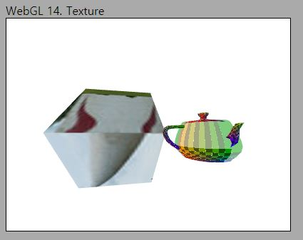
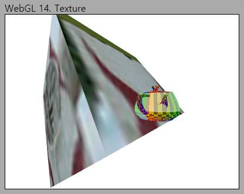
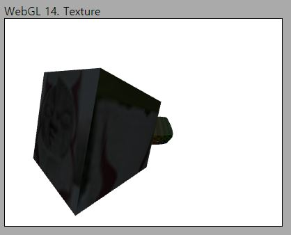

# 15. Ambient Light

이제 이번 학기의 하이라이트인 조명 효과(Lighting)구현을 보여드릴 시기가 되었습니다. 앞으로의 3~4개 강의동안 Ambient light, Diffuse light, Specular light의 구현을 순차적으로 보여드릴 예정입니다.

조명 효과가 중요한 이유는, 조명 효과에 의해 현실적인 화면이 생성되기 때문입니다. 첫 강의에서 우리가 중학교때쯤 배웠던, 빛이 물체에 반사되어 눈에 보이는 원리에 대해 이야기 했었습니다. 사람이 무언가를 보는 행위는 근본적으로 빛과 물체의 상호작용해 의해 발생합니다. 그러니 조명 효과를 구현하는 것이 중요하지 않을 수 없겠죠?

이번 강의에서는 첫 단계로 Ambient light 효과를 구현해 볼 것입니다. 결과물은 약간 실망스러우실 수 있지만, 나머지 조명 효과를 구현하는 데 필요한 제반 환경 구현도 함께 이루어질 예정이니 잘 읽어 보시기를 바랍니다.

## How to

이전 코드에서 변화된 내용들을 보자면 아래와 같습니다. 해당하는 파일은 번호 목록의 앞에 써 놓았습니다.

<span style="color:red">유의하실 점은 Light 클래스와 프래그먼트 셰이더 코드가 `main.js`내에 있다는 것입니다.</span> 점진적인 구현을 보여드리기에는 이것이 더 나을것 같아서 이렇게 결정하였습니다. Light 관련 강의가 모두 끝나면 셰이더와 클래스 정의를 별도 파일로 분리할겁니다.

---
1. Ambient light 적용한 프래그먼트 셰이더

    ```glsl
    var lightAmbientFragmentShader = 
    `#version 300 es
    precision highp float;

    struct DirectionalLight // <-- (1) 구조체 선언
    {
        vec3 lightColor;
        float ambientIntensity;
    };

    layout(location=0) out vec4 outColor;

    uniform sampler2D u_mainTexture;
    uniform DirectionalLight u_directionalLight; // <-- (2) 구조체 객체

    in vec2 v_texcoord; 
    in vec3 v_normal; 

    void main() {
        vec3 lightAmbient = u_directionalLight.lightColor * u_directionalLight.ambientIntensity; // <-- (3) Ambient 조명에 의한 영향 계산
        
        outColor = texture(u_mainTexture, v_texcoord) * vec4(lightAmbient,1.0);
    }`;
    ```
    
    조명 효과의 구현은 셰이더에 대한 설명이 위주가 될 것입니다. 

    (1) 구조체 선언 부분을 보시면 `DirectionalLight` 구조체를 선언한 것을 보실 수 있습니다. 이 구조체는 `vec3` 타입의 `lightColor`와 `float`타입의 `ambientIntensity`를 멤버로 갖습니다. 각각의 멤버의 의미는 이름을 보시면 명확합니다. 하나는 조명의 색상, 하나는 조명의 강도(세기, Intensity) 입니다. 
    
    Directional light이니 뭔가 데이터가 더 필요할 것 같다는 생각이 드실겁니다. 하지만 지금은 이정도만 있으면 됩니다.

    (2) 구조체 객체 부분을 보시면 위에서 우리가 정의한 구조체의 객체를 하나 만들어두었습니다. uniform이고 이름은 `u_directionalLight`입니다. C/C++는 다 배우셨을테니 클래스/구조체의 선언과 객체 생성이 어떤 의미인지는 아실겁니다. 셰이더라고 특별할 것은 없습니다. C/C++에서 배운 그대로 이해하시면 됩니다.

    uniform이니 이 객체의 값은 CPU-side로부터 입력받을 것이라는 것을 알 수 있습니다. <span style="color:red"> 셰이더의 구조체 객체 uniform에 어떻게 데이터를 입력하는지 이후 CPU-side의 코드를 잘 보셔야 합니다. </span>

    (3) `main()`안에서는 간단하게 조명 색상과 강도를 곱해서 `lightAmbient`를 계산하였습니다. 이렇게 계산된 `vec3`값을 텍스처에서 샘플링한 색상값과 곱해서 픽셀의 결과 색상값을 도출합니다. texture()함수의 반환값도 색상 정보가 들어있는 벡터입니다. 벡터끼리의 곱은 요소별(element-wise) 곱이라는 것을 명심하십시오. 

    개인적으로, 이렇게 처음 보는 수식이 나올때는 극단적인 값들을 넣어서 계산 결과를 검증해 보시는 것을 추천 드립니다. 예를들어, 조명의 강도가 0이면 `lightAmbient`가 (조명 색상에 상관없이) (0,0,0)이 될거고, 그러면 결과적으로 텍스처 색상과 곱했을 경우 항상 (0,0,0)이 될겁니다. 즉 모델이 검은색으로 보일 겁니다.

    다른 예로, 조명의 색상이 빨간색(1,0,0)이고 조명 강도가 1이라면, 텍스처 샘플링 색상과 곱했을때 red 채널의 값만 남고, green 및 blue 채널의 값은 0이 될겁니다.

    강의 자료에서 s_a는 ambient 조명 색상, m_a는 물체의 ambient에 대한 재질(material) 속성이라고 말씀 드렸습니다. 이를 현재 코드에 대응시켜 보자면, 아래와 같습니다.

    ```js
    s_a = u_directionalLight.lightColor * u_directionalLight.ambientIntensity;
    m_a = texture(u_mainTexture, v_texcoord);
    ```

    여전히, 정점 셰이더 코드는 변한 것이 없으니 그냥 넘어가시면 됩니다.
    
2. Light 클래스 정의

    ```js
    class Light {
        lightColor;
        ambientIntensity;

        constructor(lightColor, aIntensity)
        {
            this.lightColor = lightColor;
            this.ambientIntensity = aIntensity;
        }
        
        UseLight(gl,shader)
        {
            shader.SetUniform3f(gl,"u_directionalLight.lightColor", this.lightColor[0], this.lightColor[1], this.lightColor[2]);
            shader.SetUniform1f(gl,"u_directionalLight.ambientIntensity", this.ambientIntensity);
        }
    }
    ```

    Light 클래스는 `lightColor`와 `ambientIntensity`를 필드로 가집니다. 셰이더에 정의한 `DirectionalLight`와 동일하네요. 생성자는 이러한 두 필드를 생성자에서 전달받은 인자로 초기화해주는 간단한 역할을 수행합니다.

    <span style="color:red"> 셰이더의 구조체 객체 uniform에 데이터를 전달하는 부분은 `UseLight` 메소드에 구현되어 있습니다. </span> 우리가 셰이더에 선언한 uniform에 값을 전달하기 위해서는 `SetUniformXX`의 두번째 인자로 변수의 이름을 전달해 줬었죠?
    `u_directionalLight` 객체에 대해서도 마찬가지 입니다. 조명의 색상을 전달하기 위해서는 `u_directionalLight.lightColor`에 값을 설정하고, 강도를 전달하기 위해서는 `u_directionalLight.ambientIntensity`에 값을 설정해 주면 됩니다.

3. Light 설정

    ```js
    async function main() {
        ...
        //--Light define
        let mainLight = new Light([1.0,1.0,1.0], 0.2); 

        ...
        let shader = new Shader(gl,basicVertexShader,lightAmbientFragmentShader);
    ```

    정의한 Light 클래스를 사용해 `mainLight` 객체를 생성해 주었습니다. 첫번째 인자인 `lightColor`에는 [1.0, 1.0, 1.0]을 전달하였으니 흰색 조명일 것이고, `aIntensity`는 0.2 입니다. 이 값들이 셰이더에 전달되면 어떤 화면이 나올 것인지, 프래그먼트 셰이더의 구현을 보시고 미리 한 번 생각해 보세요.
    
    구현한 셰이더를 설정해 주는 부분도 잊지 마세요. `basicVertex` 셰이더를 정점 셰이더로, 1번에서 설명한 `lightAmbientFragmentShader`를 프래그먼트 셰이더로 사용하고 있습니다.

4. Light uniform 설정

    ```js
    function drawScene()
    {
        ...
        //Light 적용
	    mainLight.UseLight(gl, shader);
    ```

    프래그먼트 셰이더에 값을 전달하여 조명 효과를 구현하도록 하는 것은 `drawScene()`에서 위 한줄의 코드면 됩니다. 이미 `UseLight()` 메소드 안에 uniform을 설정하는 모든 코드를 구현해 두었으니까요.

5. 렌더링 옵션 설정

    ```js
    //---Options
    gl.enable(gl.CULL_FACE);
    gl.enable(gl.DEPTH_TEST);
    ```

    추가적으로 위와 같은 두줄의 코드가 삽입되어 있습니다. 지난 강의자료의 퀴즈 1,2번에  대해 조사해 보신 분이라면 이미 어느정도 이에 대한 의미를 아실 겁니다.

    첫번째 라인의 `gl.enable(gl.CULL_FACE);`는 화면을 그릴때, 삼각형의 방향을 고려하여 그리도록 하는 옵션입니다. 강의 초반부와 래스터화 강의에서 CCW(Counter clock wise)에 대해 설명한 내용을 기억하고 계신가요? 삼각형은 바라보는 방향을 가지고 있고, 이에 따라 삼각형의 뒷면을 바라보는 경우 삼각형이 화면에 그려지지 않도록 해야 합니다. 
    
    래스터화 과정에서 이렇게 뒷면이 보이는 상태의 삼각형을 그리지 않도록 back-face culling을 수행하도록 하는 옵션이 위의 코드입니다. 위 두줄의 코드 중 첫번째 라인만 실행하고(두 번째 라인은 주석 처리하고) 화면을 그려보면 아래와 같이 보입니다.(화면을 잘 보이도록 하기위해 ambient intensity를 잠시 1로 올렸습니다.)

    

    괜찮아 보이네요. 이제 육면체의 앞면은 앞에 제대로 나타나는 것 같습니다. 이는 육면체의 먼쪽 면이 back-face culling에 의해 그려지지 않기 때문입니다. (*앞의 삼각형이 뒤쪽 삼각형을 덮어쓰는 것이 아닙니다! 단지 지금 카메라를 등지고 있는 삼각형이 그려지지 않고 있는 것입니다.*) 그런데 카메라 시점을 육면체의 왼쪽으로 옮겨보면 아래와 같은 화면이 보입니다.

    

    육면체가 분명히 주전자보다 카메라 쪽에 가까운데, 육면체가 주전자를 가리지 않고 주전자가 화면에 나타나는 것을 볼 수 있습니다. 이 문제를 해결하기 위해서는 Z-buffering이 필요하고, Z-buffering은 두 번째 라인의 코드(`gl.enable(gl.DEPTH_TEST);`)를 통해 수행하도록 옵션을 켤 수 있습니다. 이론적 내용은 Output merging 강의에서 설명 드리겠습니다.

    어찌되었든, 위 두 라인의 코드를 통해서 옵션을 켜 주어야 올바른 화면을 볼 수 있습니다. 아마 여러분들도 대부분의 경우 위 옵션들을 켠 상태로 사용하셔야 할 겁니다. 일부 특수한 효과를 위해 위 옵션을 일부러 사용하지 않는 경우도 있습니다.

---

`http://localhost:8080/lessons/practice/contents.html`(또는 `http://localhost:8080/lessons/15_ambient_light/contents.html`)에 접속해 보시면 전체적으로 어두워진 장면을 보실 수 있을겁니다. 육면체에 의해 주전자가 올바로 가려진 것도 보실 수 있습니다.



말씀드렸듯이 별로 멋지진 않습니다. 단지 (지난 강의 결과에 비해) 화면이 전체적으로 어두워진 것처럼 보이죠. Ambient light 효과가 원래 이런겁니다. 딱히 광원을 특정할 수는 없지만, 어딘가에서 들어오는 빛에 의해 우리가 보는 장면이 완전한 암흑이 아니고 전반적으로 약간의 빛을 받고 있습니다. 만약 Ambient light가 없다면 빛이 비추지 않는 부분은 완전히 검게 표시될텐데, 이에 대해서는 다음 강의에서 한번 직접 확인해 봅시다.

다음 강의에서는 Diffuse light 구현을 통해서 빛을 받는 각도에 따라 밝기가 달라지도록 화면을 만들어 보겠습니다. 훨씬 그럴싸해 보일겁니다.

## Quiz

1. Ambient intensity를 바꾸어가며 장면의 변화를 살펴 보세요. 가능하다면, 슬라이더 UI를 만들어서 ambientIntensity를 인터랙티브하게 바꿔볼 수 있도록 페이지를 만들어 보세요.

2. 빛을 거의 받고있지 않은데 배경이 흰색이라 이질감이 좀 들지 않나요? 배경을 검은색으로 바꾸어 화면을 그려 보세요.

## Advanced

없음

## Useful Links

없음

---

[다음 강의](../16_diffuse_light/)

[목록으로](../)


