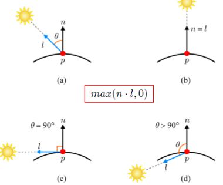
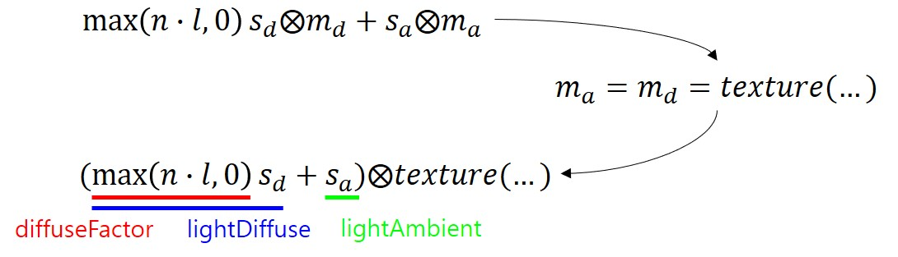
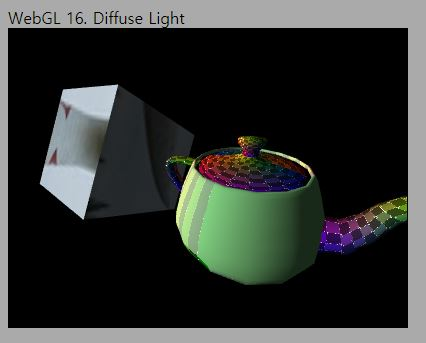
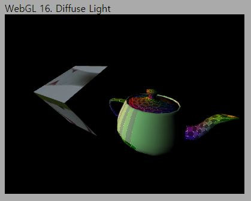

# 16. Diffuse Light

이번에는 Diffuse Light를 구현해 보겠습니다. Diffuse 반사는 빛이 물체에 닿았을 때, 모든 방향으로 고르게 반사되는 빛을 모사합니다. 이때, 반사되는 빛의 양은 빛이 물체의 표면을 수직하게 비출수록 많아지고, 각도가 커질수록 적어집니다. 코사인함수를 통해 이러한 현상을 모델링할 수 있으며, 이를 도식적으로 나타낸 그림이 강의자료에서 보여드린 아래의 그림입니다. 



주의하셔야 할 것 두가지는, 1) 빛 벡터(그림에서 l)의 방향과 법선 벡터의 방향과 공간이 일치하도록 계산해야 한다는 것과, 2) 각도가 90도가 넘어가는 경우 빛을 받지 않는 현상을 모사해야 한다는 것입니다. 2번의 경우는 명백하죠. 빛이 물체의 뒤에서 비출경우(그림에서 (d)의 경우) 물체는 빛을 받지 않아야 하는데 예외사항으로 처리해 주지 않으면 cos(theta)가 음수값이 되어 물리적으로 올바르지 않은 결과가 도출됩니다. 1) 사항에 대해서는 코드를 보면서 좀더 자세히 설명 드리겠습니다.

Diffuse term은 모든 프래그먼트마다 각자 받는 빛의 양을 계산하게 되므로 동일한 물체 안에서도 빛을 많이 받는 부분과 적게 받는 부분이 서로 다른 음영으로 구분됩니다. 이렇게 음영이 더해짐으로써 우리는 보다 현실적인 화면을 표현할 수 있게 됩니다.

## How to

이전 코드에서 변화된 내용들을 보자면 아래와 같습니다. 

---
1. 정점 셰이더 법선 벡터 변환

    ```glsl
    var lightDiffuseVertexShader = 
    `#version 300 es
    layout(location=0) in vec3 a_position; 
    layout(location=1) in vec2 a_texcoord;
    layout(location=2) in vec3 a_normal;

    uniform mat4 u_projection; 
    uniform mat4 u_view; //카메라를 통해 반환된 View행렬
    uniform mat4 u_model; //모델의 world공간 위치와 자세

    out vec2 v_texcoord;
    out vec3 v_normal; 

    void main() {
        gl_Position = u_projection * u_view * u_model * vec4(a_position,1.0); 
        v_texcoord = a_texcoord;

        //normal vector는 특별한 변환법이 필요합니다.
        //https://www.youtube.com/watch?v=d3EUd2HxsO4
        v_normal = mat3(transpose(inverse(u_model))) * a_normal;
    }
    `;
    ```
    
   지난 몇개의 강의에서 거의 건드리지 않았던 정점 셰이더에 뭔가 수정사항이 생겼습니다. 바로 법선 벡터의 월드 변환인데요, 먼저 생각해 보세요. 물체가 회전하면, 법선 벡터의 방향도 변해야 하겠죠? 그런데 지금까지는 그런 변환을 적용하지 않고 법선 벡터를 그냥 프래그먼트 셰이더로 넘겨주고 있었습니다. 그러면 안되겠죠.
   
   그러면 물체에 적용된 월드 변환(모델 행렬 곱)을 그냥 법선 벡터에 적용해 주면 되느냐 하면 그렇지는 않습니다. 법선 벡터를 올바르게 변환시켜 주려면 코드에서처럼 모델 행렬의 역행렬의 전치를 적용해 주어야 합니다.

   이 내용은 강의 초반부에 설명 드렸었는데(5장 정점 변환의 4,5페이지) 주석의 동영상 또는 아래 Useful links의 [Directional Light](https://webgl2fundamentals.org/webgl/lessons/ko/webgl-3d-lighting-directional.html)를 한번 읽어 보시기 바랍니다.

2. 프래그먼트 셰이더 Diffuse term 계산 및 적용

    ```glsl
    var lightDiffuseFragmentShader =
    `#version 300 es
    precision highp float;

    struct DirectionalLight
    {
        vec3 lightColor;
        float ambientIntensity;
        // Diffuse 계산을 위해 필요한 추가 데이터
        vec3 direction;
        float diffuseIntensity;
    };

    layout(location=0) out vec4 outColor;

    uniform sampler2D u_mainTexture;
    uniform DirectionalLight u_directionalLight; 

    in vec2 v_texcoord; 
    in vec3 v_normal; 

    void main() {
        //--Ambient
        vec3 lightAmbient = u_directionalLight.lightColor * u_directionalLight.ambientIntensity;

        //--Diffuse
        float cosAngle = dot(normalize(v_normal), normalize(-u_directionalLight.direction));
        float diffuseFactor = max(cosAngle, 0.0);
        vec3 lightDiffuse = u_directionalLight.lightColor * u_directionalLight.diffuseIntensity * diffuseFactor;

        outColor = texture(u_mainTexture, v_texcoord) * vec4(lightAmbient + lightDiffuse,1.0);
    }
    `;
    ```

    먼저 diffuse term 계산을 위해서 diffuse 빛의 방향과 세기를 `DirectionalLight` 구조체의 필드에 추가 정의해 두었습니다. 물체의 한 부분이 빛을 얼마나 받는지는 빛 벡터(l)과 법선 벡터(n)에 의해 계산되기 때문에 빛의 방향이 반드시 필요합니다. 또한 ambient light에서와 동일하게 강의자료의 수식에 대해 아래와 같은 정의가 적용됩니다.

    ```js
    s_d = u_directionalLight.lightColor * u_directionalLight.diffuseIntensity;
    m_d = texture(u_mainTexture, v_texcoord);
    ```

    `main()`함수 안에서는 Diffuse term의 계산을 수행합니다. 먼저 cosAngle은 길이가 1인 벡터들의 내적을 통해 계산할 수 있습니다. 따라서 법선 벡터(`v_normal`)와 빛 벡터(`-u_directionalLight.direction`)를 `normalize()` 내장함수를 사용해 정규화 시킨뒤에 `dot()` 내장함수를 사용해 내적합니다.

    <span style="color:red">아래 두 가지 의문이 드실 수 있는데 매우 중요하니 꼭 기억해 두셔야 합니다.</span>

    * "`v_normal`은 길이 1로 입력하지 않았나요? 왜 또 정규화를 해주어야 하죠?": 정점 셰이더에서 각 정점에 할당되어있는 법선은 길이가 1이 맞습니다. **하지만 프래그먼트 셰이더로 넘어오는 과정에서 보간되기 때문에 각 프래그먼트의 법선벡터는 길이가 1이 아닐 수 있습니다!** 따라서 다시 정규화를 통해 길이를 1로 바꿔주어야 올바른 결과가 도출됩니다.

    * "`-u_directionalLight.direction` 앞에 왜 마이너스 부호가 붙어있나요?": l과 n은 동일한 방향을 기준으로 각도가 계산되어야 합니다. n은 표면에서 나가는 방향으로 정의되어 있으므로, l벡터도 표면에서 빛을 향하는 방향을 기준으로 해야 합니다. 그런데 우리가 light 객체를 정의할때는 빛이 표면을 향하는 방향으로 정의하기 때문에, 여기서 계산 직전에 뒤집어 주어야 하는 것입니다.

    cosAngle이 계산된 뒤에는 `max()` 내장함수를 사용해 값이 0이 이하인 경우(각도가 90도 이상인 경우)엔 0이 되도록 하여 `diffuseFactor`를 계산합니다. 그리고 나서 `lightDiffuse`값을 `diffuseFactor`와 s_d를 곱해 도출합니다. 여기에 `lightAmbient`를 더한 후 텍스처 샘플링 값에 곱해서 최종 색상을 결정합니다.

    위 과정이 조금 헷갈리실 수 있을 것 같아서 아래 그림으로 표현해 봤습니다.

    

    그림에서 제일 위쪽의 수식이 우리가 강의에서 배웠던 diffuse와 ambient term입니다. 강의에서는 m_a와 m_d가 다른 값으로 쓰여있는데요, 코드에서는 이것을 간략화해서 m_a와 m_d를 모두 텍스처 샘플링 색상값으로 대체하였습니다. 따라서 수식은 아래쪽과 같이 정리됩니다. 아래쪽 수식에서 `diffuseFactor`, `lightDiffuse`, `lightAmbient`에 해당하는 식이 어떤 부분인지 표시해 두었습니다. 셰이더 코드와 매칭해 보시면 이와 같다는 것을 아실 수 있을겁니다.

3. Light 클래스

    ```js
    // Light Class (Ambient + Diffuse)
    class Light {
        ...
        // Diffuse계산을 위해 필요한 추가 데이터
        direction;
        diffuseIntensity;

        constructor(lightColor, aIntensity, dir, dIntensity)
        {
            ...
            this.direction = dir;
            this.diffuseIntensity = dIntensity;
        }
        
        UseLight(gl,shader)
        {
            ...

            shader.SetUniform3f(gl,"u_directionalLight.direction", this.direction[0], this.direction[1], this.direction[2]);
            shader.SetUniform1f(gl,"u_directionalLight.diffuseIntensity", this.diffuseIntensity);
        }
    }
    ```

    Ambient 관련 부분은 생략하고, 추가된 부분만 보여드립니다. 셰이더에 필요한 빛의 방향과 diffuse 세기를 생성자에서 입력받도록 하였고, `UseLight()`를 호출하면 객체가 가지고 있는 해당 값들을 셰이더 uniform에 전달하도록 하였습니다.

4. Light 설정

    ```js
    async function main() {
        ...
        //--Light define
        let mainLight = new Light([1.0,1.0,1.0], 0.0, //<--Ambient Data
                                  [2.0, -1.0, -2.0], 1.0); //<--light direction, diffuse intensity
        ...
        let shader = new Shader(gl,lightDiffuseVertexShader,lightDiffuseFragmentShader);
    ```

    정의한 Light 클래스를 사용해 `mainLight` 객체를 생성해 주었습니다. 빛의 방향과 diffuse 강도를 각각 세번째와 네번째 인자로 넘겨줍니다. 빛의 방향은 월드 공간상 "빛을 비추는" 방향이고, 셰이더에서는 이를 뒤집어서 표면을 기준으로 한 벡터로 방향을 변경해 줬다는 사실을 다시한번 리마인드 하시기를 바랍니다.
    
    정점 셰이더와 프래그먼트 셰이더는 1,2번에서 설명한 셰이더 코드를 사용하도록 했습니다.

5. Light uniform 설정

    ```js
    function drawScene()
    {
        ...
        //Light 적용
	    mainLight.UseLight(gl, shader);
    ```

    이전과 동일하게 `UseLight()` 메소드 안에 uniform을 설정하는 모든 코드가 이미 다 구현되어 있으니 호출만 해주면 됩니다.

---

`http://localhost:8080/lessons/practice/contents.html`(또는 `http://localhost:8080/lessons/16_diffuse_light/contents.html`)에 접속해 보시면 아래와 같은 화면을 보실 수 있습니다. 육면체와 주전자에 음영이 생긴것을 보세요! 빛이 비추는 부분은 밝게, 빛이 비추지 않는 부분은 어둡게 나타납니다. 훨씬 그럴싸한 화면이 되었죠?



Light를 설정할때 제 코드에는 ambientIntensity가 0.2로 되어 있는데 이를 0.0으로 바꾸어 보면 아래와 같은 화면이 나타납니다. `lightAmbient`가 0이고, 법선과 빛 벡터가 90도 이상이면 `lightDiffuse`도 0이기 때문에 이러한 부분에서는 픽셀이 완전히 검은색으로 표현되는 것을 볼 수 있습니다.



다음 강의에서는 Phong lighting model의 마지막 term인 specular(정반사) term을 구현하고 마무리를 짓도록 하겠습니다. Emissive가 빠지지 않았냐고요? 네 맞습니다. 그런데 Emissive는 좀 특수한 경우이고, 실제로 그럴싸한 emissive 효과를 구현하려면 좀 복잡한 처리를 해 주어야 합니다. 이에 대해서는 마지막 강의에서 Advanced topic으로 남겨두어야 할 것 같습니다.

## Quiz

1. Direction을 바꾸어가며 장면의 변화를 살펴 보세요. 가능하다면, 슬라이더 UI를 세개 만들어서 direction의 x, y, z값을 인터랙티브하게 바꿔볼 수 있도록 페이지를 만들어 보세요.

2. 강의자료에서 per-fragment lighting에 대한 설명이 있었습니다. 현재 구현한 셰이더는 per-fragment lighting이 맞을까요?

## Advanced

1. 셰이더 코드를 수정해서 per-vertex lighting으로 바꾸어 구현해 보세요. 그리고 per-fragment인 경우와 어떤 차이가 있는지 (자세히) 살펴보세요.

2. Ambient intensity가 0.2고, diffuse intensity가 1.0이므로 합이 1을 넘어가게 됩니다. 이래도 되는걸까요? 합이 1을 넘어가게 되면 색상값이 어떻게 할당되는 걸까요?

## Useful Links

- [Directional Light](https://webgl2fundamentals.org/webgl/lessons/ko/webgl-3d-lighting-directional.html)

---

[다음 강의](../17_specular_term/)

[목록으로](../)


