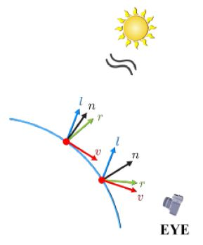
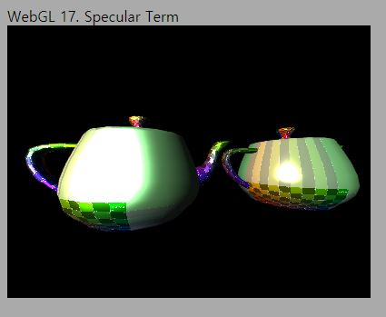
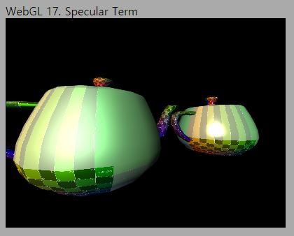
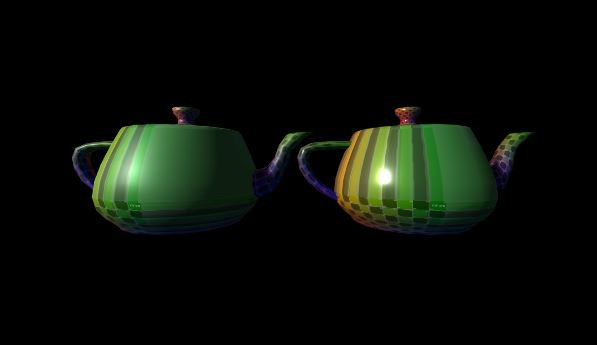

# 17. Specular Term

먼저 용어와 관련해서 약간의 첨언을 드리겠습니다. 15,16번째 강의자료에서 Ambient Light, Diffuse Light라고 제목을 적었는데 오해의 소지가 있을 것 같습니다. 사실은 Ambient term, Diffuse term이라고 하는 것이 더 맞을겁니다. Light라고 하면 대개 "조명"을 떠올리게 되는데, Ambient와 Diffuse를 위한 어떤 별도의 조명이 있는 것은 아니었습니다. 오해 없으시길 바랍니다.

이번에는 마지막으로 Specular(정반사) term을 구현해 보겠습니다. 정반사는 매끈한 표면에 빛이 반사되었을때, 빛이 정반사되는 방향(법선 벡터를 기준으로 입사각과 동일한 반사각)에서 표면을 바라보았을 때 생기는 빛의 하이라이트를 표현합니다. 이론 강의에서 그림을 통해 충분히 설명을 드렸으니 이해하고 계실거라고 생각합니다. 아직 개념이 잘 이해가 안되신다면 [링크](https://webgl2fundamentals.org/webgl/lessons/ko/webgl-3d-lighting-point.html)의 설명 자료와, 링크의 중간에 있는 인터랙티브한 예제를 보면서 다시 한 번 복습해 보십시오.

구현에 있어서 중요한 사항은 아래 두 가지입니다. 이를 잘 기억하시면서 구현 사항을 따라서 살펴 보시기를 바랍니다.

1. r 벡터(표면에서 빛이 반사되는 방향)와 v벡터(표면에서 카메라를 향하는 방향)가 필요함
2. shininess의 제곱을 통해 반사의 감쇄 정도를 조정할 수 있도록 함

## How to

이전 코드에서 변화된 내용들을 보자면 아래와 같습니다. 

---
1. 정점 셰이더 `v_worldPosition` varying 추가

    ```glsl
    var lightSpecularVertexShader = 
    `#version 300 es
    ...

    out vec3 v_worldPosition;

    void main() {
        ...

        v_worldPosition = (u_model * vec4(a_position, 1.0)).xyz; 
    }
    `;
    ```
    
   정점 셰이더에 `v_worldPosition`이라는 새로운 varying이 추가되었습니다. varying이니, 각 정점별로 데이터를 할당해 주면 스캔 변환 과정에서 보간되어 각 프래그먼트별로 값을 갖게 된다는 뜻입니다.

   world position 이름 그대로 해당 정점의 월드공간상 위치를 저장할 varying 변수입니다. 이 값이 필요한 이유는 각 정점마다(그리고 보간되어 각 프래그먼트마다) v벡터가 필요하기 때문입니다. 아래 그림을 보시면 이해가 되실겁니다. 
   
   

   우리가 색상을 정해야 하는 모든 프래그먼트마다 v와 r벡터가 필요한데, r벡터는 n과 l벡터를 사용해 계산 가능하고, v벡터는 프래그먼트의 위치(그림상 빨간색 점)와 카메라의 위치가 필요합니다. 이 중 프래그먼트의 위치가 바로 이 `v_worldPosition`을 사용해 정점 셰이더로부터 프래그먼트 셰이더로 넘겨지는 것입니다. 우리는 eye의 위치를 월드공간 좌표로 넘겨줄 것이기 때문에 빨간색 점에 대해서도 월드공간 좌표값이 필요합니다.

   정점의 월드공간상 위치 계산은 간단합니다. `u_model` 행렬이 바로 월드 변환 행렬이기 때문에 정점의 위치에 `u_model`만 곱한 결과가 바로 월드공간 위치입니다. `v_worldPosition`이 `vec3`이기 때문에 코드가 약간 길어졌습니다. `.xyz`는 `vec4`로부터 x,y,z 세개의 컴포넌트만 가져와 `vec3`를 반환해줍니다. `.xyz`와 같은 벡터 및 행렬 조작 기능이 궁금하시면 [링크](https://webgl2fundamentals.org/webgl/lessons/ko/webgl-shaders-and-glsl.html)의 마지막 부분 글을 읽어 보세요.

2. 프래그먼트 셰이더 specular term 계산 및 적용

    ```glsl
    var lightSpecularFragmentShader = 
    `#version 300 es
    ...

    struct Material
    {
        float specularIntensity;
        float shininess; // == sh
    };

    ...

    uniform vec3 u_eyePosition; // v벡터를 구하기 위해서는 카메라 위치가 필요
    uniform Material u_material; // material 객체

    ...
    in vec3 v_worldPosition; // 정점 셰이더의 worldPosition varying

    void main() {
        ...

        //--Specular
        vec3 vVec = normalize(u_eyePosition - v_worldPosition);
        vec3 rVec = 2.0 * normal * dot(normal, lightDir) - lightDir;
        float cosAngleRV = max(dot(rVec,vVec),0.0);
        vec3 lightSpecular = pow(cosAngleRV, u_material.shininess) * u_directionalLight.lightColor * u_material.specularIntensity;

        //조명에 의한 색상과 모델 머티리얼 색상값을 곱하여 최종 색상으로 결정합니다.
        outColor = texture(u_mainTexture, v_texcoord) * vec4(lightAmbient + lightDiffuse + lightSpecular,1.0);
    }
    `;
    ```

    자 이제 specular 효과를 계산해 보겠습니다. 우선 Material 구조체를 정의했습니다. 우리가 전에 정의한 DirectionalLight는 빛의 방향, 색상, ambient와 diffuse intensity 데이터를 포함하고 있습니다. 의미적으로 생각해보면 당연히 이것들은 조명과 관련된 데이터이니 DirectionalLight 클래스에 포함됩니다.

    이번에 계산하는 specular는 의미가 좀 다릅니다. 예를들어 shininess를 높여 빛을 빠르게 감쇄시키는 것은, 물체가 아주 매끄러워서 거울과 같은 반사가 일어나기 때문입니다. 조명이 아니라 물체 표면의 속성과 관계되는 값입니다. specular intensity는 좀 애매하긴 하지만 마찬가지로 조명보다는 물체의 속성으로 할당해 두었습니다. (이에 관련해서는 마지막에 조금 더 설명 드리겠습니다.) 이렇게 조명과는 관련이 없는 데이터를 조명에 포함시키는 것은 좋지 않으므로 별도의 Material 구조체를 사용해 데이터를 저장할 수 있도록 정의해 둔 것입니다.

    uniform으로는 `u_eyePosition`과 `u_material`객체를 받도록 정의하였습니다. `u_eyePosition`은 v 벡터를 계산하기 위해 사용됩니다.

    실제 `main()`함수 안에서 specular를 계산하는 코드를 보면, 먼저 v 벡터를 계산합니다. 프래그먼트 위치에서 카메라를 바라보는 벡터입니다. r 벡터는 강의자료에 나온것과 동일한 수식으로 계산합니다. 그리고 `max(dot(r,v),0.0)`을 통해 r과 v의 각도를 계산합니다.

    이제 lightSpecular는 이 각도를 shininess만큼 제곱해서  감쇄시킨다음 s_s와 곱하여 계산하게 됩니다. 지난번과 유사하게 강의자료의 s_s와 m_s는 아래 코드로 구현되었습니다.

    ```js
    s_s = u_directionalLight.lightColor * u_material.specularIntensity;
    m_s = texture(u_mainTexture, v_texcoord);
    ```

    m_a, m_d, m_s는 모두 텍스처 샘플링 색상을 사용하므로 diffuse때와 동일하게 식을 정리하면 위의 프래그먼트 셰이더가 specular term을 포함하여 구현되었다는 것을 아실 수 있을겁니다.

3. Material 클래스 정의

    ```js
    class Material{
        specularIntensity;
        shininess;

        constructor(sIntensity, shininess)
        {
            this.specularIntensity = sIntensity;
            this.shininess = shininess;
        }
        
        UseMaterial(gl, shader)
        {
            shader.SetUniform1f(gl,"u_material.specularIntensity", this.specularIntensity);
            shader.SetUniform1f(gl,"u_material.shininess", this.shininess);
        }
    }
    ```

    Light 클래스와 거의 동일합니다. Material 클래스는 셰이더에서 사용할 `u_material` 데이터를 저장하고, `UseMaterial()` 메소드는 저장된 데이터를 셰이더 프로그램의 uniform에 전달해 줍니다.

4. Material 설정

    ```js
    async function main() {
        ...
        
        //--Material Define
        let shineMat = new Material(5.0, 32.0); // 반사도가 높은 머티리얼
        let dullMat = new Material(5.0, 3.0); // 반사도가 낮은 머티리얼
    ```

    장면 초기화 부분에서 두 개의 머티리얼을 만들어 두었습니다. Intensity는 5.0으로 동일하고 shininess는 `shineMat`의 경우 32.0, `dullMat`의 경우 3.0입니다. 이번에는 두 개의 주전자를 장면에 배치해서 shininess가 어떤 차이를 가져오는지 살펴 볼 것입니다. 

5. 두 주전자를 각각 material로 그리기

    ```js
    function drawScene()
    {
        ...
        //(중요!) specular 효과를 위해서는 카메라 eye 위치를 전달해 주어야 함!
        var eyePos = mainCamera.eye;
        shader.SetUniform3f(gl,"u_eyePosition", eyePos[0], eyePos[1],eyePos[2]);

        //---왼쪽 주전자, dullMat으로 그리기
        rotationAngle += Math.PI * 1 / 180;

        let model = mat4.create();
        mat4.translate(model, model, [-1.5, 0, 0]);
        mat4.scale(model, model, [0.1, 0.1, 0.1]);
        mat4.rotateX(model, model, rotationAngle);
        shader.SetUniformMat4f(gl, "u_model", model);

        checkerTexture.Bind(gl,0);
        shader.SetUniform1i(gl, "u_mainTexture", 0);

        dullMat.UseMaterial(gl, shader);

        teapot.RenderModel(gl, shader);
        
        //---오른쪽 주전자, shineMat으로 그리기
        model = mat4.create();
        mat4.translate(model, model, [1.5, 0, 0]);
        mat4.scale(model, model, [0.1, 0.1, 0.1]);
        mat4.rotateX(model, model, rotationAngle);
        shader.SetUniformMat4f(gl, "u_model", model);

        shineMat.UseMaterial(gl, shader);

        teapot.RenderModel(gl, shader);
        
        ...
    }
    ```

    `drawScene()` 안에서는 우선 v 계산을 위해 매 프레임 셰이더에 카메라의 위치를 넘겨주는 과정이 필요합니다. `SetUniform3f()` 를 사용하여 카메라의 eye 필드에 저장된 카메라 위치를 넘겨줍니다.
    
    씬은 주전자 두개로 이루어져있고 왼쪽 주전자는 `dullMat`으로, 오른쪽 주전자는 `shineMat`으로 그리고 있습니다. 각각 드로우콜 전(`RenderModel()` 호출 전)에 `UseMaterial()`을 통해 각 머티리얼에 저장된 intensity와 shininess값을 셰이더 uniform으로 넘겨주고 있다는 사실을 확인 하시기 바랍니다.

---

`http://localhost:8080/lessons/practice/contents.html`(또는 `http://localhost:8080/lessons/17_specular_term/contents.html`)에 접속해 보시면 아래와 같은 화면을 보실 수 있습니다. 오른쪽에 위치한 `shineMat`을 적용한 주전자는 하이라이트가 좁은 영역에 집중되어 있으며 왼쪽에 위치한 `dullMat`을 적용한 주전자는 넓게 퍼져있는것을 볼 수 있습니다. shininess에 의한 감쇄 효과를 분명하게 볼 수 있습니다.

또한 W,S,A,D로 카메라를 움직여 보시면 하이라이트 위치가 변하는 것을 볼 수 있습니다. specular term은 r와 v의 내적값에 따라 달라지니 당연한 결과겠지요.



---

그런데 뭔가 좀 이상해 보이지 않나요? 문제를 눈치 채셨는지 모르겠습니다. 지금 설명드릴 문제는 아까 은근슬쩍 넘어갔던 "왜 specular intensity가 light의 데이터가 아닌 material의 데이터여야 하는지"와 관련되어 있습니다. 두 머티리얼에 우리는 동일하게 specular intensity를 5.0으로 적용하고 있습니다. 그런데 왼쪽의 주전자가 오른쪽 주전자보다 훨씬 밝은 빛을 받고있는 것 같지 않나요? 두 주전자에 빛을 비추는 조명이 마치 완전히 다른 조명같아 보입니다. 화면을 좀 더 현실적으로 만드려면 `dullmat`의 intensity를 좀 낮춰야 합니다. 0.8정도로 낮추면 아래와 같은 화면을 볼 수 있습니다.



이제는 조금 더 그럴싸하게 보일 겁니다. 이전에 5.0 intensity를 동일하게 사용했을 때에 화면이 현실적이지 않아 보이는 이유는 에너지 보존법칙을 위반하는 결과가 우리 눈에 전달되었기 때문으로 해석할 수 있습니다. 에너지 보존법칙이 성립한다면 왼쪽 주전자에 도달하는 빛에 의해 그려지는 장면과 오른쪽 주전자에 도달하는 빛에 의해 그려지는 장면에 일관성이 있어야 합니다. 조명이 directional light이기 때문에 두 주전자가 받는 빛의 양(들어가는 에너지)은 동일한데 반사되는 빛의 양(나오는 에너지)이 다릅니다. 에너지 보존법칙에 위배되죠.

현재 셰이더의 구현에서 specular term은 shininess가 작을수록 하이라이트를 더 넓게 적용하고 있을 뿐입니다. 에너지 보존법칙을 근사하기 위해서는 shininess가 작으면 intensity도 줄여야 합니다. 그렇기 때문에 specular intensity를 머티리얼의 속성으로 할당한 것입니다. 광원의 속성에 할당하면 물체의 shininess에 따라 다른 specular intensity값을 줄 수 없습니다.

Phong lighting model은 이러한 한계점이 있기 때문에 최근에는 에너지 보존법칙을 위배하지 않는 [물리기반 렌더링(PBR)](https://learnopengl.com/PBR/Theory)모델을 구현한 셰이더를 사용합니다. Unity3D나 언리얼 엔진과 같은 게임 엔진에서의 3D 구현에서는 이러한 물리기반렌더링 셰이더를 기본값으로 사용합니다. 그래서 개발자가 일일히 specular intensity값을 조정하지 않아도 물리적으로 정확한 장면이 만들어집니다. 

아래는 제가 Unity3D에서 우리가 만든것과 유사한 장면을 그린 결과입니다. Smoothness라는 파라메터 하나를 사용해 미세면을 근사하여 두 주전자의 반사도 차이를 물리적으로 좀더 정확하게 나타낼 수 있습니다.



---

마지막에 설명드린 내용은 정확하게 이해하실 필요는 없습니다. 단지 "Phong lighting model에는 에너지 보존법칙과 관련한 문제가 있다" 정도로만 이해하시고 넘어가도 됩니다. 제가 굳이 설명드린 이유는 최근에는 PBR이 거의 산업 표준이 되었기 때문에 대략적으로 알아두시면 많은 도움이 될것 같아서입니다.

다음 강의에서는 이번학기 마지막 WebGL관련 내용인 Shadow Mapping에 들어가기 전에 코드들을 좀 정리하고 Orbit Camera를 구현해 이후 예제들을 좀 더 쉽게 관찰할 수 있도록 만들어 보겠습니다.


## Quiz

1. `u_eyePosition`을 프래그먼트 셰이더에서 사용하고 있습니다. 정점 셰이더에서 `u_eyePosition`을 사용해서 v 벡터를 계산하고 보간해서 사용하면 안되는 걸까요? 한번 직접 구현해 보고 어떤 차이가 있는지 살펴 보세요.

2. 주전자 이외에 인터넷에서 다른 OBJ 모델을 다운로드 받아서 한번 장면을 만들어 보세요.

## Advanced

1. 아래 Useful Links의 Point Light 글에서는 dot(r,v) 대신에 half vector에 기반한 구현을 하고 있습니다. 셰이더 코드를 half vector에 기반한 코드로 수정해 보세요.

## Useful Links

- [GLSL 벡터 조작](https://webgl2fundamentals.org/webgl/lessons/ko/webgl-shaders-and-glsl.html)
- [Point Light](https://webgl2fundamentals.org/webgl/lessons/ko/webgl-3d-lighting-point.html)
- [물리기반 렌더링(PBR)](https://learnopengl.com/PBR/Theory)

---

[다음 강의](../18_light_abstraction/)

[목록으로](../)


