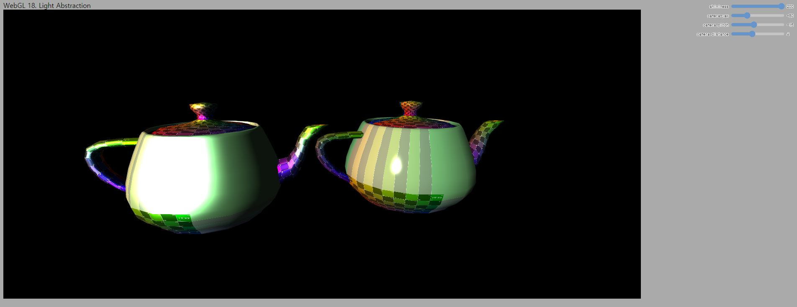

# 18. Light Abstraction

이번 강의에서는 Light 구현 부분을 마무리하면서 Shadow 관련 강의 내용을 준비하는 코드를 작성해 보았습니다. 일단 변경 사항 목록을 작성해 보면 아래와 같습니다.

1. Material 클래스 구현을 `Material.js`로 분리
2. Light 클래스 구현을 `BasicLight.js`로 분리
3. 셰이더 소스를 `dirLightVertex/Fragment.js`로 분리
4. Orbit Camera 추가 구현
5. UI 추가
6. (Canvas 사이즈 변경)

특별히 어려운 부분은 없는데, 2-3번 과정에서 상속이 사용되어 조금 헷갈릴 수도 있습니다. 상속이 잘 기억안나시는 분들은 리마인드를 한번 하고 내용을 보시면 좋을것 같습니다.

## How to

이전 코드에서 변화된 내용들을 보자면 아래와 같습니다. 보셔야 하는 파일들을 번호 목록 앞에 표기해 두었습니다.

---
1. [`_classes/Material.js`] Material 클래스 구현 분리

    지난번 `main.js`에 있던 구현을 그대로 옮겼기 때문에 별도 설명은 필요 없을 것 같습니다.

2. [`_classes/BasicLight.js`] (Directional)Light 클래스 구현 분리

    ```js
    export class Light {
        lightColor;
        ambientIntensity;
        diffuseIntensity;

        constructor(lightColor, aIntensity, dIntensity)
        {
            this.lightColor = lightColor;
            this.ambientIntensity = aIntensity;
            this.diffuseIntensity = dIntensity;
        }
    }

    export class DirectionalLight extends Light {
        direction;

        constructor(lightColor, aIntensity, dir, dIntensity)
        {
            super(lightColor, aIntensity, dIntensity);
            this.direction = dir;
        }

        UseLight(gl,shader)
        {
            shader.SetUniform3f(gl,"u_directionalLight.base.lightColor", this.lightColor[0], this.lightColor[1], this.lightColor[2]);
            shader.SetUniform1f(gl,"u_directionalLight.base.ambientIntensity", this.ambientIntensity);
            shader.SetUniform1f(gl,"u_directionalLight.base.diffuseIntensity", this.diffuseIntensity);

            shader.SetUniform3f(gl,"u_directionalLight.direction", this.direction[0], this.direction[1], this.direction[2]);
        }
    }
    `;
    ```

    지난 강의에서 구현했던 Light 클래스를 이제 Light 클래스와 DirectionalLight 클래스로 분리했습니다. Light 클래스는 기본 클래스이고, DirectionalLight는 유도 클래스입니다. JS에서는 extends 키워드를 사용해 상속관계를 구현하고 super 키워드를 사용해 기본 클래스의 생성자를 호출할 수 있습니다.

    데이터와 기능 면에서 현재 버전의 DirectionalLight 클래스를 사용하면 지난번의 Light클래스와 완전히 동일한 것을 아실 수 있을겁니다. 이렇게 구현한 이유는 사실 Directional light가 Light의 한 종류이기 때문입니다. 일반적으로 많이 사용되는 다른 조명으로 [Point light](https://webgl2fundamentals.org/webgl/lessons/ko/webgl-3d-lighting-point.html), [Spot light](https://webgl2fundamentals.org/webgl/lessons/ko/webgl-3d-lighting-spot.html) 등이 있습니다. (Point light는 과제를 통해 직접 구현해 보실 겁니다 ^^) 

    어떤 조명이던 공통적으로 조명의 색상과 diffuseIntensity를 가지기 때문에 기본 클래스인 Light에 포함시켜 두었습니다. 일반적으로 ambientIntensity의 경우 특정 조명에 종속적인 값은 아니지만, 여기서는 편의를 위해서 Light에 포함시켜 두었습니다. (게임 엔진에서는 보통 Skybox와 같은 전역적인 조명 환경에 포함됩니다.) Directional light는 여기에 더해서 조명의 방향이 필요하므로 유도 클래스의 데이터에 구현합니다. Point light에는 어떤 데이터가 필요할까요? 과제를 하시다 보면 알게 되실겁니다.

    주목하셔야 할 부분은 `UseLight()` 메소드 안에서 `SetUniformXX`를 호출할때 셰이더 내의 변수 이름이 바뀌었다는 점입니다. 아래 셰이더 코드 설명을 보시고 나서 다시 돌아와 매치시켜 생각해 보십시오.

3. [`_shaders/dirLightFragment.js`] 프래그먼트 셰이더 분리

    ```glsl
    #version 300 es
    precision highp float;

    struct Light
    {
        vec3 lightColor;
        float ambientIntensity;
        float diffuseIntensity;
    };

    struct DirectionalLight
    {
        Light base;   
        vec3 direction;
    };

    ...

    vec3 CalculateLight(Light light, vec3 direction)
    {
        ...
        
        return (lightAmbient + lightDiffuse + lightSpecular);
    }
    
    vec3 CalculateDirectionalLight()
    {
        return CalculateLight(u_directionalLight.base, u_directionalLight.direction);
    }

    void main() {
        vec3 lightColor = CalculateDirectionalLight();

        outColor = texture(u_mainTexture, v_texcoord) * vec4(lightColor,1.0);
    }
    ```

    정점 셰이더는 이전 강의와 동일하기 때문에 설명을 생략합니다. 프래그먼트 셰이더는  바뀐 부분이 있습니다.

    먼저 위쪽의 Light 클래스 구현과 마찬가지로 셰이더에서 Light와 DirectionalLight를 별도의 구조체로 정의하였습니다. Light 객체는 색상, ambient 및 diffuse intensity를 가집니다. DirectionalLight 객체는 Light 객체와 방향 벡터를 가집니다. GLSL은 C언어와 유사해서 상속에 대한 문법은 없습니다. 하지만 위와 같이 Light 객체를 멤버로 가지고 있는 경우에 상속과 동일하게 DirectionalLight 객체가 Light의 모든 데이터를 가진다는 것을 아실겁니다.

    DirectionalLight 타입 객체인 `u_directionalLight`에 포함된 `base`의 `lightColor`에는 어떻게 접근하면 될까요? `u_directionalLight.base.lightColor` 이렇게 접근하면 되겠죠? 그래서 위 2번에서 설명한 클래스의 `UseLight()` 메소드에 보면 이와 같은 이름의 uniform에 데이터를 전달하도록 구현해 두었습니다. 셰이더 내부 코드도 마찬가지입니다. C언어로 구현된 코드라고 생각하고 보시면 모두 이해하실 수 있을 것으로 생각됩니다.

    추가적으로 `CalculateLight()`와 `CalculateDirectionalLight()` 함수를 구현해 코드를 정리했습니다. 과제에서 Point light 구현에도 사용하시게 될겁니다.

4. [`main.js` & `_classes/OrbitCamera.js`] Orbit Camera 구현 및 사용

    ```js
    //---Camera(view) Initialize
    let eye = [0.0, 0.0, 5.0];
    let at = [0.0, 0.0, 0.0];
    let up = [0.0, 1.0, 0.0];
    let yaw = -90.0;
    let pitch = 0.0;
    let distance = 5.0;
    let turnspeed = 10.0;
    let mainCamera = new OrbitCamera(eye,at,up,yaw,pitch,distance,turnspeed);
    ```

    지난번 예제까지 우리가 구현해 사용하던 카메라는 흔히 Fly camera라고 이야기하는 WSAD를 사용해 움직이고 마우스로 둘러보는 카메라였습니다. 제가 퀴즈에서 UI를 구현해 값을 바꿔보라고 한 경우가 몇번 있었을텐데, 이 경우 Fly camera를 통해서 화면을 보는데 상당히 힘드셨을 겁니다. 앞으로는 이런 문제를 해결할 수 있는 Orbit camera를 사용하고 카메라 위치도 UI를 사용해 바꿀겁니다.

    Orbit Camera는 특정 위치(또는 물체)를 고정하여 바라보는 카메라입니다. 제 구현에서는 두번째 인자로 넘겨주는 at 위치를 계속 바라보록 해 두었습니다. Orbit camera의 구현에 대한 설명은 생략하도록 하겠습니다. 궁금하신 분은 코드를 보고 종이에 한번 그려보시면 어렵지 않게 이해하실 수 있을겁니다. (world)At 위치를 기준으로 yaw 및 pitch각을 이용해 eye 위치를 역산하는 방식입니다.

5. [`main.js` & `contents.html`] UI 추가

    ```html
    <!--contents.html-->
    ...
    <div id="uiContainer">
      <div id="ui">
        <div id="shininess"></div>
        <div id="camera-yaw"></div>
        <div id="camera-pitch"></div>
        <div id="camera-distance"></div>
      </div>
    </div>
    ```

    ```js
    //main.js
    webglLessonsUI.setupSlider("#shininess", {slide: updateShininess, min: 0, max: 200, step: 0.1});
    webglLessonsUI.setupSlider("#camera-yaw", {slide: updateCameraYaw, min: -180, max: 180, step: 0.5});
    webglLessonsUI.setupSlider("#camera-pitch", {slide: updateCameraPitch, min: -90, max: 90, step: 0.5});
    webglLessonsUI.setupSlider("#camera-distance", {slide: updateCameraDistance, min: 0, max: 10, step: 0.1});

    ...

    //slider의 값이 변할 때마다 호출되는 함수
    function updateShininess(event, ui)
    {
        shineMat.shininess = ui.value;
    }
    function updateCameraYaw(event, ui)
    {
        mainCamera.yaw = ui.value;
        mainCamera.Update();
    }
    function updateCameraPitch(event, ui)
    {
        mainCamera.pitch = ui.value;
        mainCamera.Update();
    }
    function updateCameraDistance(event, ui)
    {
        mainCamera.distance = ui.value;
        mainCamera.Update();
    }
    ```

    오랜만에 UI를 다시 사용합니다. Orbit camera의 yaw와 pitch각, 그리고 대상으로부터의 거리를 조정할 수 있는 슬라이더와 물체의 shininess를 조정할 수 있는 네개의 슬라이더를 추가 하였습니다. `slide:` 뒤에 써있는 함수가 슬라이더가 움직일때마다 호출되는 콜백 함수라는 내용 기억 나시나요?

    카메라의 경우에는 슬라이더가 움직이면 해당 값으로 yaw, pitch, distance를 갱신한 뒤 `Update()` 메소드를 호출하고, shininess의 경우엔 `shineMat.shininess`값을 갱신합니다. 바뀐 뷰행렬과 shininess값은 매 프레임 드로우콜을 호출하기 전에 셰이더로 넘어가게 될겁니다.

6. [`resources/webgl-tutorial.css`] (Canvas 사이즈 변경) 

    ```css
    canvas {
        background-color: #fff;
        border: 1px solid black;
        /* NOTE: This size is changed if in iframe - see below '.iframe canvas' */
        width: 80%;
        height: 80%;
        display: block;
    }
    ```

    내용과는 크게 상관없는 부분이지만 앞으로는 스크린샷을 좀 크게 보여드려야 할것 같아서 canvas의 width와 height를 400x300 고정 크기에서 페이지의 80% 크기로 변경하였습니다. 여러분은 따라서 변경하셔도 되고, 안하셔도 크게 상관은 없습니다.

---

`http://localhost:8080/lessons/_current/contents.html`(또는 `http://localhost:8080/lessons/18_light_abstraction/contents.html`)에 접속해 보시면 아래와 같은 화면을 보실 수 있습니다. 이제 남은 몇 개의 강의에서는 이와 같이 카메라 시점의 변환을 키보드 & 마우스가 아닌 슬라이더 UI를 통해 수행하게 될겁니다. 카메라의 yaw, pitch, distance를 바꾸어 시점 변경을 해 보시고 shininess가 잘 변경되는지 확인해 보세요.



다음 강의에서는 Shadow mapping을 위한 깊이맵 렌더링 방법에 대해 알아보도록 하겠습니다.


## Quiz

1. 슬라이더 UI를 하나 더 추가해서 `dullMat`의 intensity를 인터랙티브하게 바꿀 수 있도록 구현해 보세요.

2. 장면에 Directional light가 하나가 아니고 두개가 있다면 셰이더가 어떻게 바뀌어야 할까요? 과제 내용과도 깊이 연관되어 있으니 꼭 생각해 보세요.

## Advanced

1. Orbit camera의 at 위치를 인터랙티브하게 바꿀 수 있도록 확장해 보세요.

## Useful Links

- [Point Light](https://webgl2fundamentals.org/webgl/lessons/ko/webgl-3d-lighting-point.html)
- [Spot light](https://webgl2fundamentals.org/webgl/lessons/ko/webgl-3d-lighting-spot.html)
- [캔버스 리사이징과 WebGL](https://webgl2fundamentals.org/webgl/lessons/ko/webgl-resizing-the-canvas.html)

---

[다음 강의](../19_depth_map/)

[목록으로](../)

