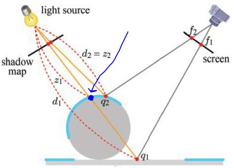
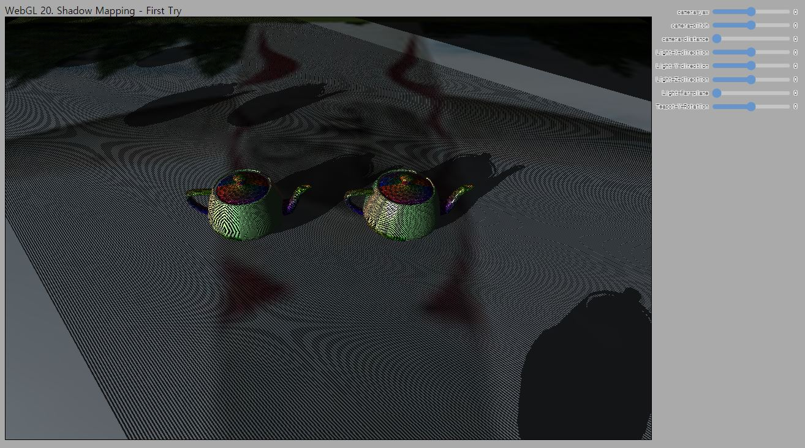

# 20. Shadow Mapping - First Try

이제 깊이맵을 그리는 방법을 알았으니 깊이맵을 사용해서 그림자를 그려봅시다. 이론 강의에서 배운 내용은 아래 한 장의 그림으로 간단히 요약이 됩니다. 오른쪽 위의 카메라 위치에서 보이는 어떤 프래그먼트`(q1, q2)`가 그림자인지 아닌지 판단하려고 합니다. 프래그먼트로부터 깊이맵을 생성할 때 사용된 조명까지의 거리인 `d1, d2`를 계산합니다. 그리고 프래그먼트 위치에 대해 깊이맵에 저장된 깊이값 `z1, z2`를 조회합니다.

만일 `z`와 `d`가 같으면(`q2`의 경우) 해당 프래그먼트는 그림자 영역에 있지 않습니다. 만일 `z`가 `d`보다 작으면(`q1`의 경우) 해당 프래그먼트는 그림자 영역에 있습니다. 왜냐하면 깊이맵에는 `q1`점이 아닌 화살표로 표시한 파란 점에 대한 깊이값이 저장되어 있기 때문입니다. 깊이맵은 화면에 가장 가까운 픽셀의 깊이값만을 저장합니다. (Z-buffering을 사용하는 이유죠.)



깊이맵을 그리는 방법을 이미 살펴봤으니, 두번째 패스(오른쪽 상단의 카메라 시점에서 그리는 패스)를 어떻게 구현해야 하는지, `z`와 `d`를 어떻게 계산하는지 등을 코드를 통해 알아보도록 합시다. 또한 단순히 위와 같이 구현하면 어떤 문제가 발생하는지도 직접 살펴보도록 합시다.

> Shadow Mapping(쉐도우 맵핑)이란 방금 설명한것처럼 깊이맵(또는 쉐도우맵)의 값을 사용하여 그림자 영역 여부를 판단해 그림자를 렌더링하는 방법을 이야기합니다. 그래픽스 API를 사용해 그림자를 그리는 방법이 쉐도우 맵핑만 있는것은 아닙니다. 쉐도우 볼륨을 사용한 기법이나, 정점을 평면에 직접 투영하여 그리는 방법도 있습니다. 현재 가장 널리 사용되는 방법이 쉐도우 맵핑 기반 방법이어서 이 방법을 설명드리는 것입니다. 쉐도우 맵핑은 예측 가능한 연산량을 가진 알고리즘이며 장면 구성에 독립적으로 적용 가능하다는 장점이 있기 때문에 널리 사용됩니다. 

---

## How to

이전 코드에서 변화된 내용들을 보자면 아래와 같습니다. 보셔야 하는 파일들을 번호 목록 앞에 표기해 두었습니다.

---
1. [`_shaders/dirDepthmapVertex/Fragment.js`] DepthMap 생성 셰이더

    이전에 `main.js`에 직접 구현했던 깊이맵 생성 셰이더를 별도의 파일로 분리하였습니다. 내용은 변한 것이 없습니다.

    해당 셰이더는 `main.js`에서 아래와 같이 import하고 있습니다.

    ```js
    //깊이맵 생성 셰이더
    import dirDepthmapVertexShader from '../_shaders/dirDepthmapVertex.js';
    import dirDepthmapFragmentShader from '../_shaders/dirDepthmapFragment.js';
    ```

2. [`main.js`] 두번째 패스에 사용할 정점 셰이더

    ```glsl
    var dirShadowVertexShader = 
    ...
    uniform mat4 u_directionalLightViewProjection; //light space transform matrix

    ...
    out vec4 v_lightSpacePos; //fragment의 light space 기준 좌표가 필요

    void main() {
        ...

        //정점의 조명 공간 좌표. shadow 계산에 사용
        v_lightSpacePos = u_directionalLightViewProjection * u_model * vec4(a_position,1.0);
    }
    `;
    ```

    이제 두번째 패스에서는 기존과 같이 조명효과를 적용해 화면을 그릴뿐만 아니라, 거기에 더해서 그림자를 그려야 합니다. [18. Light abstraction](../18_light_abstraction/README.md)에서 최종적으로 정리한 정점 셰이더와 동일한 작업을 수행하기 때문에 대부분의 코드는 동일합니다. 추가된 것은 위에 적어둔 코드들입니다.

    먼저 uniform으로 `u_directionalLightViewProjection`가 추가되었습니다. 카메라에서 보이는 프래그먼트 `(q1, q2)`가 조명의 위치에서 봤을때 깊이가 얼마나 되는지, 즉 `d1`과 `d2`의 계산이 필요할겁니다. 
    
    "`d1`과 `d2`의 계산을 위해서는 조명의 위치만 알면 되지 않나?" 하는 생각이 드실 수 있지만 그렇지 않습니다. `d`와 `z`를 비교하기 위해서는 같은 조건에서 비교해야 하는데, z값, 즉 깊이맵에 쓰여있는 깊이값은 지난강의 마지막에 봤던것처럼 far plane에 따른 정규화된 값입니다. 또한 조명이 어디를 바라보고 있느냐에 따라서도 그 값이 달라지기 때문에 깊이맵을 생성할때와 정확히 동일한 뷰/투영 행렬을 사용해 변환한 상태로 `d`값을 계산해야 합니다.

    또한 깊이맵을 생성할때와 정확히 동일한 뷰/투영 행렬을 사용한 변환을 수행해야만 깊이맵으로부터 해당 프래그먼트 위치의 깊이값인 `z`를 샘플링할 수 있게 됩니다. 이에 대해서는 아래 프래그먼트 셰이더 코드에서 설명 드리겠습니다.

    varying으로 `v_lightSpacePos`을 출력하고 있는데 이 값의 계산식은 아래 `main()`에 있습니다. 정점의 위치에 MVP 행렬을 곱하는데, 여기서 VP행렬은 `u_directionalLightViewProjection`입니다. 이미 깊이맵을 그릴때 수행했던 변환입니다. 화면에 그리기 위해 정점을 변환할 때는 클립공간으로의 변환이고 이렇게 조명 시점으로의 변환은 조명 공간(light space) 변환이라고 부릅니다.

3. [`main.js`] 두번째 패스에 사용할 프래그먼트 셰이더

    ```glsl
    var dirShadowFragmentShader = 
    ...

    layout(location=0) out vec4 outColor;

    ...
    uniform sampler2D u_depthMap; //depth map

    ...
    in vec4 v_lightSpacePos; //light 공간 좌표


    float CalculateShadowFactor(DirectionalLight light)
    {
        vec3 projCoords = v_lightSpacePos.xyz / v_lightSpacePos.w; // <-- (1)
        projCoords = (projCoords * 0.5) + 0.5; // <-- (2)
        float z = texture(u_depthMap, projCoords.xy).r; // <-- (3)
        float d = projCoords.z; // <-- (4)
        float shadowFactor = d > z ? 1.0 : 0.0; // <-- (5)
        return shadowFactor;
    }

    vec3 CalculateLight(Light light, vec3 direction, float shadowFactor) 
    {
        ...
        return (lightAmbient + (1.0-shadowFactor) * (lightDiffuse + lightSpecular));
    
    }

    vec3 CalculateDirectionalLight()
    {
        float shadowFactor = CalculateShadowFactor(u_directionalLight);
        return CalculateLight(u_directionalLight.base, u_directionalLight.direction, shadowFactor);
    
    }

    void main() {
        vec3 lightColor = CalculateDirectionalLight();
        outColor = texture(u_texture, v_texcoord) * vec4(lightColor,1.0);
    }
    `;
    ```

    프래그먼트 셰이더가 상당히 길어졌는데 대부분은 [18. Light abstraction](../18_light_abstraction/README.md)때와 동일합니다. 동일한 부분은 설명을 생략하도록 하겠습니다.

    실제로 특정 픽셀이 그림자에 가려지는 영역인지 아닌지를 계산하는 함수는 `CalculateShadowFactor()` 입니다. (1)~(5)까지 한줄씩 살펴보도록 하겠습니다.

    ---

    ### (1) Perspective division
    
    varying인 `lightSpacePos`의 `xyz`를 `w`로 나누어 주고 있습니다. 이렇게 `w`로 나누는 과정을 perspective division이라고 부른다는 것을 rasterizer 강의에서 배웠습니다. 어? 그런데 perspective division은 GPU에서 알아서 해준다고 했었는데요, 여기서는 왜 직접 하고 있는걸까요?

    GPU가 알아서 perspective vision을 해주는 것은 클립 공간의 좌표, 즉 `gl_Position`에 대입된 벡터 뿐입니다. 우리가 정의한 varying 변수를 통해 프래그먼트 셰이더로 넘겨준 값들은 필요한 경우 우리가 직접 perspective division을 해주어야 합니다. varying에 대응된 값은 조명 공간 기준의 값이고, 투영 변환에 의해 `w`값이 1이 아닐 수도 있으므로 `w`로 나눠주는 과정이 필요합니다. 
    
    >물론 여기서는 orthographic 투영을 하기 때문에 `w`가 1이어서 이 과정을 거치지 않아도 동일한 결과가 나옵니다. 하지만 만일 point light를 사용해 그림자를 그리려면 원근 투영을 하기 때문에 꼭 해줘야 합니다. 따라서 perspective division을 하도록 해 두면 두 경우에 모두 대응할 수 있습니다.

    ### (2) Depth value conversion

    조명 공간 변환을 마치면 클립 공간과 동일하게 x, y, z가 [-1, 1] 범위의 공간으로 변환됩니다. 그런데 깊이맵에 쓰여져 있는 `z`값의 범위는 [0, 1]입니다. Z-buffering 과정에서 그렇게 변환하기 때문입니다. 또한 생각해보면 깊이맵으로부터 값을 샘플링 할때에도 사용하는 텍스처 좌표의 범위는 [0, 1]입니다.

    그래서 두 가지 목적을 모두 달성하기 위한 연산을 수행합니다. 우리가 깊이맵에 가지고 있는 `z`값과, 여기서 계산하는 `d`값이 같은 범위내에 있어야 하기 때문에 [-1, 1] 범위의 값을 [0, 1]범위의 값으로 변환하기 위해 0.5를 곱한뒤 0.5를 더해줍니다. 그리고 이렇게 함으로써 클립 공간의 x,y 위치도 [-1, 1] 범위에서 [0, 1] 범위로 변환되어 깊이값 샘플링을 위한 텍스처 좌표로 사용할 수 있게됩니다.

    ### (3) Depth(z) sampling

    이제 우리가 그리고자 하는 픽셀들(ex, `q1, q2`)이 조명 위치에서 보았을 때 어디에 위치하고 있는지가 `projCoords.xy`에 저장되어 있습니다. 값의 범위는 (2)번에서의 변환을 통해 [0, 1]범위가 되었습니다. 따라서 이 좌표값을 텍스처 좌표로 사용해 깊이맵으로부터 값을 샘플링하면 깊이맵에 저장된 현재 픽셀의 깊이값인 `z`을 얻어올 수 있습니다.

    ### (4) `d` calculation

    `d`값, 즉 조명에서 해당 프래그먼트까지의 거리는 (2) 과정을 통해 [0, 1]범위로 변환되어 이미 `projCoord.z`에 저장되어 있습니다. 

    ### (5) Shadow factor calculation

    `d`가 `z`보다 큰 경우 그림자 영역을 의미하는 1을, 그렇지 않으면 0을 반환합니다.

    ---

    이제 `shadowFactor`에 그림자 영역인지 여부가 저장되어 반환되므로, 이 정보를 카메라에서 보이는 프래그먼트의 색상 정보 결정에 사용하면 됩니다. `CalculateLight()` 함수의 마지막 부분에서 아래와 같은 계산을 수행합니다.

    ```glsl
    return (lightAmbient + (1.0-shadowFactor) * (lightDiffuse + lightSpecular);
    ```

    수식을 보면 `shadowFactor`가 1.0인 경우, ambient term만 적용됩니다. `shadowFactor`가 0이면, 세 term이 모두 적용됩니다. 명백하죠? 그림자가 지는 영역에서는 주변광에 의한 영향만을 받고, 그림자가 지지않는 영역에서는 조명에 의한 모든 효과를 받습니다.

4. [`main.js`] 장면 그리기 함수 분리

    ```glsl
    function drawScene(shader)
    {
        // 주전자 1 그리기
        ...

        teapot.RenderModel(gl, shader);

        // 주전자 2 그리기
        ...

        teapot.RenderModel(gl, shader);

        // 바닥면 그리기
        ...

        ground.RenderModel(gl, shader);
    }
    `;
    ```

    <span style="color:red">기존의 `drawScene()`함수는 `drawFrame()`으로 이름을 변경하고, `drawScene()` 함수를 새로 구현하였습니다. </span> 구현 내용은 코드를 보면 아실거고, 여기서는 이렇게 한 이유를 말씀드리겠습니다.

    이전 강의에서는 첫 패스에서는 깊이맵을 그리고 두번째 패스에서는 그 깊이맵을 확인해 보기위해 두개의 별개 장면을 구성했습니다. 첫 패스에서 그리는 장면은 주전자 하나와 Directional light가 있는 장면이었고, 두번째 패스에서 그리는 장면은 카메라와 평면이 하나 있는 장면이었습니다.

    그런데 일반적으로는 첫 패스에서 깊이맵을 그린뒤에 두번째 패스에서도 동일한 구성을 가진 장면을 카메라 시점에서 렌더링을 하게됩니다. 두 장면사이에 불일치가 발생하면 그림자 효과 계산에 오류가 발생할 겁니다.

    따라서 여기서는 두 패스에 공통적으로 장면에 배치할 두 개의 주전자와 하나의 바닥면을 그리는 API들을 모두 `drawScene()`안에 모아 두었습니다. 그리고 나서 첫 번째 패스에서는 깊이맵을 그리는 셰이더를 인자로 넘겨 `drawScene()`을 호출하고, 두번째 패스에서는 조명 효과과 그림자 효과를 그리는 셰이더를 인자로 넘겨 `drawScene()`을 다시한번 호출할겁니다. 이렇게 하면 장면 구성이 달라져 오류가 발생할 가능성이 없어집니다.

    > 보시면 아시겠지만, 깊이맵을 그리는 셰이더에는 `mainTexture`와 같은 uniform이 없는데도 uniform에 값을 설정하는 API를 호출하고 있습니다. 이것이 "좋다"고 할순 없지만 "문제없다"고는 할 수 있습니다. 이런 케이스를 효율적으로 관리하기 위한 다른 API가 있지만, 이번 학기에 설명드리기는 어려울 것 같습니다.

5. [`main.js`] 프레임 그리기

    ```js
    function drawFrame()
    {
        
        // --- 1st pass--- //
        {
            ...

            drawScene(depthMapShader); 
            ...
        }

        {
            webglUtils.resizeCanvasToDisplaySize(gl.canvas);
            gl.viewport(0, 0, gl.canvas.width, gl.canvas.height);

            renderer.Clear(gl);

            shadowShader.Bind(gl); 
            mainLight.depthMap.Read(gl,1);  
            shadowShader.SetUniform1i(gl, "u_depthMap", 1); // <-- (1)

            var view = mainCamera.CalculateViewMatrix();
            shadowShader.SetUniformMat4f(gl, "u_view", view); // <-- (2)
            shadowShader.SetUniformMat4f(gl, "u_projection", proj); // <-- (3)

            var eyePos = mainCamera.eye;
            shadowShader.SetUniform3f(gl,"u_eyePosition", eyePos[0], eyePos[1],eyePos[2]); // <-- (4)

            mainLight.UseLight(gl, shadowShader); // <-- (5)

            drawScene(shadowShader); // <-- (6)

            shadowShader.Unbind(gl);
        }
    
        requestAnimationFrame(drawFrame);
    }
    ```

    한 프래임을 그리기위해 두 개의 패스를 거칩니다. 깊이맵을 그리는 첫번째 패스는 지난번과 동일합니다. 다만 장면에 물체를 배치하고 그리는 API호출들이 모두 `drawScene()`함수 안으로 들어가 있을 뿐입니다. 인자로 `depthMapShader`를 넘겨주는 것을 잊지 마시고요.

    두번째 패스에서는 `drawScene(shadowShader)` 이외에도 몇가지를 더 호출하고 있습니다. 이를 명확하게 이해할 수 있도록 도와드리겠습니다. 아래에 `shadowShader`에 입력해 주어야 하는 uniform들의 리스트와, 위 코드에서 각각 어느 명령문이 어떤 uniform에 값들을 설정해 주고 있는지를 표시해 두었습니다. 
    
    하나씩 점검해 보면서, 우리가 부지런히 Abstraction을 해 놓지 않았으면 어떤 참사가 발생했을지도 한번 상상해 보세요. 지금 이곳의 uniform 설정 코드가 잘 이해되고 매칭이 되셨다면 저는 이번학기에 여러분이 WebGL 프로그래밍을 잘 배우셨다고 생각하고 성불할 수 있을 것 같습니다. 

    ```glsl
    //정점 셰이더
    uniform mat4 u_projection; // <-- (3)
    uniform mat4 u_view; // <-- (2)
    uniform mat4 u_model; // <-- (6)
    uniform mat4 u_directionalLightViewProjection; // <-- (5)

    //프래그먼트 셰이더
    uniform sampler2D u_mainTexture; // <-- (6)
    uniform DirectionalLight u_directionalLight; // <-- (5)
    uniform vec3 u_eyePosition; // <-- (4)
    uniform Material u_material; // <-- (6)
    uniform sampler2D u_depthMap; // <-- (1)
    ```

---

`http://localhost:8080/lessons/_current/contents.html`(또는 `http://localhost:8080/lessons/20_shadow_mapping_first_try/contents.html`)에 접속해 보시면 아래와 같은 화면을 보실 수 있습니다. 지난번과 마찬가지로 UI에 관련한 코드까지 모두 설명드리지는 않았는데 이제는 코드를 찬찬히 보시면 모두 이해하실 수 있을 겁니다. 지난번 강의 UI에 더해서, 메인 카메라 이동과 바닥면의 위아래 이동을 할 수 있도록 UI 슬라이더를 추가해 두었습니다.



주전자 밑에 그림자가 보이기는 보이는데, 여러가지 뭔가 잘못된 결과들이 나타나고 있는 것 같습니다.

Shadow acne 문제는 이론 강의시간에도 설명 드렸지만, 다음 강의에서 약간의 원인 설명을 더 드린 뒤에, bias를 추가해서 해결해 보도록 하겠습니다.

## Quiz

1. varying인 `v_lightSpacePos`에 대해 프래그먼트 셰이더에서 perspective division을 직접 해주어야 한다고 했는데요, specular term 구현해서 추가한 varying인 `v_worldPosition`은 perspective division을 안해줘도 되는걸까요?

2. 현재 깊이맵의 해상도는 512x512 입니다. 깊이맵의 해상도를 높이거나 낮추어서 어떻게 화면이 바뀌는지 살펴보세요.

3. 첫번째 패스에서, 바닥면의 깊이값까지 깊이맵에 기록해 두고 있습니다. 꼭 그래야만 하는건지 생각해 보세요.

## Advanced

1. Shadow acne 말고 크게 눈에띄는 문제는 그림자가 주전자가 없는 구역에도 반복해서 나타나고 있다는 겁니다. 문제의 원인이 무엇일까요? 그리고 어떻게 해결하면 될까요?

2. 지난번에 이어서 Point light를 장면에 배치하여 그린 깊이맵을 사용하고 이를 확장하여 그림자 효과를 구현해 보세요. ([그림자 맵핑](https://webgl2fundamentals.org/webgl/lessons/ko/webgl-shadows.html) 참고)

## Useful Links

- [그림자 맵핑](https://webgl2fundamentals.org/webgl/lessons/ko/webgl-shadows.html)

---

[다음 강의](../21_shadow_mapping_add_bias/)

[목록으로](../)
