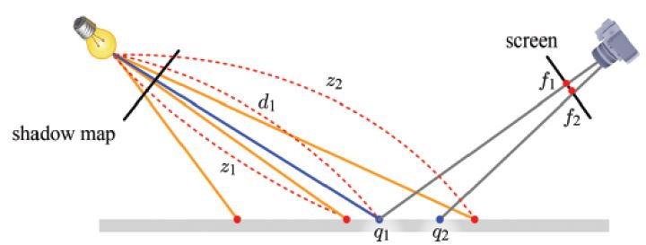
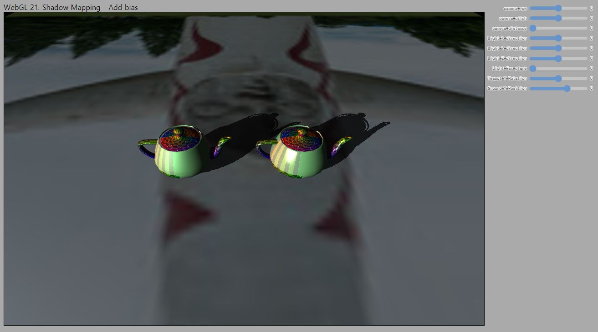

# 21. Shadow Mapping - Add Bias

이번에는 그림자 효과에 보이던 얼룩덜룩한 무늬들을 제거해 좀더 깔끔한 결과를 만들어 보도록 하겠습니다.

---

### Shadow Acne

일단 왜 문제가 발생했는지부터 알아야겠죠? 강의 자료에 있는 아래 그림이 잘 설명해 주고 있습니다.



장면에는 그림과 같이 평면(회색 가로선)만 하나 존재하고 있습니다. 그러면 아무것도 평면을 가리고 있지 않으니 그림자가 없어야 할겁니다. 첫번째 패스에서 왼쪽 상단에 있는 조명 위치에서 깊이맵을 생성하였습니다. 깊이맵에 있는 깊이값들은 빨간색 프래그먼트의 깊이값들이 기록되어 있다고 가정해 봅시다. 만일 우리가 깊이맵의 해상도를 높게 설정하였다면 그림에서 빨간 점들의 밀도가 더욱 높았을 것이고, 해상도를 낮게 설정하였다면 밀도가 낮았을 겁니다.

이제 두번째 패스에서는 오른쪽 상단의 카메라 위치에서 픽셀들이 그림자 영역에 있는지 아닌지를 판별할 겁니다. `q1`과 `q2`위치가 그림자 영역인지 아닌지 생각해 보면 당연히 그림자 영역이 아니어야 합니다.  셰이더에서 우리는 `d > z`인 경우 그림자로 판단하고 있습니다. `q1` 위치의 `d`는 `d1`입니다. 

`q1`위치의 `z`는 뭐가 될까요? **깊이맵에는 `q1` 위치에 대한 정확한 깊이값은 없습니다!** 단지 근처의 빨간 점들의 `z`값만 기록되어 있을 뿐입니다. 지난번 강의의 코드에서 본것처럼, `q1`점을 조명 공간으로 변환하여 xy좌표를 텍스처 좌표로 사용하면 어떤 `z`값이 얻어질까요? `z1`입니다. 왜냐하면, `ShadowLight.js`에서 깊이맵 텍스처를 Nearest Neighbor 샘플링을 하도록 설정했기 때문입니다.

이미지 텍스처링 강의에서 배운것처럼 텍스처에서 값을 샘플링 할때에는 정확히 텍셀의 가운에 위치의 텍스처 좌표가 쿼리되지 않을때에도 필터링을 통해서 값을 반환해 줍니다. 값이 어떻게 계산되어 반환되느냐는 필터링 방법에 따라 다른데 Nearest Neighbor의 경우 가장 가까운 텍셀의 데이터를 반환해줍니다. 지금 `q1`에 대해 계산된 텍스처 좌표에 가장 가까운 값은 `z1`에 해당하는 값입니다.

자, 그러면 어떤가요, `d1 > z1`입니다. 그림에서 볼 수 있듯이 `d1`의 길이가 더 깁니다. 그림자 영역으로 판단하겠네요. `q2`는 어떨까요? 같은 원리에 따라 그림자 영역이 아닌 것으로 판단합니다. 따라서 그림자가 없어야 할 영역에 군데군데 그림자가 표현되고 이 패턴이 얼룩덜룩한 무늬를 만들어 내는겁니다. 이런 현상을 Shadow Acne라고 합니다.

> 이처럼 신호를 해석하는 데 있어서 낮은 샘플링 주기로 인해 복원에 오류가 발생하는 현상을 [에일리어싱(Ailiasing)](https://en.wikipedia.org/wiki/Aliasing) 이라고 합니다.

* 깊이맵 해상도를 높이면 문제가 해결될까요? 해상도를 무한대로 높이지 않으면 문제 해결을 보장할 수 없습니다. 불가능합니다.

* Linear 필터링을 하면 해결될까요? 평면만 있는 경우엔 어느정도 완화시켜줄 수도 있지만 그래도 완전히 없어지지는 않을뿐더러 장면에 다른 형상의 물체가 있을때는 문제가 더 악화될 수도 있습니다. 또한 WebGL 스펙에서는 깊이맵을 Linear 필터링 설정하는 것 자체가 불가능합니다. (OpenGL 3는 가능)

---

해결책은 Bias라고 부르는 작은 값을 `d`에서 빼서, 위에 언급한 오차들을 보상하도록 하는 것입니다. 아주 간단한 방책이지만 꽤 효과적이기도 합니다. 문제는 bias를 개발자가 알아서 "적절한" 값을 할당해 주어야 한다는 것입니다. 어떤 bias값이 문제를 해결해 줄지는 카메라와 조명의 위치, 장면의 물체에 따라 다르기 때문에 예측이 불가능합니다. 노가다가 필요하단 이야기죠.

그냥 bias를 사용하는 것은 너무 간단하니, 이 강의 예제에서는 조금 더 똑똑한(?) 수식을 보여드리도록 하겠습니다. 퀴즈에서 이 수식에 대해 여러분 스스로 조금 더 생각해 볼 수 있도록 문제를 내 드리겠습니다.

> Shadow Acne를 해결(또는 완화)하는 방법 중의 하나로 비대칭적인 뷰 절두체를 사용하는 방법이 있습니다. (절두체가 꼭 대칭적이어야 하는 것은 아닙니다.) 카메라의 위치에 따라서 카메라에서 먼 쪽은 깊이맵을 만들때 더 낮은 해상도로 깊이값을 샘플링하고, 카메라에 가까운 쪽은 깊이맵을 더 높은 해상도로 샘플링하도록 투영 행렬을 조작할 수 있습니다.

> 강의에서 배운 그림자 생성 기법을 이해하시면 현재 널리 사용되고 있는 Shadow mapping의 기본 원리를 파악하신 겁니다. 2020년 기준 가장 널리 활용되는 그림자 생성 기법은 아마도 [Cascaded Shadow Mapping](https://docs.unity3d.com/kr/2018.4/Manual/DirLightShadows.html)일 겁니다. 흥미가 있으시면 읽어 보세요. 미래에는 다른 기법으로 바뀔지도 모릅니다. :joy:


---

## How to

이전 코드에서 변화된 내용들을 보자면 아래와 같습니다. 보셔야 하는 파일들을 번호 목록 앞에 표기해 두었습니다.

---
1. [`main.js`] 조명 + 그림자 셰이더 이동

    조명+그림자를 그리기 위한 정점 셰이더와 프래그먼트 셰이더를 별도의 파일로 분리했습니다. 그리고 아래와 같이 import하도록 하였습니다.

    ```js
    //조명+그림자 효과 셰이더 
    import dirShadowVertexShader from '../_shaders/dirShadowBiasVertex.js'
    import dirShadowFragmentShader from '../_shaders/dirShadowBiasFragment.js'
    ```

2. [`_shaders/dirShadowBiasFragment.js`] 두번째 패스에 사용할 프래그먼트 셰이더

    ```glsl
    float CalculateShadowFactor(DirectionalLight light)
    {
        ...
        float z = texture(u_depthMap, projCoords.xy).r;
        float d = projCoords.z; 

        vec3 normal = normalize(v_normal);
        vec3 lightDir = normalize(-light.direction);
        float bias = max(0.05*(1.0 - dot(normal,lightDir)), 0.0005); // <-- (1)

        float shadowFactor = d - bias > z ? 1.0 : 0.0; // <-- (1)

        if(d > 1.0) // <-- (2)
        {
            shadowFactor = 0.0;
        }

        if(projCoords.x > 1.0 || projCoords.y > 1.0 || projCoords.x < 0.0 || projCoords.y < 0.0) // <-- (3)
        {
            shadowFactor = 0.0;
        }

        return shadowFactor;
    }
    `;
    ```

    바뀐것은 프래그먼트 셰이더, 그 중에서도 `CalculateShadowFactor()` 함수 뿐입니다. (1), (2), (3)으로 표시된 세 가지 변경사항이 있는데 하나씩 살펴보도록 하겠습니다.
    
    우선 이론 강의에서와는 다르게 bias를 고정값이 아닌, (1)과 같은 계산식을 통해 계산하도록 수정하였습니다. 전에도 잠깐 언급했는데, 이런 수식을 볼 때에는 극단적인 값들을 집어넣어서 살펴보면 특징을 파악하는데 도움이 됩니다. 더 깊은 분석은 퀴즈의 질문을 보면서 생각해 보시기 바랍니다.

    * `dot(normal, lightDir)`이 1.0인 경우: 이 경우 `max()` 함수의 첫번째 인자가 0이 되니, `bias`는 0.0005가 됩니다.

    * `dot(normal, lightDir)`이 0.0인 경우: 이 경우 `max()` 함수의 첫번째 인자가 0.05가 되니, `bias`는 0.05가 됩니다.

    bias 적용은 이게 끝입니다. `d - bias > z`를 통해 기존과 같이 계산하여 `shadowFactor`를 계산하게 되면 Shadow Acne 현상이 사라질 겁니다.

    그 다음은 (2)의 조건문입니다. `d`가 1이상인 경우, 즉 지금 그리려는 `q1`이 깊이맵을 그릴때의 far plane보다 먼 경우에는 `shadowFactor`를 `0`으로 고정하도록 하였습니다. 이 조건이 없으면 `shadowFactor`는 `d`가 1이상인 경우 1이었을겁니다. (왜일까요?)

    결과 예제에서 far plane을 UI를 사용해 5로 설정하고 (2)번 조건문이 있을때와 없을때의 차이를 비교해 보세요. 결국 (2)번 조건문은 우리가 그림자 영역인지 아닌지 계산할 데이터가 없는 없는 픽셀에 대해서는 그림자 영역이 아닌 것으로 판단하겠다는 이야기입니다.

    마지막 (3) 조건문은 깊이맵을 그릴때의 뷰 절두체의 범위를 벗어난 영역에 대해서는 그림자 영역이 아닌 것으로 판단하겠다는 의미입니다. 이 조건문이 없다면, 주전자가 존재하지 않는 영역에 대해서 계속 주전자 그림자가 반복해서 나타납니다.

    그 이유는 우리가 깊이맵의 텍스처 파라메터에 `gl.REPEAT`을 사용하고 있기 때문인데요, projCoord.xy가 1 이상이거나 0 이하인 범위에 대해서도 계속 깊이맵의 값을 조회하여 그림자 영역을 계산하기 때문입니다. 뷰 절두체 밖 영역에 대해서도 끊임없이 깊이맵이 반복되고 있는 그림을 상상하시면 됩니다.

---

`http://localhost:8080/lessons/practice/contents.html`(또는 `http://localhost:8080/lessons/21_shadow_mapping_add_bias/contents.html`)에 접속해 보시면 아래와 같은 화면을 보실 수 있습니다. 지난번 결과에서 보였던 대부분의 문제들이 해결된 것을 보실 수 있습니다. UI에서 설정 가능한 파라메터들을 조정해 보면서 문제가 없는지 살펴 보세요. 또한 흥미가 있으시다면, 다른 값을들 추가적으로 UI에서 수정 가능하도록 확장해서 결과를 관찰해 보세요.



이제 다음 강의에서는 마지막 WebGL 내용인 PCF(Percentage Close Filtering)에 대해 보여드리고 마무리를 짓도록 하겠습니다. 그림자의 경계선을 부드럽게 조정하여 좀더 만족스러운 그림자를 얻을 수 있게 될겁니다.

## Quiz

1. 아래 코드를 bias를 y축, 내적값을 x축으로 두고 x가 0~1인 범위에서 y값이 어떻게 변하는지 그래프로 그려 보세요. 그리고 왜 bias값이 그렇게 변하도록 식이 설계되었는지 생각해 보세요.

    ```glsl
    float bias = max(0.05*(1.0 - dot(normal,lightDir)), 0.0005);
    ```

## Advanced

1. 주전자 그림자가 반복해서 나타나는 것이 `gl.TEXTURE_WRAP_S & T`에 `gl.REPEAT` 옵션을 사용했기 때문이라면 그냥 `gl.CLAMP_TO_EDGE`로 바꿔주면 되지 않을까요? 직접 바꿔서 결과를 보고, 왜 그런 결과가 나타나는지 한번 이유를 생각해 보세요.

## Useful Links

- [에일리어싱](https://en.wikipedia.org/wiki/Aliasing)
- [Cascaded Shadow Mapping](https://docs.unity3d.com/kr/2018.4/Manual/DirLightShadows.html)

---

[다음 강의](../22_shadow_mapping_pcf/)

[목록으로](../)
