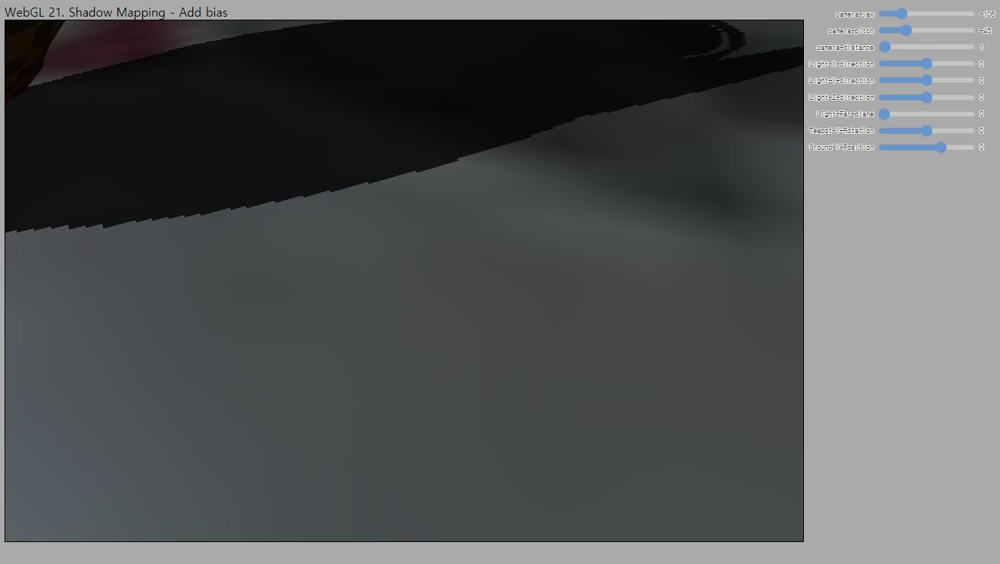
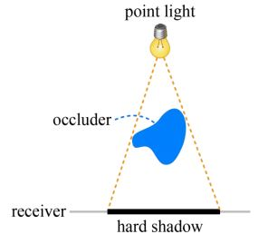
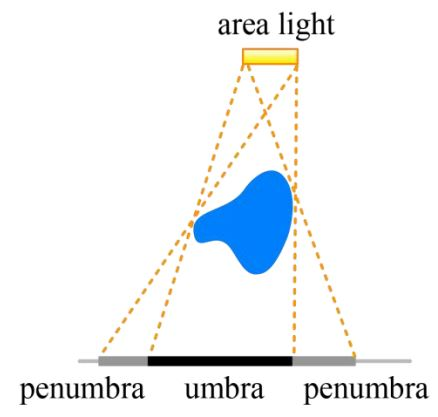
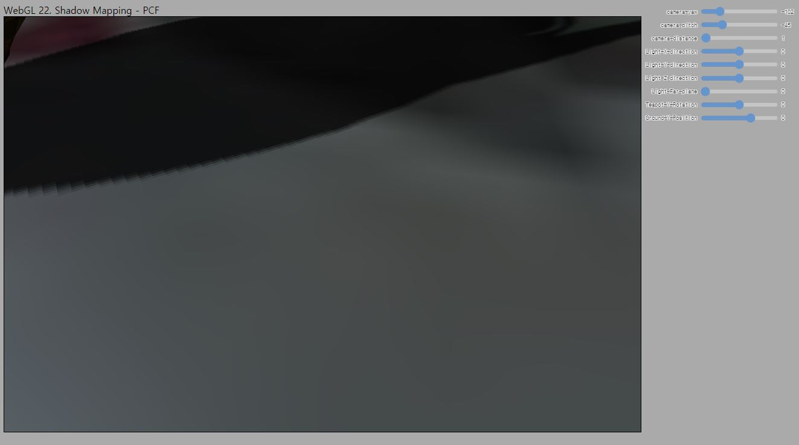

# 22. Shadow Mapping - PCF

마지막으로 부드러운 그림자의 렌더링 방법에 대해 알아보도록 하겠습니다. 이론 강의에서는 원리만 설명하고 끝냈지만, 그렇게 어렵지 않으니 구현까지 살펴보는 것이 좋을 것 같습니다.

지난 강의의 렌더링 결과물을 자세히 들여다 보면 그림자가 아래와 같이 표현되고 있습니다. 해상도가 낮아서 계단 현상이 발생하는 것이 보이네요. 계단 현상이 왜 발생하는지는 상상이 되실겁니다. (이것 또한 에일리어싱 문제입니다.) 우리가 가진 깊이맵의 해상도가 화면에 그려야 하는 픽셀에 비해 낮아서, 여러 픽셀들이 같은 깊이값을 조회하여 그림자 영역을 판단하고 있기 때문입니다. 해상도를 높이면 어느정도 완화되긴 할겁니다.



또다른 문제는 그림자 영역과 그림자가 아닌 영역이 칼로 자른듯 분명하게 나뉘어 있다는 것입니다. 이렇게 그림자 영역과 그림자가 아닌 영역이 극명하게 구분되는 것을 Hard shadow라고 합니다. 뭐가 문제냐 하고 생각하실 수도 있지만 당장 여러분 주변을 관찰해 보세요. 어떤 곳에서도 이렇게 분명한 그림자는 찾아보실 수 없을겁니다. 

왜냐하면 실 세계에 존재하는 광원은 점 광원이 아니고 면적을 갖는 area light이기 때문입니다. 빛이 면적이 없는 한 점에서 발산되는 것이 아니라 어떤 면적에 걸쳐서(예를들어 형광등의 면적) 투사되는 것이 일반적입니다. 이렇게 면적에 걸쳐 투사되는 빛에 의해 그림자는 umbra와 penumbra를 갖게 됩니다. 우리가 지난 강의에서 그림자를 계산한 방식으로는 왼쪽 그림과 같이 penumbra가 존재하지 않습니다.

<span>
</img>

</img>


</span>

이렇게 umbra와 penumbra가 모두 표현되는 그림자는 soft shadow라고 합니다. soft shadow를 정확하게 계산하려면 우선 빛의 면적을 정의해야 할거고, 그 면적을 작은 조명 여러개로 이산화해서 근사하여 효과를 계산할 수 있을 겁니다. 하지만 이런 식의 계산 방법은 shadow mapping을 기반으로 하는 그림자 효과 계산에서는 깊이맵을 여러개 만들어야 하기 때문에 현실적으로 구현이 쉽지 않습니다. 또한 깊이맵 생성을 위해 여러 패스를 거쳐야 할수도 있어서, 성능이 중요한 실시간 그래픽스에는 적합하지 않습니다.

컴퓨터 비전 또는 이미지 프로세싱 지식이 있으신 분은 가우시안 필터를 사용한 컨볼루션 연산 같은 방법을 적용하는 것을 떠올리실 수 있을겁니다. 잘 모르시는 분을 위해 간단히 설명하자면 가장자리 영역을 블러(blur)처리하는 것입니다. 그러면 물리적으로는 정확하지 않아도 그림자의 경계 영역이 흐릿해져 soft shadow 효과를 얻을 수 있을겁니다.

PCF(Percentage Close Filtering)는 계단 현상과 hard shadow 문제를 위와 같은 필터링 접근법을 사용하여 개선하는 방법입니다. 그림자 영역을 0과 1로 이산화하여 판단하는 것이 아니고, 주변 픽셀들의 깊이 정보를 활용하여 얼마만큼 그림자로 덮여있는지 그 퍼센티지를 계산하여 적용하는 방법입니다. 코드를 보시면 어렵지 않게 이해가 가능하실 겁니다.

> PCF는 일반적으로 soft shadow 알고리즘으로는 분류되지는 않는 것 같습니다. "soft-edge shadow", "shaow map anti-ailiasing" 정도의 알고리즘으로 지칭하는 문헌이 많습니다. 이해가 되는것이, 사실 제대로 된 soft shadow 알고리즘이 되려면 물체가 바닥면에서 멀어질수록(조명에 가까워질수록) 더 큰 penumbra가 생기도록 해야 하는데 뒤에 코드와 결과물을 보면 아시겠지만 PCF는 그런 부분까지는 커버가 불가능한 간단한 알고리즘입니다. soft shadow에 관련한 최신 기법이 궁금하시면 [NVidia GPU Gems의 Shadow Map 관련 글](https://developer.nvidia.com/gpugems/gpugems3/part-ii-light-and-shadows/chapter-8-summed-area-variance-shadow-maps)을 읽어보세요.

---

## How to

이전 코드에서 변화된 내용들을 보자면 아래와 같습니다. 보셔야 하는 파일들을 번호 목록 앞에 표기해 두었습니다.

---
1. [`main.js`] 조명 + 그림자 셰이더 이동

    PCF를 포함한 조명+그림자를 그리기 위한 정점 셰이더와 프래그먼트 셰이더가 별도의 파일에 구현되어 있습니다. `main.js`의 나머지 코드는 모두 동일합니다. (화면을 좀 쉽게 살펴보기 위해 UI의 범위만 조금 조정했습니다.)

    ```js
    //조명+그림자 효과 셰이더 
    import dirShadowVertexShader from '../_shaders/dirShadowPCFVertex.js'
    import dirShadowFragmentShader from '../_shaders/dirShadowPCFFragment.js'
    ```

2. [`_shaders/dirShadowBiasFragment.js`] 두번째 패스에 사용할 프래그먼트 셰이더

    ```glsl
    float CalculateShadowFactor(DirectionalLight light)
    {
        ...
        float d = projCoords.z; 

        float bias = max(0.05*(1.0 - dot(normal,lightDir)), 0.0005);

        //-- PCF --//
        float shadowFactor = 0.0;
        float texelSizeX = 1.0 / float(textureSize(u_depthMap,0).x); // <-- (1)
        float texelSizeY = 1.0 / float(textureSize(u_depthMap,0).y);
        vec2 texelSize = vec2(texelSizeX, texelSizeY);
        for(int x=-1;x<=1;x++)
        {
            for(int y=-1;y<=1;y++)
            {
                float z = texture(u_depthMap, projCoords.xy + vec2(x,y) * texelSize).r; // <-- (2)
                shadowFactor += d - bias > z ? 1.0 : 0.0;
            }
        }
        shadowFactor /= 9.0;
        //----------//

        ...

        return shadowFactor;
    }
    `;
    ```

    바뀐것은 이전과 마찬가지로 프래그먼트 셰이더, 그 중에서도 `CalculateShadowFactor()` 함수 뿐입니다. 

    (1)만 잘 이해하시면 나머지는 어렵지 않습니다. 먼저 아셔야 하는것은 [textureSize() 내장함수](https://www.khronos.org/registry/OpenGL-Refpages/gl4/html/textureSize.xhtml)입니다. 이 함수는 첫번째 인자로 넘어온 텍스처의 크기를 반환해 줍니다. 우리 코드에서는 첫번째 인자로 2차원의 텍스처인 sampler2D를 넘겨주므로 `vec2`형으로 반환될거고, 두번째 인자로 0을 넘겨줬으니 첫번째 밉맵 레벨의 크기가 반환됩니다. 따라서 깊이맵의 원래 해상도인 (512, 512)가 담겨있는 벡터가 반환됩니다. 

    `texcelSizeX`는 x축으로 1텍셀 옆의 값을 샘플링하기 위해 텍스처 좌표의 U값이 얼마나 변해야 하는지를 계산한 것입니다. 간단하게 생각해보기 위해서 깊이맵의 가로 해상도가 512가 아닌 100이라고 가정해 봅시다. 그러면 한 텍셀 옆의 값을 샘플링하기 위해서는 U 좌표를 0.01만큼 늘려야 할 것입니다. 즉 0.01 = 1/texureSize(depthMap).x 입니다. y축과 V에 대해서도 동일한 방식으로 게산이 가능합니다.

    그러면 이제 (2)의 코드가 이해가 될 것입니다. 우변에 보면 코드가 아래와 같이 되어 있는데,

    ```glsl
    texture(u_depthMap, projCoords.xy + vec2(x,y) * texelSize).r
    ```

    x,y가 각각 0인 경우 기존과 같이 `q1`에 해당하는, 깊이맵에 저장된 `z`값을 가져오지만 x가 1이라면 그 오른쪽 픽셀의 `z`값을, -1이라면 그 왼쪽 픽셀의 `z`값을 가져옵니다. 텍스처 좌표를 그만큼 오프셋 시켰기 때문입니다. 주변 9개 픽셀에 대해 for문의 각 x,y마다 아래와 같이 주변 픽셀의 `z`값을 얻어옵니다.

    ||||
    |-|-|-|
    |(-1,1)|(0,1)|(1,1)|
    |(-1,0)|(0,0)|(1,0)|
    |(-1,-1)|(0,-1)|(1,-1)|

    이렇게 얻어온 주변 텍셀에서의 `z`값을 가지고, `d - bias`와 비교하여 그림자 영역인지 아닌지 판단하여 `shadowFactor`에 누적하여 더해두고, for문을 빠져나온 후 9로 나누어 평균을 내어 사용합니다. 정리해보자면 현재 픽셀의 `d - bias`값을 주변 9개 깊이맵의 `z`값과 비교하여 그림자로 판단된 영역의 비율을 `shadowFactor`로 계산하는겁니다. 만일 9개 모두가 그림자 영역으로 판단되었다면 1.0이니 완전히 그림자 영역인거고, 3개가 그림자 영역으로 판단되었으면 0.3만큼 그림자 영역이 되는 식입니다. 0.3은 penumbra를 모사하는게 되는겁니다.

    이렇게 계산하는 것이 논리적으로 납득이 되는 이유는, 계단 현상이 발생하는 이유가 우리가 두번째 패스에서 판단해야 할 픽셀에 비해 깊이맵에 저장된 깊이 정보가 부족하기 때문입니다. 정보가 부족하기 때문에 주변 정보들을 종합해서(평균내서) 사용하여 부족한 정보를 보강하는 것입니다.

---

`http://localhost:8080/lessons/_current/contents.html`(또는 `http://localhost:8080/lessons/22_shadow_mapping_pcf/contents.html`)에 접속해 보시면 아래와 같은 화면을 보실 수 있습니다. 그림자 경계 영역이 부드럽게 표현된 것을 보실 수 있을겁니다. 저는 잘 보이도록 확대해서 스크린샷을 찍어서 그렇지만 적당한 거리에서 보면 확실히 약간 더 자연스러워진 느낌이 들겁니다. 또한 주변 픽셀 9개가 아닌 25개, 49개를 평균내어 사용하면 보다 더 부드러운 결과를 얻을 수 있습니다. 물론 연산에 추가적인 시간 소요가 있겠지요.



---

### **이렇게 해서 이번 학기의 마지막 WebGL 실습 코드까지 모두 살펴 보았습니다!!** "드디어 지긋지긋한게 끝났구나. 굳" 하고 바로 끄고 나가시면 너무 슬플 것 같습니다. :cry: 

### 그러지 마시고 다음 에필로그까지 꼭 읽어 주시기를 바랍니다. 저는 항상 처음과 마지막이 가장 중요하다고 생각합니다. 배운 내용들을 간단히 정리해 보고, 여러분이 향후 추가적으로 보시면 좋을 자료들도 정리해 두었으니 꼭 읽어 주세요.

---

## Quiz

1. 주변 픽셀 9개가 아닌 25개, 49개 등을 평균내어 PCF 효과를 적용해 보세요. 가능하다면 UI를 구성해서 인터랙티브하게 바꿔볼 수 있도록 해 보시면 더 좋습니다.

## Advanced

- 없음

## Useful Links

- [NVidia GPU Gems의 Shadow Map 관련 글](https://developer.nvidia.com/gpugems/gpugems3/part-ii-light-and-shadows/chapter-8-summed-area-variance-shadow-maps)
- [textureSize() 내장함수](https://www.khronos.org/registry/OpenGL-Refpages/gl4/html/textureSize.xhtml)

---

[다음 강의](../23_epilogue/)

[목록으로](../)
