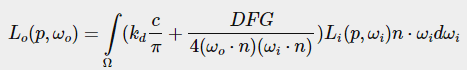
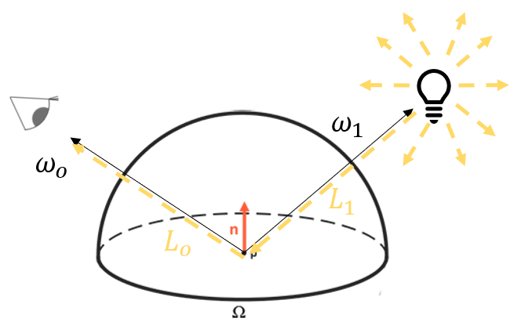
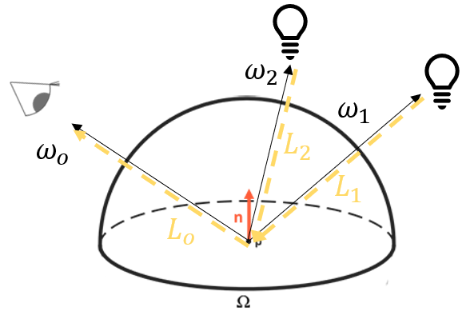

# 23. PBR(Physically based rendering)

이번 코드에서는 PBR의 구현에 관해서 알아보도록 하겠습니다. 제가 사용한 코드는 [learnopengl](https://learnopengl.com/PBR/Lighting)의 코드를 기반으로 하고 있으니 참고 하십시오.

PBR 이론에 대한 강의를 들으셨으니 이제 대부분의 기본적인 내용은 이해 하셨을 겁니다. 이론 강의에서는 주로 기반이 되는 물리적인 현상과 Cook-Torrance BRDF에 관해 설명을 드렸습니다.

이론 강의에서 살펴본 공식들은, 의미적으로는 이해가 좀 어려우셨을지 모르겠지만 그 식 자체는 매우 간단했습니다. 간단한 사칙연산과 내적, 제곱으로 이루어진 식들이지요.

하지만 실제로 PBR을 코드로 구현하려면 한가지가 더 필요합니다. 아래 Cook-Torrance Reflectance Equation을 다시 한번 보죠.



Cook-Torrance BRDF를 제외하고, 수식 계산을 위해서는 아래와 같은 두가지 사항을 어떻게 계산할 것인지를 결정해야 합니다.

 1. $L_i(p,w_i)$의 계산
 2. $\int (...) dw_i$ 적분식의 계산

 적분식의 경우 강의에서 리만합을 통한 개념적인 계산 방법을 소개하였습니다. 이러한 개념은 IBL(Image based Lighting)이라고 해서 간접광의 효과를 계산할 때는 사용하는 개념이지만 이번 강의에서는 이러한 내용까지는 다루지 않으려고 합니다. 
 
 이 강의에서는 직접광인 Point Light를 사용하는 예시를 통해 위 1,2에 대한 계산을 어떻게 할 수 있는지 설명하고 코드를 보이는 것으로 마무리를 하고자 합니다. 그 결과물이 이전과 비교해 얼마나 개선되었는지를 보시면 꽤 놀라울 것입니다.

코드를 보기에 앞서서 먼저 개념부터 살펴보고 가겠습니다.

아래 그림은 강의 자료에서 설명한 Reflectance Equation을 점 광원 하나에 대한 그림으로 약간 바꿔서 그린 것입니다. 우리는 지금 점 $p$로부터 그 점의 관찰 방향인 $w_o$ 방향으로의 radiance($L_o$)를 계산해야 합니다. 그 radiance가 바로 점 $p$가 속해있는 프래그먼트의 픽셀 색상이 됩니다.

이러한 radiance를 계산하려면 점 $p$로 들어오는 모든 빛에 대해 위 수식을 적용하는 것이 필요합니다. 수식을 보면 적분 구간이 $\Omega$인데 이것은 점 $p$와 그 법선 벡터 $n$으로부터 정의된 반구입니다. 이 반구로 들어와 $p$에 닿는 모든 빛(irradiance, $L_i$들의 가중합)이 $L_o$에 영향을 줄 것입니다.



그림에서 보면, 장면에는 Point Light(점 광원) 하나가 있습니다. 점 광원은 어떤 위치에서 모든 방향으로 동일한 양의 에너지를 방출하는 광원입니다. (그림에서는 전구로 표현했지만 실제 전구와는 다릅니다. 전구는 부피를 가지지만, 점 광원은 부피를 가지지 않습니다.) 그림에서는 이를 표현하기 위해 점 광원 주위에 바깥쪽으로 나가는 화살표를 표시해 두었습니다.

핵심은 이것입니다. 점 광원에서 나온 수많은 빛줄기중에 점 $p$로 들어오는 빛의 방향은 몇개일까요? 네. $w_i$ 하나입니다. 따라서, 이렇게 빛이 하나만 있는 상황에서의 Reflectance Equation 계산식은 아래와 같이 계산할 수 있습니다.

$L_o(p,w_o) = (k_d)\dfrac{c}{\pi} + \dfrac{DFG}{4(w_o\cdot n)(w_1\cdot n)} L_1(p,w_1)n\cdot w_1 $

적분 $\int (...) dw_i$는 모든 $dw_i$ 방향에 대한 계산 면적인데, $w_i$가 하나이므로 해당 방향에 대한 함수값만을 계산하도록 단순화된 것입니다. 만약 아래 그림과 같이 광원이 2개라면 수식은 그 아래와 같이 됩니다.



$L_o(p,w_o) = \displaystyle\sum_{i=1}^{2} (k_d)\dfrac{c}{\pi} + \dfrac{DFG}{4(w_o\cdot n)(w_i\cdot n)} L_i(p,w_i)n\cdot w_i $

간단하죠? 즉, **점 $p$에 들어오는 빛의 방향이 유한하다면, 해당 방향에 대한 합으로 적분 계산을할 수 있다**는 것입니다. 이로써 빛의 방향이 유한한 경우에 대한 2번 문제, 즉 적분 계산 방법에 대한 문제는 해결되었습니다.

나머지 하나인 $L_i(p,w_i)$의 계산은 어떻게 할까요? 사실은 계산이 아닙니다. $L_i$는 i번째 광원이 $p$ 방향으로 방출하는 에너지(radiant intensity)를 의미합니다. (점 광원이니 모든 방향으로 동일한 에너지를 방출합니다.) 따라서 광원을 정의할 때 그냥 이 광원은 얼마만큼의 에너지를 방출하는 광원이다라고 우리가 정의해 주는 파라메터입니다. 마치 우리가 이전까지 광원의 색상과 세기(intensity)를 정의해 줬던 것처럼요.

설명은 벌써 끝입니다. 한번 같이 코드를 보면서 어떻게 구현되었는지 살펴보도록 하죠. 이번 장의 구현 코드는 그림자 구현에 필요한 복잡한 코드를 제외하기 위해 [18. Light Abstraction](../18_light_abstraction/README.md)를 기반으로 만들어 졌으니 참고 하십시오.


---

## How to

이전 코드에서 변화된 내용들을 보자면 아래와 같습니다. 보셔야 하는 파일들을 번호 목록 앞에 표기해 두었습니다.

---
1. [`main.js`] PBR 셰이더 로드, 조명 및 장면 세팅

    모든 주요한 내용은 PBR 셰이더에 구현되어 있습니다. 씬에는 점 조명 4개를 배치해 두었습니다. 각 조명의 위치는 `lightPositions` 배열에 정의하였고, 조명의 radiant intensity는 `lightColors` 배열에 정의하였습니다. 단순 색상이 아닙니다. 물리적인 의미를 갖는 radiant intensity입니다.

    ```js
    //Shaders 
    import PBRVertexShader from '../_shaders/PBRShaderVertex.js';
    import PBRFragmentShader from '../_shaders/PBRShaderFragment.js';

    ...
    let lightPositions = [[-10.0,  10.0, 10.0],
                        [ 10.0,  10.0, 10.0],
                        [-10.0, -10.0, 10.0],
                        [ 10.0, -10.0, 10.0],]
    let lightColors = [ [300.0, 300.0, 300.0],
                      [300.0, 300.0, 300.0],
                      [300.0, 300.0, 300.0],
                      [300.0, 300.0, 300.0],]
    ```

    장면 세팅 부분은 특별할 것이 없으므로 따로 설명은 하지 않겠습니다. 25개의 주전자들을 이후 셰이더에서 설명할 roughness와 metalness를 바꾸어가며 그리는 코드입니다. 이제는 코드만 보시면 어떻게 된 상황인지 이해하실 수 있을 것이라 믿습니다.

2. [`_shaders/PBRShaderVertex.js`] PBR Vertex Shader

    ```glsl
    #version 300 es
    layout(location=0) in vec3 a_position; 
    layout(location=1) in vec2 a_texcoord;
    layout(location=2) in vec3 a_normal;

    uniform mat4 u_projection; 
    uniform mat4 u_view; //카메라를 통해 반환된 View행렬
    uniform mat4 u_model; //모델의 world공간 위치와 자세

    out vec2 v_texcoord;
    out vec3 v_normal; 
    out vec3 v_worldPosition; 

    void main() {
        gl_Position = u_projection * u_view * u_model * vec4(a_position,1.0); 
        v_texcoord = a_texcoord;

        v_normal = mat3(transpose(inverse(u_model))) * a_normal;

        v_worldPosition = (u_model * vec4(a_position, 1.0)).xyz; 
    }
    `;
    ```

    바뀐것이 없습니다. 각 프래그먼트의 월드공간 위치를 저장하는 worldPosition varying을 프래그먼트 셰이더로 넘기고 있는데, 이 부분도 이미 전에 사용해봤던 내용이죠.

3. [`_shaders/PBRShaderFragment.js`] PBR Fragment Shader, Material 파라메터와 조명
    
    모든 중요한 부분은 프래그먼트 셰이더에 구현되어 있으므로 셰이더를 몇개 파트으로 나누어 설명하겠습니다. 먼저 프래그먼트의 재질 속성을 세팅하기 위한 네 개의 파라메터를 uniform으로 정의하였습니다. 이론 강의에서 설명한 Albedo, Metalness, Roughness, AO 입니다. Albedo는 고유 색상을 표현하기때문에 Vector3이고 나머지는 단일 부동소수점 값입니다. 

    강의 마지막 부분에서 우리가 텍스처를 사용한다면 각 프래그먼트별로 이러한 재질 속성을 다르게 줄 수 있다는 것도 설명하였습니다. 여기서는 예제일 뿐이므로 물체 하나가 단일 재질로 이루어져있는 것으로 간단하게 정의하였습니다.

    ```glsl
    // material parameters
    uniform vec3  u_albedo;
    uniform float u_metallic;
    uniform float u_roughness;
    uniform float u_ao;
    ```

    조명은 `main.js`에서 세팅한 배열을 받아올 수 있도록 설정하였습니다. 점 광원의 위치와 radiant intensity입니다.

    ```glsl
    // lights
    uniform vec3 u_lightPositions[4];
    uniform vec3 u_lightColors[4];
    ```

4. [`_shaders/PBRShaderFragment.js`] DFG 함수 정의
    
    normal (D)istribution, (F)resnel, (G)eometry 함수입니다. 강의 자료에서 설명드린 공식을 그대로 코드로 옮겨온 것 뿐입니다.

    복습하고 싶으신 분을 위해 간단히 설명하자면, 이 DFG 함수는 Cook-Torrance BRDF의 Specular Term을 구성하는 3개의 함수들입니다.

    - D 함수는 Towbridge-Reitz GGX 근사식이고 미세면 표면의 정렬에 따른 반사 현상을 모사합니다. 그래서 h(조명&시점 방향의 중간벡터), n(법선)과 roughness를 입력으로 받습니다. roughness가 클수록 모든 방향으로 고루 빛을 반사합니다. roughness가 작으면 r 방향으로 빛을 집중적으로 반사할텐데 그때 시점 벡터와 r이 비슷하냐 아니냐에 따라 반사 강도 차이가 크게 발생할겁니다. 이를 h 벡터로 계산에 반영합니다.

    ```glsl
    float DistributionGGX (vec3 N, vec3 H, float roughness){
        float a2    = roughness * roughness * roughness * roughness;
        float NdotH = max (dot (N, H), 0.0);
        float denom = (NdotH * NdotH * (a2 - 1.0) + 1.0);
        return a2 / (PI * denom * denom);
    }
    ```

    - G 함수는 Smith-Schlick GGX 근사식이고 미세면 표면의 정렬에 따른 그림자 현상을 모사합니다. 표면이 거칠수록 그림자가 많이 발생하는데, 시점의 높이 따라 발생하는 Geometry Obstruction과 빛이 탈출하지 못해 발생하는 Geometry Shadowing 두 개의 팩터가 존재합니다. 아래 코드에서와 같이 Geometry Obstruction은 N,V를 입력으로, Geometry Shadowing은 N,L을 입력으로 SchlickGGX를 통해 계산하며 두 결과값을 곱한 것이 최종 G함수의 출력이 됩니다.

    ```glsl
    float GeometrySchlickGGX (float NdotV, float roughness){
        float r = (roughness + 1.0);
        float k = (r * r) / 8.0;
        return NdotV / (NdotV * (1.0 - k) + k);
    }

    float GeometrySmith (vec3 N, vec3 V, vec3 L, float roughness){
        return GeometrySchlickGGX (max (dot (N, L), 0.0), roughness) * 
                GeometrySchlickGGX (max (dot (N, V), 0.0), roughness);
    }
    ```

    - F 함수는 Fresnel-Schlick 근사식이고 물체의 표면을 어느 각도로 바라보느냐에 따른 반사량을 계산합니다. F0값은 물체의 고유 반사도(물체를 똑바로 바라보았을때의 반사도)이며 `cosTheta`=$h \cdot v$입니다. 물체를 비스듬히 바라볼수록 반사가 더 많이 되며, 똑바로 바라보면 반사량이 적습니다. 또한 이 계산값이 에너지 보존법칙에서 반사되는 빛의 비율을 계산하는데 사용됩니다. (1-반사량 = 굴절량)

    ```glsl
    vec3 FresnelSchlick (float cosTheta, vec3 F0){
        return F0 + (1.0 - F0) * pow (1.0 - cosTheta, 5.0);
    }
    ```

5. [`_shaders/PBRShaderFragment.js`] Main 조명계산 함수
    
    이제 하이라이트입니다. 앞서 설명한 모든 지식을 동원하여 $w_o$방향으로의 radiance를 계산합니다.

    먼저 `N`과 `V`벡터를 계산해 두고, 기본 반사도 `F0`를 정의합니다. 강의자료에서 Fresnel을 설명할 때, 금속과 비금속의 양상이 다른데 비금속은 0.04로 퉁쳐서(?) 계산하고 금속의 경우 고유 색상을 `F0`로 사용한다고 하였습니다. 그 중간값은 보간해서 사용하고요. 이 문장을 코드로 쓴 것입니다.

    ```glsl
    void main()
    {		
        vec3 N = normalize(v_normal);
        vec3 V = normalize(u_eyePosition - v_worldPosition);

        vec3 F0 = vec3(0.04); 
        F0 = mix(F0, u_albedo, u_metallic);
        ...
    ```

    다음은 reflectance equation 계산의 첫 부분입니다. 우선 장면에 4개의 조명이 있으니 각 조명에 대해 순회하며 계산을 한다는 것을 잊지 마시고요. ($L_1$~$L_4$에 대해 각각 radiance를 계산하여 더함) `L`과 `H`를 계산해 두고, 점 조명의 거리에 따른 감쇄(attenuation)를 곱해 점 p에 도달할 시점의 radiance를 구해둡니다. (여기에 `NdotL`을 곱해야 정확한 radiant intensity가 됩니다.)

    ```glsl
    for(int i = 0; i < 4; ++i) 
    {
        // calculate per-light radiance
        vec3 L = normalize(u_lightPositions[i] - v_worldPosition);
        vec3 H = normalize(V + L);
        float distance    = length(u_lightPositions[i] - v_worldPosition);
        float attenuation = 1.0 / (distance * distance);
        vec3 radiance     = u_lightColors[i] * attenuation;   
        ...
    ```

    그 뒤 Cook-Torrance BRDF를 계산합니다. DGF를 계산하는 것이고, 위에 정의해 둔 함수를 그냥 사용만 하면 됩니다. 중요한 것은 Frenel인 F가 반사 정도를 계산하는 것이기 때문에 이것이 `kS`($w_o$방향으로 반사되는 빛의 비율)이고, 1에서 `kS`를 뺀 나머지가 `kD`(굴절되는 빛의 비율) 입니다. 마지막으로 재질의 metalness에 따라 `kD`값을 줄여줍니다. 금속인 경우 굴절된 빛은 모두 흡수되는 성질을 모사한 것입니다.

    ```glsl
        // cook-torrance brdf
        float NDF = DistributionGGX(N, H, u_roughness);        
        float G   = GeometrySmith(N, V, L, u_roughness);      
        vec3 F    = FresnelSchlick(max(dot(H, V), 0.0), F0);       
        
        vec3 kS = F;
        vec3 kD = vec3(1.0) - kS;
        kD *= 1.0 - u_metallic;	  
    ```

    다음으로는 계산된 데이터들을 사용해 Specular BRDF 전체 항을 계산합니다. 0.0001을 분모항에 더해 0으로 나뉘는 오류를 방지했다는 점만 알아 두시면 되겠네요.

    ```glsl
        vec3 numerator    = NDF * G * F;
        float denominator = 4.0 * max(dot(N, V), 0.0) * max(dot(N, L), 0.0) + 0.0001;
        vec3 specular     = numerator / denominator;  
    ```

    하나의 점조명이 기여하는 radiance를 계산하여 `Lo`에 더해줍니다. 반복문을 4번 돌게되면 4개 점조명이 이 프래그먼트(점 p)에 부딪혀 $w_o$ 방향으로 반사 & 산란되는 radiance의 총 합인 irradiance가 되겠죠?

    `NdotL`은 조명의 입사각에 따른 radiant intensity의 감소량을 계산하기 위한 팩터입니다. `kD`(산란되는 빛의 비율)와 Albedo(물체의 고유 색상 또는 고유 반사도)를 곱해서 산란 색상이 계산되고 `PI`로 나누어 정규화합니다. 그리고 specular 색상을 더합니다. 이후 `radiance`와 `NdotL`을 곱해 최종적으로 (단일 조명의) radiance가 계산됩니다.

    ```glsl
        // add to outgoing radiance Lo
        float NdotL = max(dot(N, L), 0.0);                
        Lo += (kD * u_albedo / PI + specular) * radiance * NdotL; 
    ```

6. [`_shaders/PBRShaderFragment.js`] 최종 출력 색상 계산
    
    이제 몇 가지 처리만 해 주면 끝납니다.

    우선 지금까지 ambient term에 대해서는 전혀 이야기하지 않았는데요, ambient도 빼먹으면 안됩니다. 사실 완전한 PBR을 위해서는 ambient에 환경 조명 효과를 더해야 하는데 이 부분은 강의 범위에서 제외하였습니다. (궁금하신 분은 Useful Link의 IBL 관련 내용을 읽어 보십시오.) 여기서는 단순히 Albedo와 AO에 0.03 정도의 낮은 radiance를 곱해서 주변광을 모사하였습니다. 그 주변광을 `Lo`에 곱해서 간단히 Ambient 효과를 더한 색상을 만들어냈습니다.

    ```glsl
    vec3 ambient = vec3(0.03) * u_albedo * u_ao;
    vec3 color = ambient + Lo;
    ```

    이후 color값을 1.0을 더한 color값으로 나누고 1/2.2 제곱승을 해 주었습니다. 어려운 말로 하자면 이 과정은 Reinhard 연산을 통한 톤 맵핑과 감마 보정 과정입니다. 감마 보정을 설명하려면 HDR을 설명해야 하는데... 시간이 부족하네요 ㅜㅜ 강의 시간에 시간이 남으면 좀 더 설명하도록 하겠습니다. 그냥 `감마 보정`, `톤 맵핑`이라는 단어만 한번 들어 두시고 시간이 되시는 분은 링크의 글을 읽어 보도록 합시다.

    ```glsl
    color = color / (color + vec3(1.0));
    color = pow(color, vec3(1.0/2.2));  
    ```

---

`http://localhost:8080/lessons/_current/contents.html`(또는 `http://localhost:8080/lessons/23_PBR/contents.html`)에 접속해 보시면 아래와 같은 화면을 보실 수 있습니다. 일단 지금까지의 렌더링 결과보다는 훨씬 더 그럴싸해 보인다(중요)는 느낌이 드실 겁니다. 당연하죠! 실제 빛과 물체의 상호작용을 훨씬 더 정확한 식으로 모사 했으니까요. 

아래쪽으로 위로 갈수록 metalness가 커지고 왼쪽에서 오른쪽으로 갈수록 roughness가 커집니다. 그래서 낮은 roughness에서는 4개 조명의 하이라이트(정반사되는 빛이죠)가 뚜렷이 보이는 것을 알 수 있습니다. 또한 metal인 주전자는 전체적으로 어두워 보이는데 산란되는 빛이 없이 반사 아니면 흡수되기 때문입니다. 그만큼 에너지의 손실이 일어난 것이죠. 그 중간 단계의 주전자들은 반쯤 금속인(?) 주전자들이라고 할 수 있는데, 물리적으로는 있을 수 없지만 metallic workflow에서는 이러한 효과를 효율적으로 사용합니다.


---

### **이렇게 해서 이번 학기의 마지막 WebGL 실습 코드까지 모두 살펴 보았습니다!!** 작년 강의에서는 Shadow까지만 설명했었는데, 조금 어려울 수 있는 내용임에도 불구하고 PBR이 점점 일반화되고 있기 때문에 설명을 꼭 해 드리고 싶어서 추가하였습니다. 어렵지만 잘 따라 오신 분들은 분명 이 내용을 배우지 않은 학생에 비해 큰 메리트를 가지실 수 있을겁니다! 

### 마지막으로, 다음의 에필로그 내용까지 꼭 읽어 주시기를 바랍니다. 저는 항상 처음과 마지막이 가장 중요하다고 생각합니다. 배운 내용들을 간단히 정리해 보고, 여러분이 향후 추가적으로 보시면 좋을 자료들도 정리해 두었으니 꼭 읽어 주세요.

---

## Quiz

1. 네 개 조명의 Radiant Intensity나 위치를 변경해서 어떻게 렌더링이 이루어지는지 살펴 보세요.

2. 하나의 주전자에 대해 albedo, roughness, metalness를 인터랙티브하게 바꾸어가며 자세히 살펴볼 수 있도록 UI를 구성하고 장면을 만들어 보세요.

3. 주전자보다 더 복잡한 형상을 가진 모델을 로딩하여 PBR 렌더링 해 보세요.

## Advanced

- 점 조명 이외에, 방향 조명(Directional light), 스팟 조명(spotlight) 등 다른 종류의 직접 조명에 대해 동작하도록 확장해 보세요.

- 현재까지의 PBR 코드에서 반영하고 있지 못한 현상은 또 무엇이 있을까요? 최근 PBR 렌더링 파이프라인에서는 그것들이 반영되고 있을까요? 조사해 보고 알려 주세요.

## Useful Links

- [Image based lighting](https://learnopengl.com/PBR/IBL/Diffuse-irradiance)
- [감마 보정](https://learnopengl.com/Advanced-Lighting/Gamma-Correction)
- [HDR이란?](https://learnopengl.com/Advanced-Lighting/HDR)

---

[다음 강의](../epilogue/)

[목록으로](../)
