# Table of Contents

- 전체 강의 내용 목록입니다. 
- 아래 목록의 링크를 클릭하면 각 섹션으로 이동합니다.
- 각 섹션의 제목을 클릭하면 해당하는 README 파일로 이동합니다.
- 각 섹션의 스크린샷 이미지를 클릭하면 구현 결과 HTML페이지가 열립니다.
    * Setup에서 설명드린 방법에 따라 로컬 서버가 실행되고 있어야 합니다.

---

- [00. Setup](#00-setup)
- [01. Vertex Buffer](#01-vertex-buffer)
- [02. Shader Attributes](#02-shader-attributes)
- [03. Draw from Index](#03-draw-from-index)
- [04. Shader Uniform](#04-shader-uniform)
- [05. Shader Uniform (Interactive)](#05-shader-uniform-interactive)
- [06. Drawing Multiple Objects (Part 1)](#06-drawing-multiple-objects-part-1)
- [06. Drawing Multiple Objects (Part 2)](#06-drawing-multiple-objects-part-2)
- [07. Buffer Abstraction](#07-buffer-abstraction)
- [08. Vertex Array Abstraction](#08-vertex-array-abstraction)
- [09. Shader and Renderer Abstraction](#09-shader-and-renderer-abstraction)
- [10. Using Matrix](#10-using-matrix)
- [11. Input Handling (Color Change)](#11-input-handling-color-change)
- [11. Input Handling (Camera Control)](#11-input-handling-camera-control)
- [12. Model Matrix and Load OBJ](#12-model-matrix-and-load-obj)
- [13. Model Abstraction](#13-model-abstraction)
- [14. Texture](#14-texture)
- [15. Ambient Term](#15-ambient-term)
- [16. Diffuse Term](#16-diffuse-term)
- [17. Specular Term](#17-specular-term)
- [18. Light Abstraction](#18-light-abstraction)
- [19. Depth Map](#19-depth-map)
- [20. Shadow Mapping (First Try)](#20-shadow-mapping-first-try)
- [21. Shadow Mapping (Add Bias)](#21-shadow-mapping-add-bias)
- [22. Shadow Mapping (PCF)](#22-shadow-mapping-pcf)
- [23. PBR(Physicall based Rendering)](#23-pbr)
- [Epilogue](#epilogue)

---

## [00. Setup](./00_Setup/README.md)

- 이 Repository의 예제 실행을 위한 간단한 웹 서버 설치와 웹 브라우저를 통한 접속 방법을 설명합니다.

    <b><a href="#table-of-contents">↥ back to top</a></b>

---

## [01. Vertex Buffer](./01_vertex_buffer/README.md)

- WebGL API의 호출을 통한 GPU로의 데이터 전달 방법을 설명합니다.
- Vertex buffer(VBO)의 개념과 데이터 전달 개념을 설명합니다.
- State machine 방식으로 설계된 API의 동작 방식과 "바인딩"의 개념을 설명합니다.

    <b><a href="#table-of-contents">↥ back to top</a></b>

---

## [02. Shader Attributes](./02_shader_attribute/README.md)

    <a href="http://localhost:8080/lessons/02_shader_attribute/contents.html">
    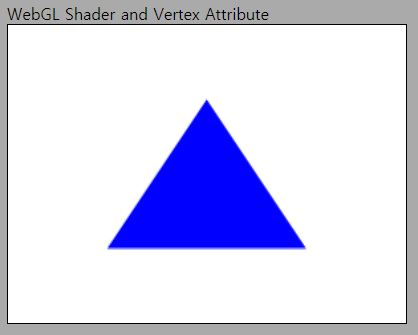 </a>
    
 인터랙션 없음 

    

- GPU에서 실행되는 프로그램인 셰이더의 개념과 사용 방법을 설명합니다.
- 셰이더의 정점별 데이터인 Attribute의 입력과 설정 방법을 설명합니다.

    <b><a href="#table-of-contents">↥ back to top</a></b>

---

## [03. Draw from Index](./03_draw_from_index/README.md)

<a href="http://localhost:8080/lessons/03_draw_from_index/contents.html">
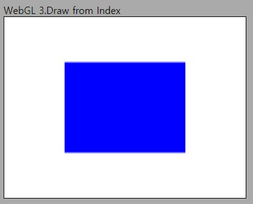 </a>

 인터랙션 없음 

- Index buffer(IBO)의 개념과 사용 방법을 설명합니다.
- gl.drawElements()을 통한 드로우콜 방법을 설명합니다.

    <b><a href="#table-of-contents">↥ back to top</a></b>

---

## [04. Shader Uniform](./04_shader_uniform/README.md)

<a href="http://localhost:8080/lessons/04_shader_uniform/contents.html">
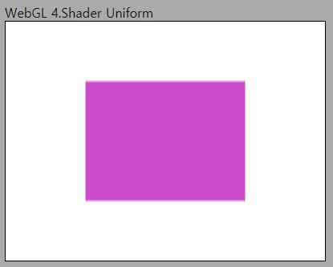</a>

 인터랙션 없음 

- 모든 정점에 공통적으로 사용되는 셰이더의 Uniform 변수와 사용 방법을 설명합니다.

    <b><a href="#table-of-contents">↥ back to top</a></b>

---

## [05. Shader Uniform (Interactive)](./05_shader_uniform_interactive/README.md)

<a href="http://localhost:8080/lessons/05_shader_uniform_interactive/contents.html">
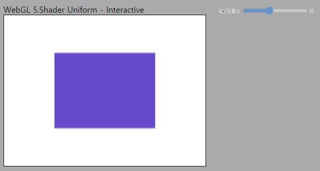</a>

 UI Slider를 통한 인터랙션 

- 인터랙티브의 개념을 설명합니다.
- Uniform에 실시간으로 다른 값을 전달하여 화면을 새로 그림으로써 인터랙티브한 페이지를 구성해 봅니다.

    <b><a href="#table-of-contents">↥ back to top</a></b>

---

## [06. Drawing Multiple Objects (Part 1)](./06_drawing_multiple_objects_pt1/README.md) 

<a href="http://localhost:8080/lessons/06_drawing_multiple_objects_pt1/contents.html">
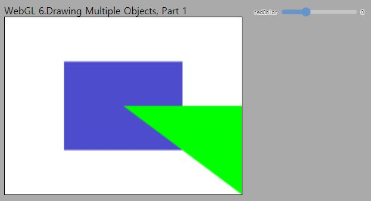</a>

 UI Slider를 통한 인터랙션 

- 드로우콜을 여러번 호출하여 두 물체를 한 화면에 그리는 법을 설명합니다.
- 드로우콜 호출 전에 그려야 할 물체와 상태를 API를 사용해 바꾸는 법을 설명합니다.

    <b><a href="#table-of-contents">↥ back to top</a></b>

## [06. Drawing Multiple Objects (Part 2)](./06_drawing_multiple_objects_pt2/README.md) 

<a href="http://localhost:8080/lessons/06_drawing_multiple_objects_pt2/contents.html">
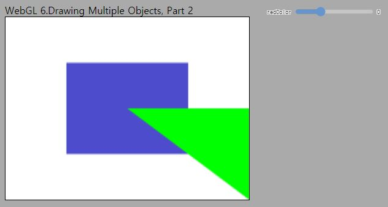</a>

 UI Slider를 통한 인터랙션 

- Vertex Array(VAO)의 개념과 사용 방법을 설명합니다.
- VAO를 사용해 각 물체를 그리기 위한 상태를 손쉽게 저장할 수 있음을 보입니다.

    <b><a href="#table-of-contents">↥ back to top</a></b>

---

## [07. Buffer Abstraction](./07_buffer_abstraction/README.md)

<a href="http://localhost:8080/lessons/07_buffer_abstraction/contents.html">
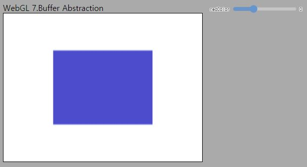</a>

 UI Slider를 통한 인터랙션 

- Vertex & Index buffer 관리 클래스를 구현하여 코드를 구조화 하는 방법을 설명합니다.

    <b><a href="#table-of-contents">↥ back to top</a></b>

---

## [08. Vertex Array Abstraction](./08_vertex_array_abstraction/README.md)

<a href="http://localhost:8080/lessons/08_vertex_array_abstraction/contents.html">
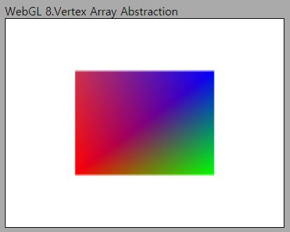</a>

 인터랙션 없음 

- Vertex Array 관리 클래스를 구현하여 코드를 구조화 하는 방법을 설명합니다.
- Attribute layout을 일반화하여 설정할 수 있는 코드에 대해 소개합니다.

    <b><a href="#table-of-contents">↥ back to top</a></b>

---

## [09. Shader and Renderer Abstraction](./09_shader_renderer_abstraction/README.md)

<a href="http://localhost:8080/lessons/09_shader_renderer_abstraction/contents.html">
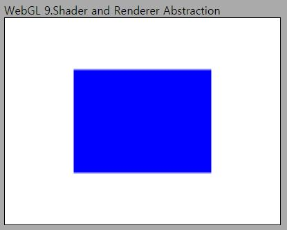</a>

 인터랙션 없음 

- Shader와 Renderer 클래스를 구현하여 코드를 구조화 하는 방법을 설명합니다.
- Abstraction 결과를 사용하여 드로우 함수를 간략화 하는 방법을 보입니다.

    <b><a href="#table-of-contents">↥ back to top</a></b>

---

## [10. Using Matrix](./10_using_matrix/README.md)

<a href="http://localhost:8080/lessons/10_using_matrix/contents.html">
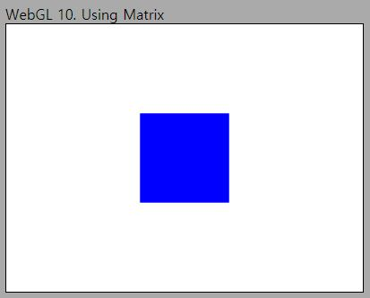</a>

 인터랙션 없음 

- glMatrix 라이브러리의 기본적인 사용 방법을 설명합니다.
- 셰이더의 uniform으로 glMatrix를 사용해 생성한 행렬을 전달하는 방법을 설명합니다.

    <b><a href="#table-of-contents">↥ back to top</a></b>

---

## [11. Input Handling (Color Change)](./11_input_handling_pt1_color_change/README.md)

<a href="http://localhost:8080/lessons/11_input_handling_pt1_color_change/contents.html">
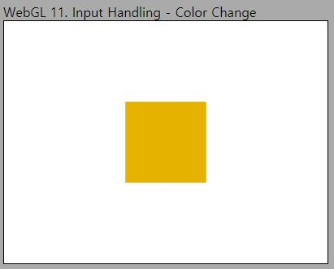</a>

 키보드(W,A,S,D) 인터랙션 

- HTML 및 캔버스의 키보드 및 마우스 입력 처리 방법을 설명합니다.

    <b><a href="#table-of-contents">↥ back to top</a></b>

## [11. Input Handling (Camera Control)](./11_input_handling_pt2_camera_control/README.md) 

<a href="http://localhost:8080/lessons/11_input_handling_pt2_camera_control/contents.html">
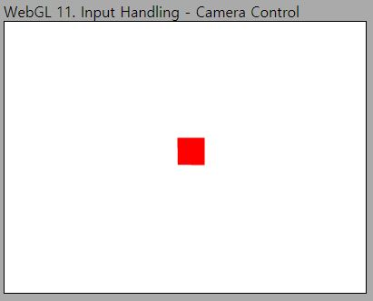</a>

 키보드(W,A,S,D) 및 마우스 인터랙션 

- Camera 클래스를 구현하여 카메라 관련 코드를 구조화 하는 방법을 설명합니다.
- 키보드 및 마우스 입력으로 뷰 행렬을 조작하여 카메라를 이동하는 방법을 설명합니다.

    <b><a href="#table-of-contents">↥ back to top</a></b>

---

## [12. Model Matrix and Load OBJ](./12_model_matrix_and_load_obj/README.md) 

<a href="http://localhost:8080/lessons/12_model_matrix_and_load_obj/contents.html">
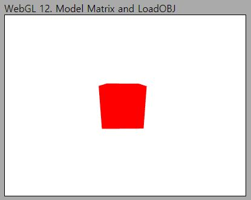</a>

 키보드(W,A,S,D) 및 마우스 인터랙션 

- 모델을 월드 공간에 배치하는 모델 행렬의 개념과 uniform 설정 방법을 설명합니다.
- Obj 파일 포맷과 obj loader 헬퍼 클래스를 사용한 모델 로딩 방법을 설명합니다.
- 로드된 모델 데이터의 VBO, IBO, VAO 설정 방법을 설명합니다.
- requestAnimationFrame()을 사용한 화면 갱신 방법을 소개합니다.

    <b><a href="#table-of-contents">↥ back to top</a></b>

---

## [13. Model Abstraction](./13_model_abstraction/README.md) 

<a href="http://localhost:8080/lessons/13_model_abstraction/contents.html">
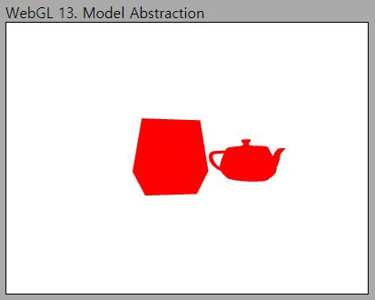</a>

 키보드(W,A,S,D) 및 마우스 인터랙션 

- Model 클래스를 구현하여 모델(메쉬) 관련 코드를 구조화 하는 방법을 설명합니다.
- 서로 다른 모델 행렬을 사용하여 화면에 여러 물체를 배치하는 방법을 설명합니다.

    <b><a href="#table-of-contents">↥ back to top</a></b>

---

## [14. Texture](./14_texture/README.md) 

<a href="http://localhost:8080/lessons/14_texture/contents.html">
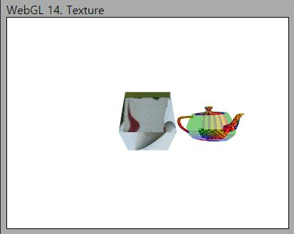</a>

 키보드(W,A,S,D) 및 마우스 인터랙션 

- 2차원 데이터의 배열인 텍스처와 텍스처 유닛, 그리고 관련 API들을 설명합니다.
- Texture 클래스를 구현하여 비동기 텍스처 로딩 및 설정 코드를 구조화 하는 방법을 설명합니다.
- 셰이더의 sampler2D에 텍스처를 참조하는 방법과 데이터(색상) 샘플링 방법을 설명합니다.

    <b><a href="#table-of-contents">↥ back to top</a></b>

---

## [15. Ambient Term](./15_ambient_light/README.md)

<a href="http://localhost:8080/lessons/15_ambient_light/contents.html">
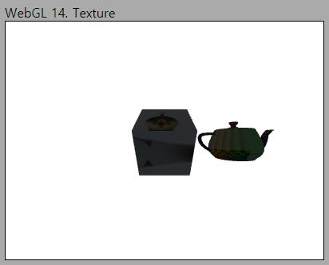</a>

 키보드(W,A,S,D) 및 마우스 인터랙션 

- Light 클래스를 구현하여 조명 관련 코드를 구조화 하는 방법을 설명합니다.
- Ambient 조명 효과와 구현 방법, 컬링과 깊이 테스트 옵션 설정 방법을 소개합니다.
- 셰이더에서 구조체를 사용하는 방법과 uniform 설정 방법을 설명합니다.

    <b><a href="#table-of-contents">↥ back to top</a></b>

---

## [16. Diffuse Term](./16_diffuse_light/README.md) 

<a href="http://localhost:8080/lessons/16_diffuse_light/contents.html">
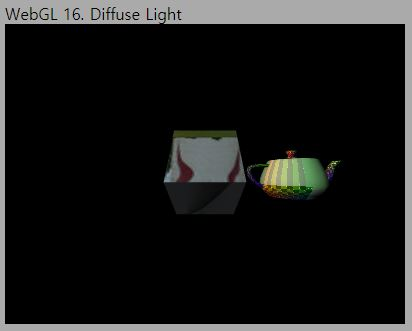</a>

 키보드(W,A,S,D) 및 마우스 인터랙션 

- 법선 벡터와 조명 벡터의 각도를 계산하여 조명에 의한 음영 효과를 생성하는 방법을 설명합니다.

    <b><a href="#table-of-contents">↥ back to top</a></b>

---

## [17. Specular Term](./17_specular_term/README.md) 

<a href="http://localhost:8080/lessons/17_specular_term/contents.html">
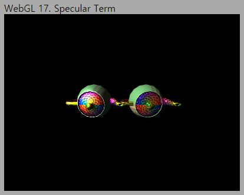</a>

 키보드(W,A,S,D) 및 마우스 인터랙션 

- 뷰 벡터와 반사 벡터의 각도를 계산하고 shininess에 의한 감쇄를 적용하는 방법을 설명합니다.
- Material 클래스를 구현하여 물체의 표면 속성 관련 코드를 구조화 하는 방법을 설명하고, 두 물체에 다른 Material을 적용해 봅니다.

    <b><a href="#table-of-contents">↥ back to top</a></b>

---

## [18. Light Abstraction](./18_light_abstraction/README.md) 

<a href="http://localhost:8080/lessons/18_light_abstraction/contents.html">
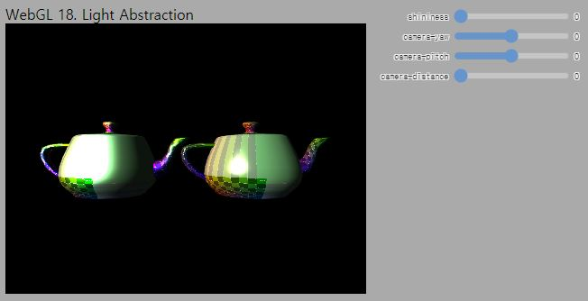</a>

 UI Slider를 통한 인터랙션 

- 여러 종류의 조명 정의가 가능하도록 BasicLight에 상속 관계를 사용한 조명 클래스를 구현하는 방법을 설명합니다.
- OrbitCamera를 소개합니다.

    <b><a href="#table-of-contents">↥ back to top</a></b>

---

## [19. Depth Map](./19_depth_map/README.md) 

<a href="http://localhost:8080/lessons/19_depth_map/contents.html">
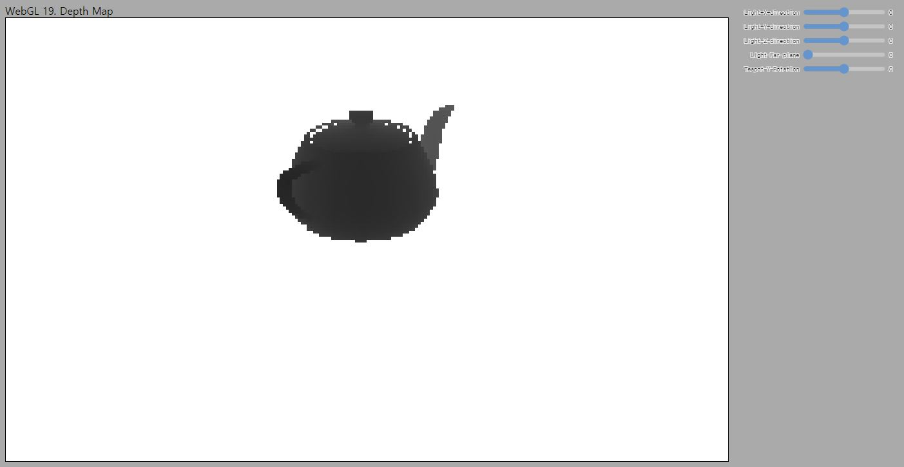</a>

 UI Slider를 통한 인터랙션 

- FrameBuffer(FBO)에 대해 소개하고 프레임버퍼에 데이터를 쓰는 방법을 설명합니다.
- Two-pass 알고리즘의 개념과, 깊이맵을 생성하는 방법을 설명합니다.

    <b><a href="#table-of-contents">↥ back to top</a></b>

---

## [20. Shadow Mapping (First Try)](./20_shadow_mapping_first_try/README.md) 

<a href="http://localhost:8080/lessons/20_shadow_mapping_first_try/contents.html">
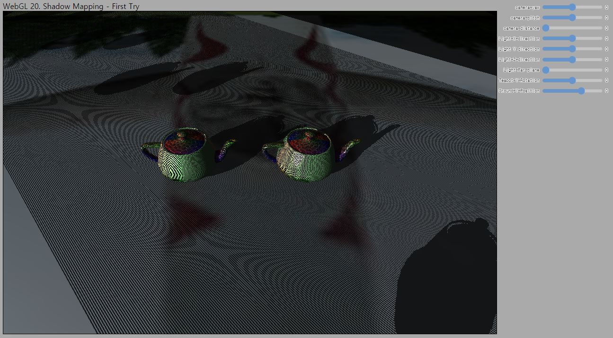</a>

 UI Slider를 통한 인터랙션 

- 깊이맵에 쓰여진 픽셀의 깊이값과 실제 거리를 비교하여 그림자를 생성하는 Shadow Mapping의 구현 방법을 설명합니다.

    <b><a href="#table-of-contents">↥ back to top</a></b>

---

## [21. Shadow Mapping (Add Bias)](./21_shadow_mapping_add_bias/README.md)

<a href="http://localhost:8080/lessons/21_shadow_mapping_add_bias/contents.html">
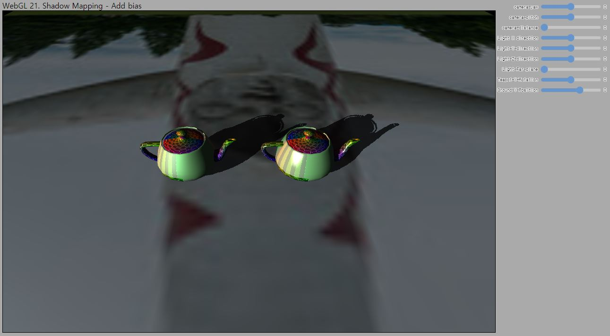</a>

 UI Slider를 통한 인터랙션 

- 깊이맵의 에일리어싱 문제와 이로 인해 나타나는 Shadow Acne문제를 Bias를 추가해 해결하는 방법을 설명합니다.

    <b><a href="#table-of-contents">↥ back to top</a></b>

---

## [22. Shadow Mapping (PCF)](./22_shadow_mapping_pcf/README.md) 

<a href="http://localhost:8080/lessons/22_shadow_mapping_pcf/contents.html">
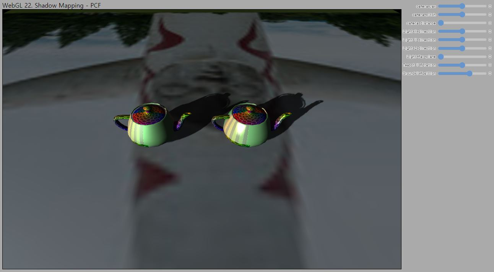</a>

 UI Slider를 통한 인터랙션 

- 깊이맵의 에일리어싱으로 인한 또다른 문제와 soft shadow의 필요성에 대해 설명합니다.
- PCF(Percentage Closer Filtering) 알고리즘과 구현 방법을 설명합니다.

    <b><a href="#table-of-contents">↥ back to top</a></b>

---

## [23. PBR(Physically based Rendering)](./23_PBR/README.md)

<a href="http://localhost:8080/lessons/23_PBR/contents.html">
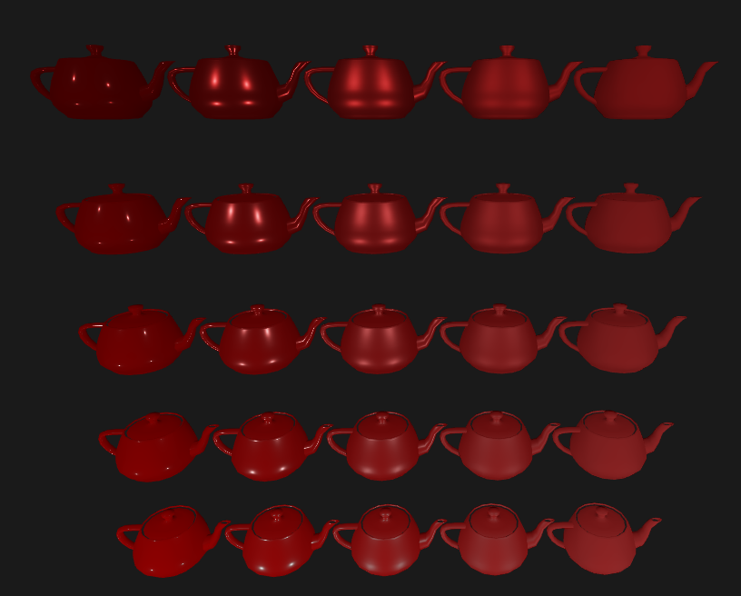</a>

 UI Slider를 통한 인터랙션 

- 컴퓨터 그래픽스 분야의 최신 이론인 PBR에 대해 개략적으로 알아 봅니다.
- 직접 조명에 대해 Reflectance equation을 근사적으로 계산하는 법을 코드를 통해 알아봅니다.

    <b><a href="#table-of-contents">↥ back to top</a></b>

---

## [Epilogue](./epilogue/README.md) 

- 배운 내용들을 정리하고, 유용한 참고 자료들을 소개합니다.

    <b><a href="#table-of-contents">↥ back to top</a></b>

